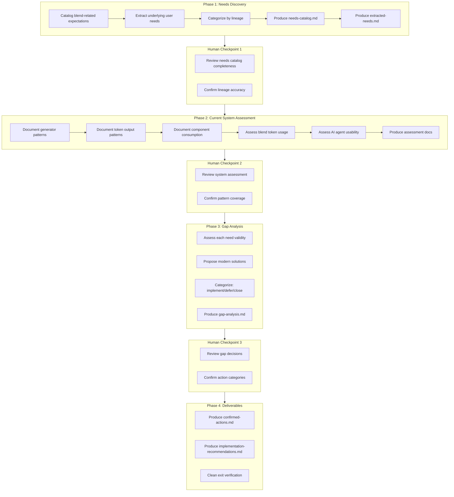

# Design Document: Blend Token Infrastructure Audit

**Date**: December 28, 2025
**Spec**: 024 - Blend Token Infrastructure Audit
**Status**: Phase 2 - Current System Assessment
**Dependencies**: blend-tokens, 023-component-token-compliance-audit
**Type**: Audit
**Phase 1 Complete**: December 28, 2025 (Human Checkpoint 1 Approved)

---

## Overview

This design document defines the methodology for auditing blend token infrastructure. The audit follows a four-phase workflow adapted from the Test Failure Audit Methodology, modified for feature gap analysis rather than test failure resolution.

**Critical Principle**: Past escalations and expectations were written at a specific point in time. This audit divorces the *underlying needs* from the *implementation expectations* of that era. Any implementation recommendations must align with the system's current structure, standards, and patterns.

---

## Phase 1 Findings Summary

**Completed**: December 28, 2025
**Human Checkpoint**: Approved

### Key Discovery: Definition Infrastructure is Complete

Phase 1 revealed that the blend token **definition infrastructure is more complete than expected**:

| Component | Status | Evidence |
|-----------|--------|----------|
| Primitive tokens (blend100-blend500) | ✅ Complete | `src/tokens/BlendTokens.ts` |
| Semantic tokens (hoverDarker, focusSaturate, etc.) | ✅ Complete | `src/tokens/semantic/BlendTokens.ts` |
| Calculation algorithms | ✅ Complete | `src/blend/BlendCalculator.ts`, `ColorSpaceUtils.ts` |
| Platform generators | ✅ Complete | `src/generators/BlendValueGenerator.ts`, `BlendUtilityGenerator.ts` |
| Composition parsers | ✅ Complete | `src/composition/BlendCompositionParser.ts` |
| Documentation | ✅ Complete | Usage guides, AI agent guidance |

### The Real Gap: Runtime Application Bridge

The gap is **narrower but deeper** than originally anticipated:

**What exists**: Token definitions, calculation algorithms, generators, parsers, documentation
**What's missing**: The bridge from "token definition" to "component consumption"

Specifically:
1. Generated utilities are not in the build output
2. No component patterns exist for applying blend modifications
3. Components use `color.primary` directly instead of blend-modified colors

### Single Root Cause

All Spec 023 escalations (NC-018, NC-019, NC-020, NC-021) trace back to the same root cause: blend tokens are defined but not consumable by components.

### Lineage Summary

| Category | Count | Items |
|----------|-------|-------|
| Built-and-current | 14 | Core infrastructure (tokens, calculators, generators, parsers, docs) |
| Built-but-outdated | 1 | NC-011: "Unified generator integration" claim |
| Escalated-never-addressed | 1 | NC-018: E1:H1 - Runtime application infrastructure |
| Still-needed | 3 | NC-019, NC-020, NC-021: Component blend token usage |

### Extracted User Needs (10 total)

| ID | Theme | Need |
|----|-------|------|
| UN-001 | Interactive States | Clear focus state visual distinction |
| UN-002 | Interactive States | Hover state visual feedback |
| UN-003 | Interactive States | Pressed/active state feedback |
| UN-004 | Disabled States | Disabled element recognition |
| UN-005 | Visual Hierarchy | Icon visual weight balance |
| UN-006 | Theme Consistency | Consistent color transformations |
| UN-007 | Theme Consistency | Theme-aware color modifications |
| UN-008 | Developer Experience | Predictable component behavior |
| UN-009 | Developer Experience | AI agent guidance for token selection ✅ Complete |
| UN-010 | Cross-Platform | Identical visual behavior across platforms |

### Historical Context (from Human Checkpoint discussion)

The gap likely resulted from **oversight combined with system immaturity**. Blend tokens were planned quickly out of necessity rather than with the careful consideration given to color and typography tokens. The generators were built and marked "complete," but the integration into the build pipeline was never finished - like building a factory without connecting it to the distribution network.

---

## Priority Context

**Component states are critical.** Blends are used extensively for interactive states (hover, focus, pressed, disabled). Getting these states working as intended is essential for:
- Providing accurate feedback on current component implementations
- Ensuring deliverables reflect intended design behavior
- Validating the design system's interactive patterns

---

## Audit Scope Refinement

**Primary Focus**: Blend token infrastructure gaps
**Secondary**: Surface notable gaps in other token families for future action

If Phase 2 discovers that other token families (opacity, color) have similar "definition exists but no consumption bridge" problems, these will be documented but not investigated in depth. The audit stays blend-focused.

---

## Architecture

### Four-Phase Audit Workflow



### Audit Scope Boundaries

| In Scope | Out of Scope |
|----------|--------------|
| Catalog all blend-related expectations | Implement blend infrastructure |
| Assess current system patterns | Modify existing components |
| Identify gaps and their validity | Expand blend token definitions |
| Recommend modern implementation | Execute implementation tasks |
| Document AI agent usability issues | Fix AI agent guidance (separate spec) |

---

## Components and Interfaces

### Phase 1: Needs Discovery

**Purpose**: Catalog all blend-related expectations and extract underlying user needs.

**Input Sources**:
- `.kiro/specs/blend-tokens/` - Original blend token spec (marked complete)
- `.kiro/specs/023-component-token-compliance-audit/` - Escalation source
- `.kiro/specs/025-test-suite-overhaul/` - Potential references
- `src/tokens/BlendTokens.ts` - Primitive token definitions
- `src/tokens/semantic/BlendTokens.ts` - Semantic token definitions
- `src/blend/BlendCalculator.ts` - Calculation algorithms
- Component design docs and READMEs

**Output Artifacts**:
- `findings/needs-catalog.md` - All expectations with lineage categorization
- `findings/extracted-needs.md` - User needs divorced from implementation

**Lineage Categories**:

| Category | Definition | Action Implication |
|----------|------------|-------------------|
| **Claimed-not-built** | Task marked complete but artifact doesn't exist | Assess if still needed |
| **Built-but-outdated** | Exists but doesn't match current patterns | Modernize or replace |
| **Escalated-never-addressed** | Explicitly deferred to future spec that wasn't created | Extract the *need*, not the implementation |
| **Superseded** | Original need addressed differently elsewhere | Document and close |
| **Still-needed** | Gap remains valid with current architecture | Plan modern implementation |

### Phase 2: Current System Assessment

**Purpose**: Understand how the system works today to inform modern recommendations.

**Assessment Areas**:

1. **Generator Patterns**
   - How does the unified generator work?
   - How are platform-specific outputs generated?
   - What extension points exist?

2. **Token Output Patterns**
   - How do token families output to web (CSS variables, TypeScript)?
   - How do token families output to iOS (Swift)?
   - How do token families output to Android (Kotlin)?

3. **Component Consumption Patterns**
   - How do components reference tokens?
   - What patterns exist for dynamic color manipulation?
   - How are interactive states (hover, focus, pressed) handled?

4. **Blend Token Usage Analysis**
   - Expected usage (per documentation)
   - Actual usage (in component implementations)
   - Usability gap identification

5. **AI Agent Usability Assessment**
   - Is compositional nature clear?
   - Is guidance sufficient?
   - Are semantic names intuitive?
   - Is color/blend relationship documented?
   - What happens when AI tries to use blend tokens today?

**Output Artifacts**:
- `findings/current-system-assessment.md`
- `findings/pattern-inventory.md`
- `findings/blend-usage-analysis.md`

### Phase 3: Gap Analysis

**Purpose**: Analyze each identified gap and determine appropriate action.

**Analysis Framework**:

For each identified gap:
1. **What user need was this supposed to address?**
2. **What component behavior requires this?**
3. **Is the need still valid with current architecture?**
4. **What's the modern way to solve this?**

**Decision Categories**:
- **Implement**: Gap is valid, modern solution identified
- **Defer**: Gap is valid but lower priority, document conditions for future
- **Close**: Gap is no longer valid, document why

**Output Artifacts**:
- `findings/gap-analysis.md`

### Phase 4: Deliverables

**Purpose**: Produce final recommendations and ensure clean exit.

**Output Artifacts**:
- `findings/confirmed-actions.md` - Human-reviewed decisions
- `findings/implementation-recommendations.md` - Modern implementation plan
- Potential new spec recommendation (e.g., 031-blend-infrastructure-implementation)

---

## Data Models

### Needs Catalog Entry

```typescript
interface NeedsCatalogEntry {
  id: string;                    // e.g., "NC-001"
  source: string;                // e.g., "blend-tokens/tasks.md Task 4.1"
  claim: string;                 // What was claimed/expected
  lineage: LineageCategory;      // Categorization
  extractedNeed: string;         // Underlying user need
  evidence: string[];            // Supporting evidence
}

type LineageCategory = 
  | 'claimed-not-built'
  | 'built-but-outdated'
  | 'escalated-never-addressed'
  | 'superseded'
  | 'still-needed';
```

### Gap Analysis Entry

```typescript
interface GapAnalysisEntry {
  id: string;                    // e.g., "GAP-001"
  needsCatalogRef: string;       // Reference to NC-XXX
  userNeed: string;              // The underlying need
  componentBehavior: string;     // What component behavior requires this
  stillValid: boolean;           // Is need still valid?
  modernSolution: string;        // How to solve with current patterns
  decision: GapDecision;         // implement | defer | close
  rationale: string;             // Why this decision
}

type GapDecision = 'implement' | 'defer' | 'close';
```

### AI Agent Usability Finding

```typescript
interface AIAgentUsabilityFinding {
  id: string;                    // e.g., "AI-001"
  area: AIUsabilityArea;         // What aspect of usability
  finding: string;               // What was found
  severity: 'high' | 'medium' | 'low';
  recommendation: string;        // How to improve
}

type AIUsabilityArea =
  | 'compositional-clarity'
  | 'guidance-sufficiency'
  | 'semantic-naming'
  | 'relationship-documentation'
  | 'practical-usability';
```

---

## Error Handling

### Audit Process Errors

| Error Scenario | Handling |
|----------------|----------|
| Missing source file | Document as "source unavailable", note in findings |
| Ambiguous lineage | Flag for human checkpoint review |
| Conflicting evidence | Document both perspectives, request human decision |
| Incomplete information | Note gaps, proceed with available data |

### Human Checkpoint Failures

If human review identifies issues:
1. Document the feedback
2. Revise affected deliverables
3. Re-request human review
4. Do not proceed until checkpoint passes

---

## Testing Strategy

Since this is an audit spec (not implementation), testing focuses on deliverable quality:

### Deliverable Quality Checks

1. **Completeness**: All known sources reviewed
2. **Accuracy**: Lineage categories correctly assigned
3. **Traceability**: Each finding traces to source evidence
4. **Actionability**: Recommendations are specific and implementable

### Human Checkpoint Validation

Each checkpoint validates:
- Phase deliverables are complete
- Findings are accurate
- Decisions are justified
- No issues silently ignored

---

## Design Decisions

### Decision 1: Audit-Only Scope

**Options Considered**:
1. Audit + Implementation in same spec
2. Audit-only with separate implementation spec
3. Skip audit, proceed directly to implementation

**Decision**: Audit-only with separate implementation spec

**Rationale**: 
- Audit may reveal blend tokens aren't needed
- Implementation should use modern patterns discovered during audit
- Separating concerns allows focused review at each stage
- Prevents scope creep during audit phase

**Trade-offs**: 
- Requires additional spec for implementation
- Longer timeline to functional blend tokens
- More human checkpoints required

### Decision 2: Divorce Needs from Implementation

**Options Considered**:
1. Implement original spec expectations as-is
2. Extract needs and design modern solutions
3. Abandon blend tokens entirely

**Decision**: Extract needs and design modern solutions

**Rationale**:
- Original expectations may be outdated
- System has evolved since blend-tokens spec
- Modern patterns may offer better solutions
- Prevents implementing obsolete approaches

**Trade-offs**:
- More analysis work upfront
- May invalidate previous documentation
- Requires deeper system understanding

### Decision 3: Human Checkpoints After Each Phase

**Options Considered**:
1. Single checkpoint at end
2. Checkpoint after each phase
3. No checkpoints (fully autonomous)

**Decision**: Checkpoint after each phase

**Rationale**:
- Follows Test Failure Audit Methodology pattern
- Catches issues early before they compound
- Ensures human alignment on direction
- Prevents wasted work on wrong assumptions

**Trade-offs**:
- Slower overall progress
- Requires human availability
- More context switches

### Decision 4: AI Agent Usability as Explicit Requirement

**Options Considered**:
1. Ignore AI agent usability
2. Include as optional consideration
3. Make explicit requirement with dedicated findings

**Decision**: Make explicit requirement with dedicated findings

**Rationale**:
- AI agents are primary consumers of token guidance
- Usability issues may explain low blend token adoption
- Explicit requirement ensures thorough investigation
- Findings inform implementation guidance requirements

**Trade-offs**:
- Additional audit scope
- May reveal uncomfortable truths about documentation
- Requires understanding AI agent behavior patterns

---

## Known Context (Updated Post-Phase 1)

### From blend-tokens Spec (Verified in Phase 1)

**All tasks verified as complete with artifacts existing:**
- Task 1: Primitive blend tokens ✅
- Task 2: Calculation algorithms ✅
- Task 3: Semantic blend tokens ✅
- Task 4: Platform generators ✅ (generators exist, but output not in build pipeline)
- Task 5: Composition support ✅
- Task 6: Documentation ✅

**What actually exists (verified):**
- `src/tokens/BlendTokens.ts` - Primitive tokens with mathematical relationships
- `src/tokens/semantic/BlendTokens.ts` - Semantic tokens with AI agent guidance
- `src/blend/BlendCalculator.ts` - Orchestrator for all four blend directions
- `src/blend/ColorSpaceUtils.ts` - RGB↔HSL conversion utilities
- `src/generators/BlendValueGenerator.ts` - Platform-specific value generation
- `src/generators/BlendUtilityGenerator.ts` - Platform-specific utility generation
- `src/composition/BlendCompositionParser.ts` - "color with blend direction" syntax
- `src/composition/OpacityCompositionParser.ts` - Blend + opacity composition
- Documentation guides in `.kiro/specs/blend-tokens/`

**What's missing (the actual gap):**
- Generator output integrated into build pipeline
- Component patterns for consuming blend utilities
- Runtime application of blend modifications to colors

### From Spec 023 Escalations (Verified in Phase 1)

**E1: H1 - Blend Token Runtime Application Infrastructure**
- Finding: `blend.focusSaturate` documented but components can't consume it
- Root cause: No bridge from token definition to component consumption
- All escalations (NC-018, NC-019, NC-020, NC-021) trace to this single gap

### Phase 2 Key Question

**How do other token families bridge definition to consumption?**
- Do color tokens have runtime utilities in the build output?
- Do opacity tokens have runtime utilities in the build output?
- What patterns exist that blend tokens could follow?
- Is this gap unique to blend tokens or systemic?

---

## Success Criteria

1. **Complete Catalog**: All blend-related expectations from existing specs documented
2. **Needs Extracted**: Underlying user needs separated from implementation assumptions
3. **System Understood**: Current generator/token/component patterns documented
4. **Usage Clarity**: Blend token expected vs actual usage documented; AI agent guidance assessed
5. **Gaps Analyzed**: Each gap has explicit decision (implement, defer, close)
6. **Modern Plan**: Any implementation recommendations use current patterns
7. **Clean Exit**: No silent ignoring of discovered issues

---

*This design document establishes the audit methodology. Upon approval, tasks.md will define specific audit activities.*
