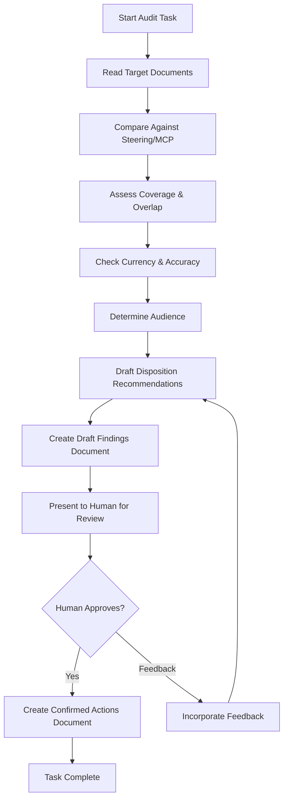
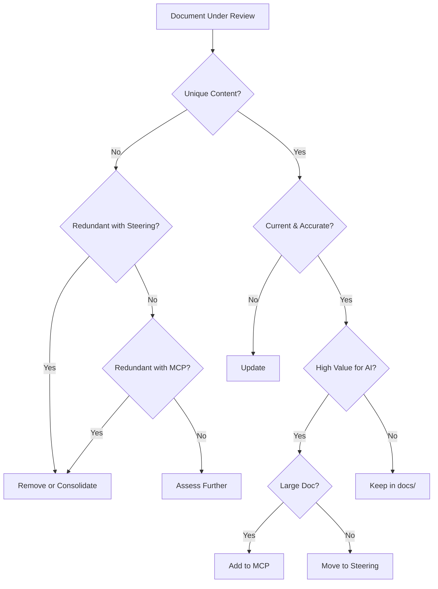

# Design Document: Documentation Architecture Audit

**Date**: 2025-12-30
**Spec**: 032 - Documentation Architecture Audit
**Status**: Design Phase
**Dependencies**: None

---

## Overview

This design defines the approach for auditing the `docs/` directory to assess coverage gaps, redundancy with steering/MCP documentation, and consolidation opportunities. The audit will evaluate ~19,000 lines across 34 files using a systematic per-document assessment framework.

The audit is primarily a documentation review process, not a code implementation. The design focuses on:
1. Assessment methodology and criteria
2. Findings document structure
3. Disposition decision framework
4. MCP integration approach

---

## Architecture

### Audit Workflow



### Disposition Decision Tree



---

## Components and Interfaces

### Audit Findings Document Structure

Each audit task produces findings documents following a two-phase workflow adapted from Test Failure Audit Methodology:

#### Phase 1: Draft Findings Document

Location: `.kiro/specs/032-documentation-architecture-audit/findings/draft-[category]-findings.md`

```markdown
# Draft Audit Findings: [Directory/Category Name]

**Date**: [Audit Date]
**Auditor**: AI Agent
**Scope**: [Files audited]
**Status**: DRAFT - Awaiting Human Review

---

## Summary

| File | Lines | Recommended Disposition | Rationale |
|------|-------|------------------------|-----------|
| file1.md | 500 | Keep | Unique value |
| file2.md | 300 | Remove | Redundant with X |

---

## Items Requiring Human Decision

These items have ambiguous disposition or significant impact:

1. **[filename.md]**: [Brief description of why human input needed]
2. **[filename.md]**: [Brief description of why human input needed]

---

## Detailed Assessments

### [filename.md]

**Size**: [X lines]

**Coverage Analysis**:
- Topics covered: [list]
- Overlaps with steering: [specific docs and sections]
- Overlaps with MCP: [specific docs and sections]
- Unique content: [what's not covered elsewhere]

**Audience Assessment**:
- Primary audience: [AI agents / human developers / both]
- Recommendation: [stay in docs / move to steering / add to MCP]

**Currency Check**:
- Last update: [if detectable]
- Outdated references: [list any]
- Alignment with True Native: [yes/no/partial]

**Recommended Disposition**: [Keep / Update / Move to Steering / Add to MCP / Consolidate / Remove]

**Rationale**: [Explanation of recommendation]

**Confidence Level**: [High / Medium / Low] - [reason for confidence level]
```

#### Phase 2: Confirmed Actions Document

Created after Human review. Location: `.kiro/specs/032-documentation-architecture-audit/findings/confirmed-[category]-actions.md`

```markdown
# Confirmed Actions: [Directory/Category Name]

**Date**: [Confirmation Date]
**Reviewed By**: Human (Peter)
**Status**: CONFIRMED - Ready for Execution

---

## Confirmed Dispositions

| File | Confirmed Action | Human Notes |
|------|-----------------|-------------|
| file1.md | Keep | Approved as recommended |
| file2.md | Keep (changed from Remove) | Has historical value |

---

## Decisions Made

### [filename.md]
- **Original Recommendation**: [disposition]
- **Confirmed Action**: [disposition]
- **Human Rationale**: [if changed or additional context]

---

## Action Items for Task 10 (Consolidation)

- [ ] [Specific action with file path]
- [ ] [Specific action with file path]
```

### Steering Comparison Reference

For each audit, the agent will reference these steering docs for overlap detection:

| Steering Doc | Key Topics to Compare |
|--------------|----------------------|
| Component Development Guide | Token usage, component patterns, True Native |
| Token Resolution Patterns | Token types, validation, type safety |
| Test Development Standards | Test categories, patterns, anti-patterns |
| Test Failure Audit Methodology | Audit workflow, pattern identification |
| Cross-Platform Decision Framework | Platform-specific vs cross-platform |
| Development Workflow | Task completion, git, hooks, troubleshooting |
| Technology Stack | Platform technologies, CSS standards |
| Browser Distribution Guide | Web component loading, ESM/UMD |
| Core Goals | Project context, token usage principles |
| A Vision of the Future | Architectural philosophy |

### MCP Integration Interface

For documents recommended for MCP addition:

1. **Verify MCP health** before adding
2. **Add metadata header** to document:
   ```markdown
   **Date**: [Date]
   **Purpose**: [Clear description]
   **Organization**: [appropriate value]
   **Scope**: [scope]
   **Layer**: [0-3]
   **Relevant Tasks**: [task types]
   ```
3. **Move to `.kiro/steering/`** (MCP indexes this directory)
4. **Rebuild MCP index** via `rebuild_index` tool
5. **Verify health** shows "healthy" status

---

## Data Models

### Disposition Types

```typescript
type Disposition = 
  | 'keep'           // Unique value, correct location, current
  | 'update'         // Valuable but needs refresh
  | 'move-steering'  // AI-focused, should be in steering
  | 'add-mcp'        // Large reference doc, good MCP candidate
  | 'consolidate'    // Merge with existing doc
  | 'remove';        // Redundant, stale, or irrelevant
```

### Assessment Criteria

```typescript
interface DocumentAssessment {
  path: string;
  lines: number;
  
  coverage: {
    topics: string[];
    steeringOverlaps: Array<{ doc: string; sections: string[] }>;
    mcpOverlaps: Array<{ doc: string; sections: string[] }>;
    uniqueContent: string[];
  };
  
  audience: 'ai-agents' | 'human-developers' | 'both';
  
  currency: {
    lastUpdate: string | null;
    outdatedReferences: string[];
    trueNativeAlignment: 'yes' | 'no' | 'partial';
  };
  
  disposition: Disposition;
  rationale: string;
  actionItems: string[];
}
```

---

## Error Handling

### Audit Edge Cases

1. **Empty files**: Verify no references exist, recommend removal
2. **Very large files**: May need to read in sections to avoid context limits
3. **Unclear purpose**: Flag for human review if disposition is ambiguous
4. **Cross-references**: Track and update if files are moved/removed

### MCP Integration Errors

1. **Index rebuild fails**: Log error, continue with manual verification
2. **Health check degraded**: Identify stale file, rebuild index
3. **Document not indexed**: Verify metadata format, check file location

---

## Testing Strategy

This spec is primarily documentation work, not code implementation. Testing consists of:

### Validation Approach

1. **Per-task validation**: Each audit findings document reviewed for completeness
2. **Disposition consistency**: Verify similar documents get similar treatment
3. **Cross-reference integrity**: After consolidation, verify no broken links
4. **MCP health**: Final verification that MCP index is healthy

### Success Metrics

- All 34 documents have documented dispositions
- No undocumented redundancy remains
- MCP index healthy after changes
- Cross-references updated where needed

---

## Design Decisions

### Decision 1: Per-Directory Task Structure

**Options Considered**:
1. Single task auditing all docs
2. Per-file tasks
3. Per-directory tasks with size-based splitting

**Decision**: Per-directory tasks with large root docs split by size

**Rationale**: 
- Directories represent coherent topic areas
- Avoids context limits by keeping each task focused
- Size-based splitting for root docs prevents any single task from being too large
- Allows parallel execution by different agents/sessions

**Trade-offs**: More tasks to track, but better context management

### Decision 2: Value-Based MCP Inclusion

**Options Considered**:
1. Token count threshold (e.g., >5000 tokens)
2. Reference frequency
3. Value-based assessment

**Decision**: Value-based assessment

**Rationale**: The question is "Does this improve understanding and enhance ability to maintain, enhance, and/or leverage this design system?" Token count is a constraint (large docs benefit from MCP's progressive disclosure), but value drives the decision.

**Trade-offs**: More subjective, but avoids adding low-value large docs or excluding high-value small docs

### Decision 3: Delete Rather Than Archive

**Options Considered**:
1. Move to `docs/archive/` folder
2. Delete with Git as backup
3. Keep everything

**Decision**: Delete with Git history as archive

**Rationale**: Archive folders become graveyards. Git history provides recovery if needed. Clean deletion keeps the docs directory focused.

**Trade-offs**: Slightly harder to recover (requires Git knowledge), but cleaner structure

### Decision 4: Findings Document Per Task

**Options Considered**:
1. Single consolidated findings document
2. Per-task findings documents
3. Inline comments in existing docs

**Decision**: Per-task findings documents in `.kiro/specs/032-documentation-architecture-audit/findings/`

**Rationale**: 
- Keeps each audit self-contained
- Allows incremental progress
- Provides audit trail for decisions
- Can be consolidated at end if desired

**Trade-offs**: More files, but better traceability

### Decision 5: Human Review Checkpoint Pattern

**Options Considered**:
1. AI makes all disposition decisions autonomously
2. Human reviews only "risky" decisions (deletions)
3. Human reviews all findings before any actions

**Decision**: Two-phase workflow with Human review of all findings before confirmation

**Rationale**: Adapted from Test Failure Audit Methodology (Phase 3: Confirmation). Benefits:
- Documentation decisions are subjective; Human perspective catches blind spots
- Some docs may have historical context AI doesn't know
- Deletion is permanent (even with Git recovery, it's friction)
- Prevents unilateral AI decisions on documentation architecture
- Builds trust through transparency

**Trade-offs**: Adds a checkpoint to each task, but the value of Human oversight outweighs the extra step. The checkpoint is lightweight (review summary table, confirm or adjust).

---

## Implementation Notes

### Task Execution Pattern

Each audit task follows this two-phase pattern (adapted from Test Failure Audit Methodology):

**Phase 1: Audit & Draft Findings**
1. **Read target documents** in scope
2. **Query MCP** for relevant steering doc sections
3. **Compare content** for overlaps and unique value
4. **Assess currency** against current architecture
5. **Determine disposition** using decision tree
6. **Create draft findings document** with recommendations
7. **Flag items requiring Human decision** (ambiguous, high-impact)

**Phase 2: Human Review & Confirmation**
8. **Present draft findings** to Human for review
9. **Highlight**: Items requiring decision, potential deletions, MCP candidates
10. **Incorporate feedback** and adjust recommendations as directed
11. **Create confirmed actions document** with final dispositions
12. **Execute quick wins** only after confirmation (e.g., remove empty files)

### Human Review Checkpoint

The Human review checkpoint is lightweight but mandatory:

**What AI Presents**:
- Summary table of all files with recommended dispositions
- Items flagged for Human decision (with rationale)
- Confidence levels for each recommendation

**What Human Provides**:
- Approval of recommendations (or adjustments)
- Additional context AI may not have
- Final decision on ambiguous items

**When to Proceed**:
- Only after explicit Human confirmation
- Confirmed actions document created
- No disposition actions until Task 10 (Consolidation)

### Context Management

Given the large document sizes, agents should:
- Read documents in full when possible
- Use MCP's `get_section` for targeted steering comparisons
- Avoid loading multiple large docs simultaneously
- Document findings incrementally to preserve context

### Consolidation Task (Task 10)

The final task executes all Human-confirmed recommendations:
1. Review all confirmed actions documents from Tasks 1-9
2. Remove files marked for deletion (only confirmed ones)
3. Move files to steering (with metadata)
4. Update MCP index
5. Fix broken cross-references
6. Verify final state
7. Present summary to Human for final verification

---

## Related Documentation

- Design Outline: `.kiro/specs/032-documentation-architecture-audit/design-outline.md`
- Requirements: `.kiro/specs/032-documentation-architecture-audit/requirements.md`
- MCP Server: `mcp-server/README.md`
- File Organization Standards: `.kiro/steering/File Organization Standards.md`
- Test Failure Audit Methodology: `.kiro/steering/Test Failure Audit Methodology.md` (source of Human Review checkpoint pattern)
