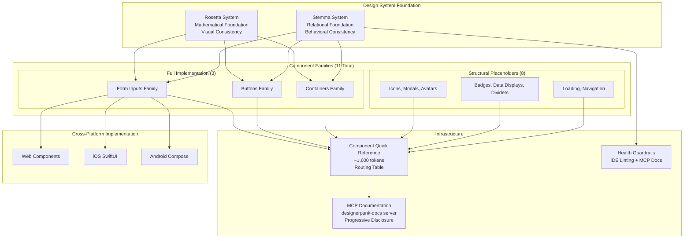

# Design Document: Component Architecture System

**Date**: 2025-12-31
**Spec**: 034 - Component Architecture System
**Status**: Design Phase
**Dependencies**: None

---

## Overview

The Component Architecture System (Stemma System) establishes foundational principles and infrastructure for systematic component development across web, iOS, and Android platforms. This system complements the existing Rosetta System by providing relational component foundation that handles behavioral consistency, family inheritance patterns, and composition relationships.

**Rosetta + Stemma Integration**:
- **Rosetta System**: Mathematical relationships and token hierarchy (how things look and scale)
- **Stemma System**: Family relationships and component hierarchy (how things behave and relate)
- Together: Complete design system foundation covering both visual consistency (Rosetta) and behavioral consistency (Stemma)

The Stemma System introduces AI-optimal naming conventions, comprehensive documentation infrastructure, and health guardrails that enable systematic component discovery and usage.

## Architecture

### Stemma System Foundation

The Stemma System operates on four core principles that govern all component development:

1. **Family Inheritance Patterns**: Components are organized into families with primitive components (Base suffix) serving as foundational bases for semantic components
2. **Behavioral Contracts**: Each component guarantees consistent behaviors across platforms through explicit contracts
3. **Composition Relationships**: Systematic patterns define how components work together in real-world scenarios
4. **Cross-Platform Consistency**: Behavioral contracts work uniformly across web, iOS, and Android with platform-appropriate implementations

### System Architecture Diagram



### AI-Optimal Component Naming Convention

The naming convention encodes hierarchy and relationships directly in component names for systematic AI agent discovery:

**Pattern**: `[Family]-[Type]-[Variant]`

| Component | Type | Description |
|-----------|------|-------------|
| `Input-Text-Base` | Primitive | Foundational text input behaviors |
| `Input-Text-Email` | Semantic | Email validation + autocomplete |
| `Input-Text-Password` | Semantic | Secure input + password toggle |
| `Input-Text-PhoneNumber` | Semantic | Phone formatting + international validation |

**AI Agent Benefits**:
- Predictable naming enables component name inference without documentation lookup
- Self-documenting hierarchy makes inheritance relationships explicit
- Systematic discovery through prefix-based auto-completion
- Clear primitive vs semantic distinction through "Base" suffix

### Health Guardrails Architecture

**Dual Mechanism Approach** - "Guidance at point of consumption rather than checkpoints":

| Mechanism | Purpose | Feedback Type |
|-----------|---------|---------------|
| IDE Linting | Catch structural issues immediately | Real-time |
| MCP Documentation | Provide contextual understanding | On-demand |

**IDE Linting (Real-time)**:
- Component naming convention validation
- Token usage validation (catch inline styles, missing tokens)
- Required property checks
- Basic accessibility compliance

**MCP Documentation (Contextual)**:
- Component Quick Reference for routing to detailed docs
- Family-specific MCP documents with behavioral contracts
- Usage guidelines and composition patterns
- AI agent guidance for systematic component discovery

## Components and Interfaces

### Component Family Structure

Each component family follows a consistent inheritance pattern:

```yaml
Family Structure:
  Primitive Component:
    - Provides foundational behaviors
    - Named with "Base" suffix
    - Legitimate for coverage gaps (unlike tokens)
    - Serves as inheritance foundation
  
  Semantic Components:
    - Inherit from primitive base
    - Add specialized functionality
    - Named with descriptive variants
    - Preferred when available
```

### Form Inputs Family Implementation

**Input-Text-Base (Primitive)**:
```yaml
Input-Text-Base:
  type: primitive
  family: FormInputs
  behaviors: [focusable, validatable, float-label]
  properties:
    label: string (required)
    value: string
    placeholder: string
    disabled: boolean
  contracts:
    - provides_float_label_animation
    - validates_on_blur
    - supports_error_states
  tokens: [typography.input.*, color.*, space.*, motion.float-label.*]
  platforms: [web, ios, android]
  readiness: production-ready
```

**Input-Text-Email (Semantic)**:
```yaml
Input-Text-Email:
  type: semantic
  family: FormInputs
  inherits: Input-Text-Base
  extends:
    validation: email_format
    autocomplete: email
    properties:
      type: "email" (fixed)
  contracts:
    - validates_email_format
    - provides_email_autocomplete
    - inherits_all_input_text_base_contracts
  platforms: [web, ios, android]
  readiness: production-ready
```

**Input-Text-Password (Semantic)**:
```yaml
Input-Text-Password:
  type: semantic
  family: FormInputs
  inherits: Input-Text-Base
  extends:
    validation: password_security
    autocomplete: current-password
    properties:
      type: "password" (fixed)
      showPassword: boolean
  contracts:
    - provides_secure_input
    - supports_password_toggle
    - inherits_all_input_text_base_contracts
  platforms: [web, ios, android]
  readiness: production-ready
```

**Input-Text-PhoneNumber (Semantic)**:
```yaml
Input-Text-PhoneNumber:
  type: semantic
  family: FormInputs
  inherits: Input-Text-Base
  extends:
    validation: phone_format
    autocomplete: tel
    formatting: phone_number_mask
    properties:
      type: "tel" (fixed)
      countryCode: string
  contracts:
    - validates_phone_format
    - provides_phone_formatting
    - supports_international_formats
    - inherits_all_input_text_base_contracts
  platforms: [web, ios, android]
  readiness: production-ready
```

### All 11 Component Families

| Family | Shared Need/Purpose | Phase 1 Status |
|--------|---------------------|----------------|
| **Buttons** | User interaction and actions | Full (ButtonCTA exists) |
| **Form Inputs** | Data collection and validation | Full (4 components) |
| **Containers** | Layout and content organization | Full (PD-Container exists) |
| Icons | Visual communication | Placeholder |
| Modals | Overlay interactions | Placeholder |
| Avatars | Identity representation | Placeholder |
| Badges & Tags | Status and labeling | Placeholder |
| Data Displays | Information presentation | Placeholder |
| Dividers | Visual separation | Placeholder |
| Loading | Progress indication | Placeholder |
| Navigation | Wayfinding | Placeholder |

### Component Quick Reference System

The Component Quick Reference serves as a routing table for all component families:

**Structure** (following Token Quick Reference pattern):
```markdown
# Component Quick Reference

## Purpose
Routing table for component documentation - helps find right MCP document

## Component Documentation Map
| Component Family | Shared Need/Purpose | MCP Document Path |
| Buttons | User interaction and actions | `.kiro/steering/button-components.md` |
| Form Inputs | Data collection and validation | `.kiro/steering/form-input-components.md` |
...

## Common Composition Patterns
### Login Form
- Form Inputs: Input-Text-Email, Input-Text-Password
- Buttons: ButtonCTA (primary for submit)
- Containers: Simple container for layout

### Feed Post
- Avatars: AvatarUser
- Buttons: ButtonIcon, ButtonMedia
- Data Displays: Text content, media display

## MCP Query Examples
[Progressive disclosure workflow examples]
```

**Content Requirements**:
- All 11 component families included regardless of implementation status
- Clear routing paths to MCP documentation
- ~1,600 tokens target for efficient loading (soft target - prioritize documentation quality over strict token count)
- Extends existing designerpunk-docs MCP server

### MCP Architecture: Systems MCP vs Application MCP

**Current Scope (Spec 034)**: This spec extends the existing `designerpunk-docs` MCP server with component family documentation. This serves the **Systems MCP** use case - supporting development and maintenance of the design system itself.

**Future Scope (Deferred)**: A separate **Application MCP** server will be created in a future spec to support product development using the design system. This is deferred until sufficient component families are implemented.

| MCP Server | Purpose | Audience | Current Status |
|------------|---------|----------|----------------|
| **Systems MCP** | Development and maintenance | System architects, component developers | This spec (034) |
| **Application MCP** | Product development | Product developers, application teams | Future spec |

**Architectural Preparation**: Documentation structure in this spec is designed to support both use cases:
- Component Quick Reference serves as shared routing table for both servers
- Composition patterns documented in format extractable by Application MCP
- Usage guidelines separated from architectural details
- Progressive disclosure workflow applicable to both servers

**Application MCP Trigger Criteria**: Consider creating Application MCP spec when:
- 5+ component families are fully implemented (not just placeholders)
- Common composition patterns are validated through real usage
- Product development teams express need for "how to build X" documentation
- Systems MCP has stabilized and proven effective for system development

**Why Two MCP Servers?**:
- **Different Query Patterns**: Systems MCP answers "How do I create a component?" while Application MCP answers "How do I build a login form?"
- **Different Documentation Needs**: Systems MCP needs deep architectural knowledge; Application MCP needs practical recipes
- **Optimized Context Loading**: Each server loads context appropriate to its use case

## Data Models

### Component Schema Format

Components are defined using YAML schemas that capture behavioral contracts and inheritance relationships.

**Schema File Location**: Each component's YAML schema lives in its component directory to maintain colocation with implementation. This ensures schemas stay in sync with code and enables atomic changes when components are renamed or moved.

**Pattern**: `src/components/core/[Component-Name]/[Component-Name].schema.yaml`

**Examples**:
- `src/components/core/Input-Text-Base/Input-Text-Base.schema.yaml`
- `src/components/core/Button-CTA-Primary/Button-CTA-Primary.schema.yaml`
- `src/components/core/Container-Layout-Base/Container-Layout-Base.schema.yaml`

**Rationale**:
- **Colocation**: Schema lives with the code it describes
- **Discoverability**: Opening a component folder shows everything about that component
- **Atomic changes**: Renaming/moving a component moves its schema too
- **Consistency**: Follows existing pattern of `types.ts`, `tokens.ts` in component directories

```yaml
ComponentSchema:
  name: string                    # Component name following naming convention
  type: primitive | semantic      # Component type
  family: string                  # Family name (FormInputs, Buttons, etc.)
  inherits?: string              # Parent component (for semantic components)
  behaviors: string[]            # Reusable behaviors (focusable, validatable, etc.)
  properties:                    # Component properties
    [property]: type (required|optional)
  contracts: string[]            # Behavioral guarantees
  tokens: string[]               # Required design tokens
  platforms: string[]            # Supported platforms
  readiness: ReadinessStatus     # Component readiness indicator
  extends?:                      # Extensions for semantic components
    validation?: string
    autocomplete?: string
    formatting?: string
    properties?: object
```

### Readiness Status System

Components and families use standardized readiness indicators:

| Status | Indicator | Description | Usage |
|--------|-----------|-------------|-------|
| Production Ready | 🟢 | Fully implemented, tested, safe for production | Recommended for all development |
| Beta | 🟡 | Implemented but may have minor issues | Safe for development, caution in production |
| Placeholder | 🔴 | Structural definition only | Do not use - architectural planning only |
| Deprecated | ⚠️ | Being phased out | Migrate to recommended alternatives |

### MCP Documentation Structure

Each component family has structured MCP documentation:

```yaml
MCPDocumentStructure:
  metadata:
    family: string
    purpose: string
    readiness: ReadinessStatus
  
  sections:
    - family_overview
    - inheritance_structure
    - component_details
    - behavioral_contracts
    - usage_guidelines
    - token_dependencies
    - cross_platform_notes
    - examples
```

## Correctness Properties

*A property is a characteristic or behavior that should hold true across all valid executions of a system—essentially, a formal statement about what the system should do. Properties serve as the bridge between human-readable specifications and machine-verifiable correctness guarantees.*

### Behavioral Properties (PBT-Testable) - Evergreen

These properties can be verified through property-based testing with generated inputs. All are evergreen tests that provide ongoing value as the Stemma System grows.

**Property 1: Component Naming Convention Compliance**
*For any* component in the Stemma System, the component name should follow the pattern [Family]-[Type]-[Variant] with primitive components using "Base" suffix and semantic components using descriptive variants.
**Validates: Requirements 2.1, 2.2, 2.3**
**Test Approach**: Generate random component names and verify parsing extracts correct family, type, and variant; verify "Base" suffix correctly identifies primitives.
**Test Category**: Evergreen (permanent naming convention)

**Property 2: Component Inheritance Consistency**
*For any* semantic component, it should inherit from its family's primitive base component and extend with specialized functionality while maintaining all base contracts.
**Validates: Requirements 1.2, 4.3, 4.4, 4.5**
**Test Approach**: For each semantic component, verify it references a valid base component and that all base contracts are present in the semantic component's contract list.
**Test Category**: Evergreen (permanent inheritance pattern)

**Property 3: Component Schema Validation**
*For any* component schema definition, it should contain all required fields (name, type, family, behaviors, properties, contracts, tokens, platforms, readiness) with valid values.
**Validates: Requirements 1.1, 10.2**
**Test Approach**: Generate component schemas with various field combinations and verify validation correctly identifies missing or invalid fields.
**Test Category**: Evergreen (permanent schema requirements)

### Integration Properties (Automated Tests) - Evergreen

These properties are verified through integration tests that check consistency across system components. All are evergreen tests.

**Property 4: Readiness Status Consistency**
*For any* component, its readiness status should be one of the valid values (production-ready, beta, placeholder, deprecated) and should be consistently applied across all documentation references.
**Validates: Requirements 13.1, 13.2, 13.5**
**Test Approach**: Query component readiness from multiple sources (schema, Quick Reference, MCP docs) and verify consistency.
**Test Category**: Evergreen (permanent readiness system)

**Property 5: MCP Progressive Disclosure Workflow**
*For any* component family MCP documentation, it should support progressive disclosure with document summary, specific sections, and full document query options returning valid content.
**Validates: Requirements 7.3, 5.4**
**Test Approach**: For each MCP document, verify summary query returns metadata and outline, section queries return targeted content, and full document query returns complete content.
**Test Category**: Evergreen (permanent MCP workflow)

### Structural Properties (Static Analysis) - Evergreen

These properties are verified through static analysis of documentation and configuration files.

**Property 6: Component Quick Reference Routing Completeness**
*For all* 11 component families, the Component Quick Reference should include routing entries with family name, shared need/purpose, and valid MCP document path.
**Validates: Requirements 5.2, 10.3**
**Verification**: Static analysis of Component Quick Reference document to verify all families are listed with required fields.
**Test Category**: Evergreen (permanent documentation structure)

**Property 7: Component Family Documentation Completeness**
*For any* component family (implemented or placeholder), it should have MCP documentation that includes inheritance structures, behavioral contracts, token dependencies, and usage guidelines sections.
**Validates: Requirements 7.1, 7.2, 7.4, 10.2**
**Verification**: Static analysis of MCP documents to verify required sections exist.
**Test Category**: Evergreen (permanent documentation requirements)

**Property 8: Health Guardrails Rule Coverage**
*For any* linting rule in the health guardrails system, it should have a corresponding error message template and correction guidance.
**Validates: Requirements 8.1, 8.5**
**Verification**: Static analysis of linting configuration to verify all rules have associated guidance.
**Test Category**: Evergreen (permanent linting system)

### Process Properties (Manual Verification) - Evergreen

These properties require human review and cannot be fully automated.

**Property 9: Cross-Platform Behavioral Contract Consistency**
*For any* component implemented across platforms, it should maintain identical behavioral contracts while using platform-appropriate implementations.
**Validates: Requirements 6.1, 6.2, 6.3, 6.5**
**Verification**: Manual review of platform implementations to verify behavioral contracts are honored; automated tests can verify contract presence but not semantic equivalence.
**Test Category**: Evergreen (permanent cross-platform requirement)

**Property 10: Family Development Standards Compliance**
*For any* new component family, it should follow established Stemma System patterns, behavioral contract standards, and documentation requirements.
**Validates: Requirements 12.2, 12.3, 12.4, 12.5**
**Verification**: Manual review against family development checklist; automated checks for structural compliance.
**Test Category**: Evergreen (permanent development standards)

## Error Handling

### Component Development Errors

**Invalid Naming Convention**:
- **Detection**: IDE linting validates component names against [Family]-[Type]-[Variant] pattern
- **Response**: Clear error message with correct naming example and link to naming guidelines
- **Recovery**: Provide suggested correct name based on component purpose

**Missing Behavioral Contracts**:
- **Detection**: Schema validation checks for required contracts based on component type
- **Response**: Error listing missing contracts with explanations of what each contract provides
- **Recovery**: Template generation for missing contract implementations

**Cross-Platform Inconsistency**:
- **Detection**: Automated testing verifies behavioral contracts work identically across platforms
- **Response**: Detailed report of inconsistencies with platform-specific differences highlighted
- **Recovery**: Guidance on maintaining contracts while allowing platform-appropriate implementations

### Documentation Errors

**Missing MCP Documentation**:
- **Detection**: Validation checks that all families have required MCP documents
- **Response**: Error listing missing documentation sections with templates
- **Recovery**: Auto-generation of placeholder documentation structure

**Incorrect Readiness Status**:
- **Detection**: Automated validation compares component implementation against readiness claims
- **Response**: Warning about readiness mismatch with recommended status
- **Recovery**: Guidance on requirements for each readiness level

### Usage Errors

**Inappropriate Primitive Usage**:
- **Detection**: Linting detects primitive component usage when semantic alternative exists
- **Response**: Suggestion to use semantic component with migration guidance
- **Recovery**: Note that primitive usage IS legitimate for coverage gaps (unlike tokens)

**Missing Required Properties**:
- **Detection**: Property validation checks component usage against schema requirements
- **Response**: Error listing missing properties with type information and examples
- **Recovery**: Auto-completion suggestions for missing properties

## Testing Strategy

### Dual Testing Approach

The Stemma System requires both unit testing and property-based testing for comprehensive coverage:

**Unit Tests**: Verify specific examples, edge cases, and error conditions
- Component instantiation with valid properties
- Error handling for invalid inputs
- Platform-specific implementation details
- Integration points between components

**Property Tests**: Verify universal properties across all inputs
- Component naming convention compliance (minimum 100 iterations)
- Inheritance relationship consistency
- Schema validation completeness
- Documentation structure verification

### Test Categories per Test Development Standards

All Stemma System tests are **Evergreen** because they verify permanent architectural behaviors:

| Property Type | Test Category | Rationale |
|---------------|---------------|-----------|
| Behavioral (1-3) | Evergreen | Permanent naming, inheritance, schema requirements |
| Integration (4-5) | Evergreen | Permanent readiness and MCP workflow |
| Structural (6-8) | Evergreen | Permanent documentation structure |
| Process (9-10) | Evergreen | Permanent cross-platform and standards compliance |

**Temporary Tests** (retire after completion):
- Audit-related tests checking specific anti-patterns in ButtonCTA/PD-Container
- Migration tracking tests for TextInputField → Input-Text-Base
- These should be explicitly marked with retirement criteria

### Property-Based Testing Configuration

Behavioral properties (Properties 1-3) must be implemented as property-based tests with minimum 100 iterations:

| Property | Tag | Test Focus |
|----------|-----|------------|
| 1 | `component-architecture-system, Property 1` | Naming convention compliance |
| 2 | `component-architecture-system, Property 2` | Inheritance consistency |
| 3 | `component-architecture-system, Property 3` | Schema validation |

### Integration Testing Configuration

Integration properties (Properties 4-5) are verified through integration tests:

| Property | Tag | Test Focus |
|----------|-----|------------|
| 4 | `component-architecture-system, Property 4` | Readiness status consistency |
| 5 | `component-architecture-system, Property 5` | MCP progressive disclosure |

### Static Analysis Configuration

Structural properties (Properties 6-8) are verified through static analysis:

| Property | Verification Method |
|----------|---------------------|
| 6 | Static analysis of Component Quick Reference - verify all 11 families listed |
| 7 | Static analysis of MCP documents - verify required sections exist |
| 8 | Static analysis of linting configuration - verify all rules have guidance |

### Manual Verification Checklist

Process properties (Properties 9-10) require manual review:

| Property | Review Focus |
|----------|--------------|
| 9 | Cross-platform behavioral contract consistency - review platform implementations |
| 10 | Family development standards compliance - review against checklist |

### Testing Integration with Linting

| Validation Type | Mechanism | When to Use |
|-----------------|-----------|-------------|
| Static Analysis (Linting) | IDE real-time | Naming conventions, schema compliance, token usage |
| Unit Tests | Runtime | Specific examples, edge cases, error conditions |
| Integration Tests | Runtime | Component interaction, composition patterns, readiness consistency |
| Property Tests | Runtime | Universal properties across all inputs |
| Manual Validation | Human review | Documentation quality, architectural compliance |

---

*This design document establishes the complete architecture for the Stemma System, providing systematic component development that complements the Rosetta System with behavioral consistency and relationship management across all platforms.*
