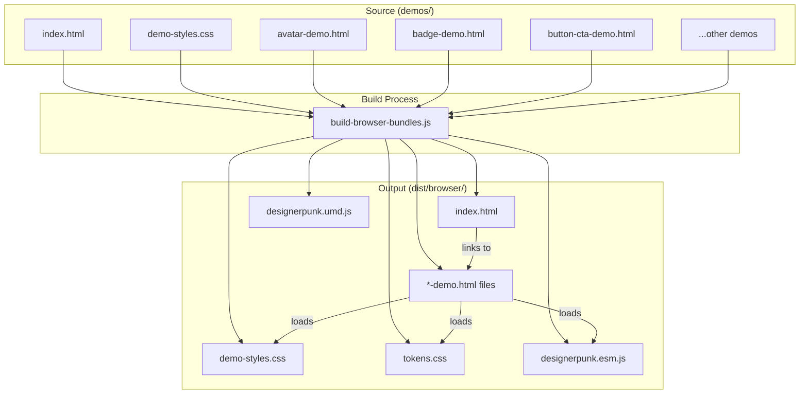

# Design Document: Component Demo System

**Date**: January 2026
**Spec**: 061 - Component Demo System
**Status**: Design Phase

---

## Overview

The Component Demo System provides a standardized infrastructure for creating, organizing, and serving interactive demo pages for all DesignerPunk web component families. It replaces the current ad-hoc approach (3 manually created demo files in `dist/browser/`) with a structured system that includes a central index page, a shared demo stylesheet, a consistent page template, and build integration.

The system is intentionally simple: static HTML files with a shared CSS file, served via a local HTTP server. No framework, no build-time HTML generation, no JavaScript templating. Each demo is a hand-authored HTML file that uses the existing browser bundle and token CSS.

---

## Demo Page Grouping Strategy

**Grouping Philosophy:** Functional cohesion over inheritance hierarchy. Components are grouped when they serve the same user goal, provide comparison value side-by-side, or share significant behavioral patterns.

**Resolved Groupings:**
- **Button family:** 3 separate demos (Button-CTA, Button-Icon, Button-VerticalList serve distinct use cases)
- **Input-Text family:** 1 combined demo (all variants serve same core purpose with minor differences)
- **Input-Checkbox family:** 1 combined demo (Legal is specialized variant of Base)
- **Input-Radio family:** 1 combined demo (Set is compositional wrapper around Base)
- **Container family:** 2 separate demos (Base is generic primitive, Card is specialized semantic container)
- **Progress family:** 3 demos (primitives separate, Pagination separate, Steppers together for comparison)

**Total demo pages: 16** (comprehensive coverage without unnecessary fragmentation)

---

### Design Decisions

**Decision 1: Demo Scope - Comprehensive Coverage**

**Options Considered:**
- A) Create demos for all component families with web implementations (~15-20 demo pages)
- B) Create demos only for components registered in the browser bundle
- C) Create demos for high-priority components first, defer others

**Decision:** Option A — comprehensive coverage of all component families with web implementations.

**Rationale:**
- The project is approaching a validation checkpoint before production use
- Visual design review requires comprehensive coverage (can't review what you can't see)
- The component set is stabilizing (specs 049/050 may not get web implementations)
- Demos serve as visual validation for design review, not just developer documentation

**Trade-offs:**
- Larger scope (~15-20 demo pages vs. 5-6)
- Longer timeline (2-3 weeks vs. 1 week)
- But: provides complete visual inventory for design validation and production readiness assessment

**Implementation approach:** Phased delivery within the spec to validate the system before scaling (see Decision 4).

---

**Decision 2: Demo Maintenance Strategy**

**Options Considered:**
- A) Manual maintenance (developer updates demo when component changes)
- B) Automated validation (test fails if component API doesn't match demo)
- C) Generated demos (demos auto-generated from component schemas)

**Decision:** Option A — manual maintenance with checklist enforcement.

**Rationale:**
- Automated validation requires parsing HTML and comparing to component APIs (complex, brittle)
- Generated demos lose human-authored explanations and context that make demos valuable for visual review
- Manual maintenance with a checklist in the Component-Development-Guide is simple and sufficient
- Demos load components via the browser bundle — if the API changes and breaks the demo, it's immediately visible when loading the demo (inherent validation)

**Trade-offs:**
- Demos can drift if developers forget to update them
- But: the cost of automation outweighs the risk given the low frequency of API changes and inherent validation through demo loading

**Checklist addition to Component-Development-Guide:**
- [ ] Update component README with new API
- [ ] Update component demo page (if demo exists)
- [ ] Run demo locally to verify changes

**README addition:** "Demo Health Check" section documenting the maintenance expectation.

---

**Decision 3: Relationship to Component READMEs**

**Options Considered:**
- A) Demos replace READMEs (all documentation in demos)
- B) READMEs replace demos (all examples in READMEs)
- C) Demos and READMEs are complementary (different audiences, different purposes)

**Decision:** Option C — demos and READMEs serve different purposes.

**Rationale:**
- **READMEs** are for developers integrating components (code-focused, copy-paste examples, API reference)
- **Demos** are for visual design review and exploration (interactive, show all variants, visual comparison)
- **Audience overlap but different use cases:** README for "how do I use this?", demo for "what does this look like and how does it behave?"
- Demos are primarily for human visual validation, not documentation purposes

**Trade-offs:**
- Some duplication (usage examples appear in both)
- But: each serves its purpose better than a single unified approach

---

**Decision 4: Phased Delivery Within Spec**

**Options Considered:**
- A) Deliver all demos at once (single large task)
- B) Phased delivery within the spec (infrastructure + validation, then comprehensive coverage)
- C) Split into multiple specs (infrastructure spec, then coverage spec)

**Decision:** Option B — phased delivery within the spec.

**Rationale:**
- After 3-6 demos, patterns emerge: which sections are useful vs. boilerplate, whether shared CSS covers common patterns, whether index organization works
- Phasing allows learning and adaptation without reworking 20 demos
- Provides working system faster (Phase 1 = 1 week, Phase 2 = 1-2 weeks)
- Reduces risk of rework if guidelines or infrastructure need refinement
- Avoids coordination overhead of multiple specs

**Trade-offs:**
- Adds a checkpoint within the spec (slight coordination overhead)
- But: significantly reduces risk of large-scale rework

**Phase 1 deliverables:**
- Infrastructure (index, shared CSS, build integration, README with guidelines)
- 3 migrated demos (avatar, badge, checkbox)
- 3 new demos representing different complexity levels (Icon-Base, Button-CTA, Input-Text-Base)
- **Checkpoint: Review guidelines, refine shared CSS, validate approach**

**Phase 2 deliverables:**
- Remaining demos for all component families with web implementations
- Apply learnings from Phase 1

---

**Decision 5: Guidelines Over Template**

**Options Considered:**
- A) Rigid HTML template (all demos follow identical structure)
- B) Flexible guidelines (required elements + recommended sections + styling standards)
- C) No standards (each demo is completely custom)

**Decision:** Option B — flexible guidelines with required elements and recommended sections.

**Rationale:**
- Different components have different demo needs:
  - Button-CTA needs interactive state demos (hover, focus, press)
  - Input-Text needs validation state demos (error, success, helper text)
  - Progress-Stepper needs sequential flow demos (step 1 → 2 → 3)
  - Icon-Base needs a grid of all available icons
- A rigid template can't accommodate these differences without becoming overly complex
- Guidelines provide structure (consistency) without constraint (flexibility)
- Allows demos to showcase what's unique about each component

**Trade-offs:**
- More variation between demos (less uniformity)
- Requires more judgment from implementers
- But: demos are more useful and better showcase component capabilities

**Guidelines structure:**
- **Required elements** (all demos must have)
- **Recommended sections** (include if applicable)
- **Styling guidelines** (shared CSS, tokens, logical properties)
- **Organization guidelines** (grouping, labeling, explanations)

---

**Additional Architectural Decisions (Supporting Choices):**

These decisions support the five primary decisions above:

- **Static HTML over framework:** Demos are plain HTML files that load the existing ESM bundle. This avoids adding build dependencies and keeps demos accessible to anyone who can read HTML.

- **Shared CSS file over inline styles:** The existing demos duplicate ~100 lines of identical CSS. A shared `demo-styles.css` eliminates this duplication while allowing per-page overrides.

- **Source directory (`demos/`) separate from output (`dist/browser/`):** Demo source files live in `demos/` at the project root. The build script copies them to `dist/browser/` alongside the bundle and tokens. This keeps source and build artifacts cleanly separated.

- **No auto-generation of index:** The index page is manually maintained. With component families changing infrequently, auto-generation would add complexity without meaningful benefit. A manual checklist in the README is sufficient.

---

## Architecture



### File Flow

1. Developer authors demo HTML files in `demos/` directory
2. `npm run build` (or `npm run build:browser`) compiles bundles and copies demo files to `dist/browser/`
3. Developer starts a local server pointing at `dist/browser/`
4. Browser loads `index.html` → navigates to component demos → demos load `tokens.css`, `demo-styles.css`, and `designerpunk.esm.js`

---

## Components and Interfaces

### 1. Demo Index Page (`demos/index.html`)

The central navigation page. Lists all component demos organized by category.

**Structure:**
```html
<!DOCTYPE html>
<html lang="en">
<head>
  <meta charset="UTF-8">
  <meta name="viewport" content="width=device-width, initial-scale=1.0">
  <title>DesignerPunk Component Demos</title>
  <link rel="stylesheet" href="tokens.css">
  <link rel="stylesheet" href="demo-styles.css">
  <script type="module" src="designerpunk.esm.js"></script>
</head>
<body>
  <header class="demo-header">
    <h1>DesignerPunk Component Demos</h1>
    <p class="demo-subtitle">Interactive demos for all web component families</p>
  </header>
  <main class="demo-index">
    <!-- One section per category -->
    <section class="demo-category">
      <h2>Buttons</h2>
      <div class="demo-card-grid">
        <a href="button-cta-demo.html" class="demo-card">
          <span class="demo-card-title">Button-CTA</span>
          <span class="demo-card-desc">Call-to-action button with variants and icon support</span>
        </a>
        <!-- ...more cards -->
      </div>
    </section>
    <!-- ...more categories -->
  </main>
</body>
</html>
```

**Categories and component families:**

| Category | Component Families |
|----------|-------------------|
| Avatar | Avatar |
| Badge | Badge-Label-Base, Badge-Count-Base, Badge-Count-Notification |
| Button | Button-CTA, Button-Icon, Button-VerticalList-Item, Button-VerticalList-Set |
| Chip | Chip-Base, Chip-Filter, Chip-Input |
| Container | Container-Base, Container-Card-Base |
| Icon | Icon-Base |
| Input | Input-Text-Base, Input-Text-Email, Input-Text-Password, Input-Text-PhoneNumber, Input-Checkbox-Base, Input-Checkbox-Legal, Input-Radio-Base, Input-Radio-Set |
| Progress | Progress-Indicator-Node-Base, Progress-Indicator-Connector-Base, Progress-Indicator-Label-Base, Progress-Pagination-Base, Progress-Stepper-Base, Progress-Stepper-Detailed |

Note: Some families (Chip, Progress, Input-Radio, Container-Card) have web implementations but are not yet registered in the browser bundle (`browser-entry.ts`). Demo pages for these components will be created but may require the bundle to be updated first. The design accounts for this by noting bundle registration as a prerequisite per component.

### 2. Shared Demo Stylesheet (`demos/demo-styles.css`)

Extracted from the common CSS patterns in existing demos. Provides consistent layout, typography, and section styling.

**Key classes:**
</text>
</invoke>

```css
/* Base page styles */
.demo-page { /* body-level dark theme */ }
.demo-header { /* page title area */ }
.demo-subtitle { /* subtitle text */ }

/* Section containers */
.demo-section { /* dark card for each demo group */ }
.demo-note { /* callout box with left border */ }

/* Layout helpers */
.demo-row { /* flex row for component variants */ }
.demo-item { /* flex column for labeled component */ }
.demo-item-label { /* small label under component */ }
.demo-grid { /* responsive grid layout */ }

/* Code display */
.demo-code { /* pre/code block styling */ }

/* Interactive areas */
.demo-interactive { /* darker background for hover/focus demos */ }

/* Index page specific */
.demo-index { /* index page layout */ }
.demo-category { /* category section */ }
.demo-card-grid { /* grid of demo links */ }
.demo-card { /* individual demo link card */ }
.demo-card-title { /* card title */ }
.demo-card-desc { /* card description */ }

/* Token verification */
.demo-token-list { /* list of token references */ }
```

**CSS requirements:**
- Uses CSS logical properties (`padding-inline`, `margin-block`, etc.) per project standards
- Dark background using DesignerPunk design tokens where available, fallback hex values where tokens don't cover demo chrome
- Responsive: flexbox/grid layouts that work from 320px to 1920px
- No physical directional properties (no `padding-left`, `margin-right`, etc.)

### 3. Demo Page Guidelines

Demo pages follow flexible guidelines rather than a rigid template. Different components have different demo needs (Button-CTA needs interactive states, Input-Text needs validation states, Progress-Stepper needs sequential flows, Icon-Base needs an icon grid). Guidelines provide structure without constraint.

#### Required Elements (All Demos Must Have)

1. **Page metadata and resources:**
   ```html
   <head>
     <meta charset="UTF-8">
     <meta name="viewport" content="width=device-width, initial-scale=1.0">
     <title>{Component Family} Demo - DesignerPunk</title>
     <link rel="stylesheet" href="tokens.css">
     <link rel="stylesheet" href="demo-styles.css">
     <script type="module" href="designerpunk.esm.js"></script>
   </head>
   ```

2. **Page header with navigation:**
   ```html
   <header class="demo-header">
     <a href="index.html" class="demo-back-link">← All Components</a>
     <h1>{Component Family} Demo</h1>
     <p class="demo-subtitle">{Brief description}</p>
   </header>
   ```

3. **At least one usage example section:**
   - HTML code example showing how to use the component
   - JavaScript code example (if component has events or requires JS interaction)

4. **Token verification section:**
   - List of CSS custom properties the component uses
   - Helps verify tokens are loaded correctly

5. **Page footer:**
   ```html
   <footer class="demo-footer">
     <p>DesignerPunk Design System • {Component Family} Demo</p>
   </footer>
   ```

#### Recommended Sections (Include If Applicable)

- **Size variants:** If component has size prop (small, medium, large), show all sizes
- **Visual variants:** If component has variant/color/style props, show all variants
- **State variants:** Disabled, error, success, loading, etc.
- **Interactive states:** Hover, focus, active, pressed (for interactive components)
- **Accessibility features:** Keyboard navigation, ARIA attributes, screen reader behavior
- **Event handling:** If component emits events, show interactive examples with visible event output
- **Composition examples:** If component composes other components, show composition patterns

#### Styling Guidelines

1. **Use shared CSS classes from demo-styles.css for layout:**
   - `.demo-section` — container for each demo group
   - `.demo-row` — flex row for component variants
   - `.demo-item` — flex column for labeled component
   - `.demo-item-label` — small label under component
   - `.demo-grid` — responsive grid layout
   - `.demo-code` — pre/code block styling
   - `.demo-interactive` — darker background for hover/focus demos
   - `.demo-note` — callout box with left border

2. **Use DesignerPunk design tokens for any custom styling:**
   - No hard-coded colors, spacing, or typography values
   - Reference tokens via CSS custom properties (`var(--token-name)`)

3. **Use CSS logical properties:**
   - No physical directional properties (`padding-left`, `margin-right`, etc.)
   - Use logical equivalents (`padding-inline-start`, `margin-inline-end`, etc.)

4. **Dark background theme:**
   - Use DesignerPunk design tokens for backgrounds
   - Ensure sufficient contrast for readability

#### Organization Guidelines

1. **Group related examples in sections with clear headings:**
   ```html
   <div class="demo-section">
     <h2>Size Variants</h2>
     <p>Button-CTA supports three sizes: small, medium, and large.</p>
     <div class="demo-row">
       <!-- examples -->
     </div>
   </div>
   ```

2. **Label each example with descriptive text:**
   ```html
   <div class="demo-item">
     <button-cta label="Small" size="small"></button-cta>
     <span class="demo-item-label">Small (32px height)</span>
   </div>
   ```

3. **Show code alongside rendered examples where helpful:**
   - Helps developers understand how to achieve the demonstrated result

4. **Include brief explanations for complex interactions:**
   - Don't assume the visual alone is self-explanatory

#### Example Structure (Not a Template)

This shows one possible organization. Adapt to your component's needs:

```html
<!DOCTYPE html>
<html lang="en">
<head>
  <!-- Required metadata and resources -->
</head>
<body class="demo-page">
  <header class="demo-header">
    <!-- Required navigation -->
  </header>

  <main>
    <div class="demo-section">
      <h2>Overview</h2>
      <p>Brief description and basic usage</p>
      <!-- Live examples -->
    </div>

    <div class="demo-section">
      <h2>Variants</h2>
      <!-- Show all visual variants -->
    </div>

    <div class="demo-section">
      <h2>States</h2>
      <!-- Show all states (disabled, error, etc.) -->
    </div>

    <div class="demo-section">
      <h2>Interactive States</h2>
      <div class="demo-interactive">
        <!-- Hover/focus/active demos -->
      </div>
    </div>

    <div class="demo-section">
      <h2>Token Verification</h2>
      <ul class="demo-token-list">
        <li><code>--token-name</code> = expected value</li>
      </ul>
    </div>

    <div class="demo-section">
      <h2>Usage Examples</h2>
      <h3>HTML</h3>
      <pre class="demo-code"><!-- HTML example --></pre>
      <h3>JavaScript</h3>
      <pre class="demo-code">// JS example</pre>
    </div>
  </main>

  <footer class="demo-footer">
    <!-- Required footer -->
  </footer>
</body>
</html>
```

### 4. Build Integration

The `copyDemoFiles()` function is added to `scripts/build-browser-bundles.js`:

```javascript
function copyDemoFiles() {
  const DEMOS_DIR = path.join(__dirname, '..', 'demos');
  
  if (!fs.existsSync(DEMOS_DIR)) {
    console.log('      Note: No demos/ directory found, skipping demo copy');
    return false;
  }
  
  const files = fs.readdirSync(DEMOS_DIR)
    .filter(f => f.endsWith('.html') || f.endsWith('.css'));
  
  for (const file of files) {
    fs.copyFileSync(
      path.join(DEMOS_DIR, file),
      path.join(OUTPUT_DIR, file)
    );
  }
  
  console.log(`      Copied ${files.length} demo files to ${OUTPUT_DIR}`);
  return true;
}
```

Called in the `main()` function after bundle building and token copying:

```javascript
// Copy demo files
console.log('   Copying demo files...');
copyDemoFiles();
```

### 5. README (`demos/README.md`)

Documents the demo system for developers:

**Sections:**
1. Overview of the demo system
2. How to build demos (`npm run build`)
3. How to serve demos locally (`npx serve dist/browser` or `python -m http.server`)
4. How to create a new demo page (template, naming, index update)
5. Component family checklist (which demos exist, which are needed)

---

## Data Models

No persistent data models. The system is entirely static HTML/CSS files.

**File naming convention:**
- Demo pages: `{component-family-lowercase}-demo.html` (e.g., `button-cta-demo.html`, `avatar-demo.html`)
- Index: `index.html`
- Shared styles: `demo-styles.css`

**Component family to demo file mapping:**

| Component Family | Demo File | Status | Rationale |
|-----------------|-----------|--------|-----------|
| Avatar | `avatar-demo.html` | Migrate existing | Single component |
| Badge-Label-Base, Badge-Count-Base, Badge-Count-Notification | `badge-demo.html` | Migrate existing | Related variants, comparison value |
| Button-CTA | `button-cta-demo.html` | New | Distinct use case (text CTAs) |
| Button-Icon | `button-icon-demo.html` | New | Distinct use case (icon-only actions) |
| Button-VerticalList-Item, Button-VerticalList-Set | `button-vertical-list-demo.html` | New | Compositional pattern |
| Chip-Base, Chip-Filter, Chip-Input | `chip-demo.html` | New | Related variants, comparison value |
| Container-Base | `container-base-demo.html` | New | Generic layout primitive |
| Container-Card-Base | `container-card-demo.html` | New | Specialized semantic container |
| Icon-Base | `icon-base-demo.html` | New | Single component (icon grid) |
| Input-Text-Base, Input-Text-Email, Input-Text-Password, Input-Text-PhoneNumber | `input-text-demo.html` | New | Functional cohesion, minor variants |
| Input-Checkbox-Base, Input-Checkbox-Legal | `checkbox-demo.html` | Migrate existing | Base + specialized variant |
| Input-Radio-Base, Input-Radio-Set | `radio-demo.html` | New | Base + compositional wrapper |
| Progress-Indicator-Node-Base, Progress-Indicator-Connector-Base, Progress-Indicator-Label-Base | `progress-indicator-demo.html` | New | Compositional primitives |
| Progress-Pagination-Base | `progress-pagination-demo.html` | New | Distinct pattern (page indicators) |
| Progress-Stepper-Base, Progress-Stepper-Detailed | `progress-stepper-demo.html` | New | Sequential workflows, comparison value |

**Total demo pages: 16** (comprehensive coverage without unnecessary fragmentation)

---

## Correctness Properties

*A property is a characteristic or behavior that should hold true across all valid executions of a system — essentially, a formal statement about what the system should do. Properties serve as the bridge between human-readable specifications and machine-verifiable correctness guarantees.*

The Component Demo System is primarily a static HTML/CSS authoring system, so correctness properties focus on structural consistency, file organization, and build integration rather than runtime behavior.

### Property 1: Index entry completeness

*For any* demo entry in the Demo_Index, it should be organized under a Component_Category heading and include both a component family name and a non-empty description.

**Validates: Requirements 1.1, 1.3**

### Property 2: Index-to-file bidirectional consistency

*For any* demo HTML file in the `demos/` directory, there should be a corresponding link in the Demo_Index; and *for any* link in the Demo_Index, the referenced file should exist in the `demos/` directory.

**Validates: Requirements 1.2, 1.5**

### Property 3: Demo page structural compliance

*For any* demo page HTML file, it should contain: a `<title>` tag with the component family name, a `<link>` to `tokens.css`, a `<link>` to `demo-styles.css`, a `<script>` loading the ESM bundle, a token verification section, and HTML/JavaScript usage example sections.

**Validates: Requirements 2.1, 2.4, 2.5, 2.6**

### Property 4: CSS logical property compliance

*For any* CSS rule in `demo-styles.css` and in any `<style>` block within demo pages, no physical directional properties (`padding-left`, `padding-right`, `margin-left`, `margin-right`, `border-left`, `border-right`) should be used — only CSS logical properties (`padding-inline`, `margin-inline`, `border-inline`, etc.).

**Validates: Requirements 2.7**

### Property 5: Demo file naming convention

*For any* HTML file in the `demos/` directory (excluding `index.html`), the filename should match the pattern `{name}-demo.html` where `{name}` is a lowercase kebab-case string.

**Validates: Requirements 4.1, 4.2**

### Property 6: Build output completeness

*For any* file in the `demos/` source directory (HTML and CSS files), after the build process runs, a copy of that file should exist in `dist/browser/` alongside `tokens.css` and the ESM bundle.

**Validates: Requirements 4.3, 4.4**

### Property 7: Component family demo coverage

*For any* component family directory under `src/components/core/` that contains a `platforms/web/` subdirectory, a corresponding demo HTML file should exist in the `demos/` directory.

**Validates: Requirements 3.1**

### Property 8: Visual consistency via shared stylesheet

*For any* demo page HTML file, it should contain a `<link>` to `demo-styles.css` and use the standard CSS classes (`demo-section`, `demo-row`, `demo-item`, `demo-code`, `demo-header`) for structural elements.

**Validates: Requirements 6.1, 6.3**

---

## Error Handling

### File Protocol Detection

Demo pages include a small inline script that detects `file://` protocol and displays a warning banner:

```javascript
if (window.location.protocol === 'file:') {
  const banner = document.createElement('div');
  banner.className = 'demo-file-protocol-warning';
  banner.textContent = 'Components may not load correctly via file:// protocol. Use a local server: npx serve dist/browser';
  document.body.prepend(banner);
}
```

This addresses Requirement 5.5 without blocking page rendering.

### Missing Token CSS

If `tokens.css` fails to load, components will render without styling. The existing browser bundle already logs a console warning when tokens are not detected. No additional error handling is needed in demo pages.

### Missing Browser Bundle

If the ESM bundle fails to load, custom elements will not be registered and will render as empty HTML elements. Demo pages do not add additional error handling for this case — the browser's native behavior (showing empty elements) is sufficient to indicate the problem.

### Build Script Resilience

The `copyDemoFiles()` function handles the case where the `demos/` directory does not exist by logging a note and returning gracefully. This allows the build to succeed even if no demos have been created yet.

---

## Testing Strategy

### Dual Testing Approach

The Component Demo System uses both unit tests and property-based tests:

- **Property-based tests**: Verify structural properties across all demo files (naming, required elements, CSS compliance)
- **Unit tests**: Verify specific examples like build integration, file protocol detection script, and README content

### Property-Based Testing Configuration

- **Library**: fast-check (already available in the project's Jest environment, or can be added)
- **Minimum iterations**: 100 per property test
- **Tag format**: `Feature: component-demo-system, Property {number}: {property_text}`

Since this system deals with a finite set of static files rather than unbounded input spaces, some properties are better tested as exhaustive checks over all demo files rather than randomized property tests. Properties 1-8 will be implemented as tests that iterate over all demo files and verify structural invariants.

### Unit Test Coverage

- Build script `copyDemoFiles()` function: verify files are copied correctly
- File protocol detection: verify the inline script produces the expected banner element
- README content: verify required sections exist

### Test File Location

Tests will be placed in `src/__tests__/browser-distribution/demo-system.test.ts` alongside existing browser distribution tests.

### What Not to Test

- Visual rendering (requires browser, not suitable for Jest)
- Component behavior within demos (already covered by component-specific tests)
- Server startup (manual process, documented in README)
