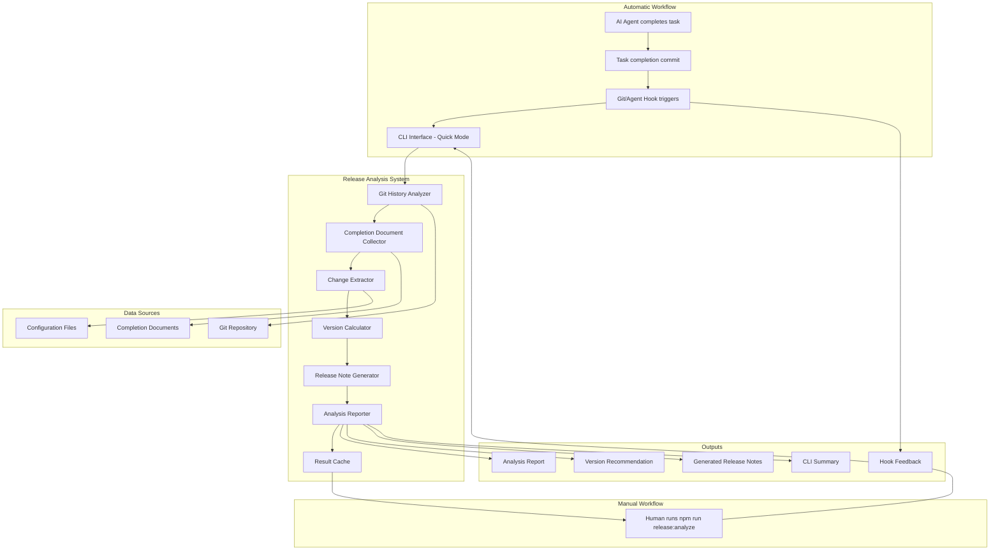

# Design Document: Release Analysis System

**Date**: October 20, 2025  
**Purpose**: Design specification for CLI-driven release analysis workflow  
**Organization**: spec-completion  
**Scope**: release-analysis-system  
**Spec**: F5 - Release Analysis System  
**Status**: Design Phase  
**Dependencies**: None

---

## Overview

The Release Analysis System implements an AI-collaboration-first workflow for analyzing changes between releases and generating version bump recommendations with release notes. The system automatically triggers analysis after task completion commits, providing immediate feedback to AI agents, while maintaining a CLI interface for detailed human review.

The design prioritizes seamless integration with the task completion workflow while maintaining simplicity and clarity. The system leverages Git history to determine analysis scope, integrates with commit hooks for automatic triggering, and parses completion documentation to extract meaningful change information. Both automatic (post-commit) and manual (CLI) workflows are supported.

---

## Architecture



The system supports two workflows:

**Automatic Workflow**: Task completion → commit hook → quick analysis → concise feedback  
**Manual Workflow**: Human-initiated CLI → detailed analysis → comprehensive report

Both workflows share the same analysis pipeline: analyze Git history → collect completion documents → extract changes → calculate version bump → generate release notes → report results. Results are cached for quick retrieval.

---

## Components and Interfaces

### CLI Interface

**Responsibility**: Provides command-line interface for initiating analysis and presenting results.

```typescript
interface ReleaseCLI {
  analyzeChanges(options: AnalysisOptions): Promise<AnalysisResult>;
  showDetailedReport(result: AnalysisResult): void;
  confirmVersionBump(recommendation: VersionRecommendation): Promise<boolean>;
  saveAnalysis(result: AnalysisResult, path: string): Promise<void>;
}

interface AnalysisOptions {
  since?: string; // Git tag or commit to analyze from
  includePatterns?: string[]; // File patterns to include
  excludePatterns?: string[]; // File patterns to exclude
  outputFormat?: 'summary' | 'detailed' | 'json';
  dryRun?: boolean;
}

interface AnalysisResult {
  scope: AnalysisScope;
  changes: ExtractedChanges;
  versionRecommendation: VersionRecommendation;
  releaseNotes: string;
  confidence: ConfidenceMetrics;
}
```

### Git History Analyzer

**Responsibility**: Determines analysis scope by examining Git history and identifying relevant completion documents.

```typescript
interface GitHistoryAnalyzer {
  findLastRelease(): Promise<GitTag | null>;
  getChangesSince(tag: string): Promise<GitChanges>;
  findCompletionDocuments(changes: GitChanges): Promise<CompletionDocument[]>;
  validateAnalysisScope(scope: AnalysisScope): ValidationResult;
}

interface GitChanges {
  commits: GitCommit[];
  addedFiles: string[];
  modifiedFiles: string[];
  deletedFiles: string[];
  timeRange: { from: Date; to: Date };
}

interface AnalysisScope {
  fromTag?: string;
  fromCommit?: string;
  toCommit: string;
  completionDocuments: CompletionDocument[];
  analysisDate: Date;
}
```

### Change Extractor

**Responsibility**: Parses completion documents and extracts structured change information.

```typescript
interface ChangeExtractor {
  extractChanges(documents: CompletionDocument[]): Promise<ExtractedChanges>;
  parseCompletionDocument(document: CompletionDocument): Promise<DocumentChanges>;
  deduplicateChanges(changes: ExtractedChanges): ExtractedChanges;
  validateExtraction(changes: ExtractedChanges): ExtractionValidation;
}

interface ExtractedChanges {
  breakingChanges: BreakingChange[];
  newFeatures: Feature[];
  bugFixes: BugFix[];
  improvements: Improvement[];
  documentation: DocumentationChange[];
  metadata: ExtractionMetadata;
}

interface ExtractionMetadata {
  documentsAnalyzed: number;
  extractionConfidence: number;
  ambiguousItems: string[];
  filteredItems: string[];
}
```

### Version Calculator

**Responsibility**: Determines appropriate semantic version bump based on extracted changes.

```typescript
interface VersionCalculator {
  calculateVersionBump(changes: ExtractedChanges, currentVersion: string): VersionRecommendation;
  validateSemanticVersioning(recommendation: VersionRecommendation): ValidationResult;
  generateVersionRationale(changes: ExtractedChanges): string;
  handlePreReleaseVersions(currentVersion: string, bumpType: BumpType): string;
}

interface VersionRecommendation {
  currentVersion: string;
  recommendedVersion: string;
  bumpType: 'major' | 'minor' | 'patch' | 'none';
  rationale: string;
  confidence: number;
  evidence: ChangeEvidence[];
}

interface ChangeEvidence {
  type: 'breaking' | 'feature' | 'fix' | 'improvement';
  description: string;
  source: string;
  impact: 'high' | 'medium' | 'low';
}
```

### Release Note Generator

**Responsibility**: Formats extracted changes into comprehensive, readable release notes.

### Hook Integration Manager

**Responsibility**: Manages automatic triggering of analysis via Git hooks or Kiro agent hooks, providing quick feedback for AI agents.

```typescript
interface HookIntegrationManager {
  installHook(hookType: 'git' | 'agent'): Promise<void>;
  uninstallHook(hookType: 'git' | 'agent'): Promise<void>;
  runQuickAnalysis(): Promise<QuickAnalysisResult>;
  cacheResult(result: AnalysisResult): Promise<void>;
  getCachedResult(): Promise<AnalysisResult | null>;
}

interface QuickAnalysisResult {
  versionBump: 'major' | 'minor' | 'patch' | 'none';
  changeCount: {
    breaking: number;
    features: number;
    fixes: number;
    improvements: number;
  };
  confidence: number;
  summary: string; // Concise one-line summary for AI feedback
  fullResultCached: boolean;
}

interface HookConfig {
  enabled: boolean;
  hookType: 'git' | 'agent' | 'both';
  quickMode: boolean; // Skip detailed extraction for speed
  timeoutSeconds: number; // Max time before giving up
  failSilently: boolean; // Don't block commit on failure
  cacheResults: boolean; // Cache for later CLI access
}
```

**Key Features**:
- Installs Git post-commit or Kiro agent hooks
- Runs optimized "quick mode" analysis (<10 seconds)
- Provides concise output suitable for AI agent feedback
- Caches full results for later detailed review
- Fails gracefully without blocking commits
- Configurable enable/disable

```typescript
interface ReleaseNoteGenerator {
  generateReleaseNotes(changes: ExtractedChanges, version: string): Promise<string>;
  formatBreakingChanges(changes: BreakingChange[]): string;
  formatNewFeatures(features: Feature[]): string;
  formatBugFixes(fixes: BugFix[]): string;
  applyTemplate(content: ReleaseContent, template: ReleaseTemplate): string;
}

interface ReleaseContent {
  version: string;
  date: string;
  summary: string;
  sections: ReleaseSection[];
}

interface ReleaseSection {
  title: string;
  items: ReleaseItem[];
  priority: number;
}

interface ReleaseTemplate {
  format: 'markdown' | 'html' | 'plain';
  sections: TemplateSectionConfig[];
  styling: TemplateStyle;
}
```

### Analysis Reporter

**Responsibility**: Presents analysis results to the user in various formats and handles result persistence.

```typescript
interface AnalysisReporter {
  generateSummaryReport(result: AnalysisResult): string;
  generateDetailedReport(result: AnalysisResult): string;
  generateJSONReport(result: AnalysisResult): string;
  saveReport(result: AnalysisResult, format: ReportFormat, path: string): Promise<void>;
}

interface ReportFormat {
  type: 'summary' | 'detailed' | 'json';
  includeMetadata: boolean;
  includeConfidence: boolean;
  includeEvidence: boolean;
}
```

---

## Data Models

### Core Analysis Models

```typescript
interface CompletionDocument {
  path: string;
  content: string;
  lastModified: Date;
  gitCommit: string;
  metadata: DocumentMetadata;
}

interface DocumentMetadata {
  title: string;
  date?: string;
  task?: string;
  spec?: string;
  status?: string;
  type: 'task-completion' | 'spec-completion' | 'other';
}

interface BreakingChange {
  id: string;
  title: string;
  description: string;
  affectedAPIs: string[];
  migrationGuidance?: string;
  source: string;
  severity: 'low' | 'medium' | 'high' | 'critical';
}

interface Feature {
  id: string;
  title: string;
  description: string;
  benefits: string[];
  requirements: string[];
  artifacts: string[];
  source: string;
  category: string;
}
```

### Configuration Models

```typescript
interface AnalysisConfig {
  extraction: ExtractionConfig;
  versioning: VersioningConfig;
  reporting: ReportingConfig;
  git: GitConfig;
}

interface ExtractionConfig {
  completionPatterns: string[];
  breakingChangeKeywords: string[];
  featureKeywords: string[];
  bugFixKeywords: string[];
  documentationKeywords: string[];
  confidenceThresholds: ConfidenceThresholds;
}

interface VersioningConfig {
  semanticVersioning: boolean;
  preReleaseHandling: 'increment' | 'promote' | 'ignore';
  versionBumpRules: BumpRules;
}

interface ReportingConfig {
  defaultFormat: 'summary' | 'detailed' | 'json';
  includeConfidence: boolean;
  includeMetadata: boolean;
  templates: TemplateConfig;
}
```

---

## Artifact Integration Strategy

Based on the evaluation framework from the requirements document, this design incorporates selected artifacts from the previous Release Management System:

### Integrated Artifacts

**ReleaseTypes.ts (Adapted)**
- Reuse core type definitions: `BreakingChange`, `Feature`, `BugFix`, `Improvement`
- Adapt `ReleaseAnalysis` to `ExtractedChanges` for better naming
- Keep validation result structures

**Core Configuration Infrastructure (Simplified)**
- Reuse configuration loading and validation patterns
- Remove detection-specific settings (confidence thresholds for automatic detection)
- Adapt for CLI-driven workflow configuration

**Extraction Methods from CompletionAnalyzer (Refactored)**
- Extract core parsing methods: `findSections()`, `parseBreakingChangeSection()`, etc.
- Simplify by removing automatic detection complexity
- Keep semantic deduplication and documentation filtering logic
- Remove confidence scoring for release necessity (not needed for on-demand analysis)

**Test Utilities and Patterns (Adapted)**
- Reuse test organization patterns and utilities
- Adapt extraction accuracy tests for new workflow
- Keep regression test patterns for extraction improvements

### Removed Artifacts

**ReleaseDetector.ts** - Entire automatic detection system not needed
**WorkflowMonitor.ts** - Background monitoring not applicable to CLI workflow
**Integration Tests for Automatic Workflow** - CLI workflow requires different integration testing
**Detection-Specific Configuration** - Confidence thresholds, automatic triggering settings

### Implementation Approach

**Phase 1: Clean Slate Implementation**
- Implement core CLI workflow and Git analysis
- Build simple extraction using patterns from existing CompletionAnalyzer
- Create basic version calculation and release note generation

**Phase 2: Artifact Integration Evaluation**
- Measure complexity vs value of integrating existing extraction methods
- Compare performance and accuracy of simple vs complex extraction
- Make data-driven decisions about artifact integration

**Phase 3: Optimization and Refinement**
- Integrate valuable artifacts that prove their worth
- Remove or simplify components that don't justify their complexity
- Optimize for the CLI workflow use case

---

## Error Handling

### Error Categories and Recovery Strategies

**Git Analysis Errors**
- **Cause**: No Git repository, no release tags, corrupted Git history
- **Recovery**: Fallback to manual scope specification, analyze all available documents
- **Prevention**: Git repository validation, clear error messages with guidance

**Completion Document Errors**
- **Cause**: Missing documents, malformed content, inaccessible files
- **Recovery**: Skip problematic documents with warnings, continue with available documents
- **Prevention**: Document validation, graceful handling of parsing errors

**Version Calculation Errors**
- **Cause**: Invalid current version, conflicting change types, ambiguous bump requirements
- **Recovery**: Request manual version specification, provide multiple options with rationale
- **Prevention**: Version format validation, clear bump logic documentation

**Configuration Errors**
- **Cause**: Invalid configuration files, missing required settings, conflicting options
- **Recovery**: Use default configuration with warnings, prompt for configuration fixes
- **Prevention**: Configuration validation, comprehensive default settings

### User Experience for Errors

```bash
# Example error handling
$ npm run release:analyze

⚠️  Warning: No previous release tag found
   → Analyzing all available completion documents
   → Use --since <commit> to specify analysis scope

✅ Analysis complete
   → Found 3 completion documents
   → Detected 2 new features, 1 bug fix
   → Recommended version bump: minor (1.2.0 → 1.3.0)

❓ Low confidence on 1 item:
   → "Updated error handling" - unclear if breaking change
   → Review: .kiro/specs/validation/completion/task-2-completion.md:15

Continue with minor version bump? (y/n/review)
```

---

## Testing Strategy

### Unit Testing Approach

**Component Isolation**: Each component (GitHistoryAnalyzer, ChangeExtractor, etc.) tested independently with mocked dependencies.

**CLI Testing**: Command-line interface tested with various input scenarios and output validation.

**Extraction Accuracy**: Comprehensive testing of completion document parsing with real-world examples.

### Integration Testing Approach

**End-to-End CLI Workflow**: Full workflow testing from Git analysis through report generation.

**Git Integration**: Testing with various Git repository states and history scenarios.

**Configuration Integration**: Testing configuration loading, validation, and application across components.

### Validation Testing Approach

**Version Bump Accuracy**: Validation that version recommendations follow semantic versioning rules correctly.

**Release Note Quality**: Testing that generated release notes contain accurate and complete information.

**Error Handling**: Comprehensive testing of error scenarios and recovery mechanisms.

---

## Design Decisions

### Decision 1: CLI-First vs Web Interface

**Options Considered**: 
- Command-line interface only
- Web-based interface with GUI
- Both CLI and web interface

**Decision**: CLI-first approach with potential for web interface later

**Rationale**: Aligns with developer workflow, integrates naturally with existing tooling, simpler to implement and maintain. Web interface can be added later if needed.

**Trade-offs**: Less visual appeal than GUI, but better integration with development workflow and automation.

**Counter-arguments**: A web interface could provide better visualization of change analysis and make the system more accessible to non-technical stakeholders. However, the CLI approach aligns better with developer workflows and can be easily integrated into automation scripts.

### Decision 2: Git-Based vs Manual Scope Definition

**Options Considered**:
- Automatic Git history analysis
- Manual specification of analysis scope
- Hybrid approach with Git default and manual override

**Decision**: Git-based analysis with manual override capability

**Rationale**: Provides intelligent defaults while maintaining flexibility. Most common use case (analyze since last release) is handled automatically.

**Trade-offs**: Requires Git repository and proper tagging, but provides much better user experience for typical workflows.

**Counter-arguments**: Manual scope definition would be more flexible and work in any environment. However, Git-based analysis eliminates the most common user error (forgetting to specify scope) and provides intelligent defaults that work for 90% of use cases.

### Decision 3: Automatic vs Manual Triggering

**Options Considered**:
- Manual CLI-only (human runs command when needed)
- Automatic on every commit (Git hook on all commits)
- Automatic on task completion (integrate with task completion workflow)
- Hybrid (automatic + manual CLI available)

**Decision**: Hybrid approach - automatic on task completion with manual CLI access

**Rationale**: The system is designed for AI-human collaboration where AI agents complete tasks and commit work. Automatic analysis provides immediate feedback to AI agents about change significance, while manual CLI allows humans to review detailed analysis when needed. This aligns with the actual workflow where AI agents don't inherently understand release significance.

**Trade-offs**: Adds complexity of hook integration and requires performance optimization for quick analysis. However, this provides the best user experience for the AI-collaboration workflow and solves the real problem of consistent release documentation without manual intervention.

**Counter-arguments**: Manual-only would be simpler and avoid performance concerns. However, this would require humans to remember to run analysis, defeating the purpose of having AI agents handle task completion. The automatic approach ensures consistent release tracking without requiring manual intervention.

### Decision 4: Simple vs Complex Extraction Logic

**Options Considered**:
- Reuse complex extraction logic from previous system
- Build simple pattern-based extraction
- Hybrid approach with complexity evaluation

**Decision**: Start simple, evaluate complex integration based on accuracy needs

**Rationale**: Avoid premature optimization, validate that simple extraction meets accuracy requirements before adding complexity.

**Trade-offs**: May need to add complexity later, but ensures we don't over-engineer the solution.

**Counter-arguments**: Starting with complex extraction logic could provide better accuracy from day one and avoid the need to rebuild later. However, the evaluation framework in Task 4 allows us to make this decision based on data rather than assumptions.

### Decision 4: Structured vs Flexible Output Format

**Options Considered**:
- Fixed output format optimized for readability
- Flexible templating system for customizable output
- Multiple predefined formats with customization options

**Decision**: Multiple predefined formats with basic customization

**Rationale**: Covers most use cases without excessive complexity. Provides standard formats (summary, detailed, JSON) while allowing basic customization.

**Trade-offs**: Less flexibility than full templating system, but much simpler to implement and maintain.

**Counter-arguments**: A full templating system would provide maximum customization and could support complex formatting requirements. However, the additional complexity is not justified unless there's clear evidence of diverse formatting needs that predefined formats cannot address.

This design provides a clear, implementable architecture that leverages valuable artifacts from previous work while avoiding unnecessary complexity. The systematic artifact evaluation ensures that integration decisions are based on value rather than sunk cost considerations.