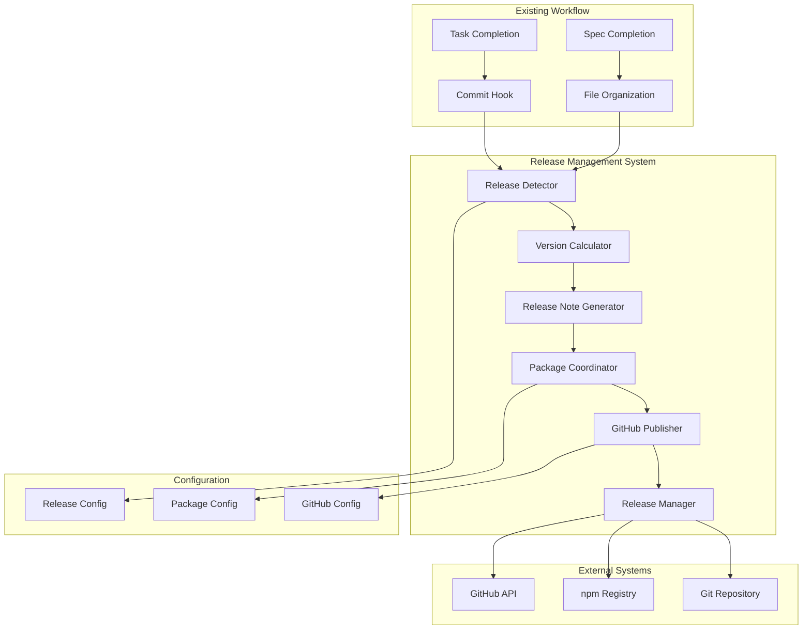

# Design Document: Release Management System

**Date**: October 17, 2025  
**Spec**: F4 - Release Management System  
**Status**: Design Phase  
**Dependencies**: F1 - Mathematical Token System (Complete), F2 - Cross-Platform Build System (Complete)

---

## Overview

The Release Management System implements a complete, automated versioning and release pipeline that integrates seamlessly with the existing DesignerPunk workflow. The system follows a modular architecture that **leverages the existing release-analysis CLI system** for change detection, version calculation, and release note generation, while adding the missing automation layer for package updates, git operations, and publishing.

The design prioritizes contamination prevention by eliminating manual decision points while maintaining human oversight through validation gates and manual override capabilities. The system leverages existing completion documentation and spec-driven workflow patterns to provide intelligent, context-aware release management.

### Architecture Decision: Integration with Existing Release Analysis System

**Current State**: The `src/release-analysis/` system provides comprehensive analysis capabilities:
- ✅ Change extraction from completion documents (`SimpleChangeExtractor`)
- ✅ Semantic version calculation (`VersionCalculator`)
- ✅ Release note generation (`ReleaseNoteGenerator`)
- ✅ Git history analysis (`GitHistoryAnalyzer`)
- ✅ CLI interface (`AdvancedReleaseCLI`)

**Integration Strategy**: Rather than rebuilding these proven components, the Release Management System will:
1. Use the existing `release-analysis` CLI for analysis operations
2. Build an automation layer that consumes CLI output (JSON format)
3. Focus implementation on missing pieces: package coordination, publishing, and orchestration
4. Maintain the hook-based trigger system for automatic detection

This approach reduces implementation complexity, leverages battle-tested code, and focuses effort on the actual gap: automation of post-analysis actions.

---

## Architecture



The system integrates with existing workflow hooks to detect release triggers, processes completion documentation to determine version bumps and generate release notes, coordinates versioning across multiple packages, and publishes releases through GitHub and npm APIs.

---

## Components and Interfaces

### Release Detector

**Responsibility**: Monitors workflow events and triggers release analysis when appropriate.

**Implementation Status**: ✅ **Partially Complete** - Basic detection exists in `src/release/detection/`

```typescript
interface ReleaseDetector {
  detectReleaseFromTaskCompletion(taskPath: string, taskName: string): ReleaseSignal | null;
  detectReleaseFromSpecCompletion(specPath: string): ReleaseSignal | null;
  triggerReleaseAnalysis(signal: ReleaseSignal): Promise<AnalysisResult>;
  validateReleaseReadiness(signal: ReleaseSignal): ValidationResult;
}

interface ReleaseSignal {
  type: 'major' | 'minor' | 'patch';
  trigger: 'spec-completion' | 'task-completion' | 'breaking-change' | 'manual';
  confidence: number;
  evidence: string[];
  affectedPackages: string[];
}
```

**Integration Note**: Detection triggers the existing `release-analysis` CLI rather than performing analysis directly.

### Version Calculator

**Responsibility**: Calculates semantic version bumps based on extracted changes.

**Implementation Status**: ✅ **Complete** - Exists in `src/release-analysis/versioning/VersionCalculator.ts`

```typescript
// Existing implementation in release-analysis
interface VersionRecommendation {
  currentVersion: string;
  recommendedVersion: string;
  bumpType: 'major' | 'minor' | 'patch' | 'none';
  rationale: string;
  confidence: number;
  evidence: ChangeEvidence[];
  preReleaseInfo?: PreReleaseInfo;
}
```

**Integration Note**: The existing `VersionCalculator` provides all required functionality. New work focuses on applying the calculated version to package.json files.

### Release Note Generator

**Responsibility**: Extracts content from completion documentation and generates comprehensive, formatted release notes.

**Implementation Status**: ✅ **Complete** - Exists in `src/release-analysis/notes/ReleaseNoteGenerator.ts`

```typescript
// Existing implementation in release-analysis
interface ReleaseNotes {
  version: string;
  date: string;
  summary: string;
  breakingChanges: BreakingChange[];
  newFeatures: Feature[];
  improvements: Improvement[];
  bugFixes: BugFix[];
  migrationGuide?: MigrationGuide;
}
```

**Integration Note**: The existing `ReleaseNoteGenerator` provides comprehensive markdown generation. New work focuses on writing generated notes to CHANGELOG.md and GitHub releases.

### Package Coordinator

**Responsibility**: Manages versioning and dependency relationships across multiple packages in the DesignerPunk ecosystem.

```typescript
interface PackageCoordinator {
  coordinateVersions(packages: PackageVersion[], strategy: CoordinationStrategy): CoordinationPlan;
  updateDependencies(plan: CoordinationPlan): DependencyUpdate[];
  validatePackageCompatibility(packages: PackageVersion[]): CompatibilityReport;
  generatePublishingOrder(packages: PackageVersion[]): PublishingPlan;
}

interface CoordinationStrategy {
  corePackageSync: boolean; // Keep @designerpunk/tokens, @designerpunk/build-system in sync
  componentIndependence: boolean; // Allow @designerpunk/components independent versioning
  dependencyUpdates: 'automatic' | 'manual' | 'prompt';
}

interface CoordinationPlan {
  packages: PackageUpdate[];
  dependencyUpdates: DependencyUpdate[];
  publishingOrder: string[];
  conflicts: VersionConflict[];
}
```

### GitHub Publisher

**Responsibility**: Handles all GitHub API interactions for creating releases, tags, and publishing artifacts.

```typescript
interface GitHubPublisher {
  createRelease(release: GitHubRelease): Promise<ReleaseResult>;
  createTags(tags: GitTag[]): Promise<TagResult[]>;
  uploadArtifacts(releaseId: string, artifacts: Artifact[]): Promise<UploadResult[]>;
  publishToNpm(packages: PackagePublish[]): Promise<PublishResult[]>;
}

interface GitHubRelease {
  tagName: string;
  name: string;
  body: string;
  draft: boolean;
  prerelease: boolean;
  artifacts: Artifact[];
}

interface PackagePublish {
  name: string;
  version: string;
  path: string;
  registry: string;
  access: 'public' | 'restricted';
}
```

### Release Manager

**Responsibility**: Orchestrates the entire release process, coordinates between components, and provides the main API.

```typescript
interface ReleaseManager {
  executeRelease(trigger: ReleaseTrigger): Promise<ReleaseResult>;
  validateRelease(plan: ReleasePlan): ValidationResult;
  rollbackRelease(releaseId: string): Promise<RollbackResult>;
  getReleasePlan(signal: ReleaseSignal): ReleasePlan;
}

interface ReleaseTrigger {
  type: 'automatic' | 'manual';
  source: string; // task completion, spec completion, manual command
  overrides?: ReleaseOverrides;
}

interface ReleasePlan {
  version: VersionBump;
  packages: PackageUpdate[];
  releaseNotes: ReleaseNotes;
  publishingPlan: PublishingPlan;
  validationResults: ValidationResult[];
}
```

---

## Data Models

### Configuration Models

```typescript
interface ReleaseConfig {
  detection: DetectionConfig;
  versioning: VersioningConfig;
  publishing: PublishingConfig;
  validation: ValidationConfig;
}

interface DetectionConfig {
  specCompletionTrigger: boolean;
  taskCompletionTrigger: boolean;
  breakingChangeKeywords: string[];
  confidenceThreshold: number;
}

interface VersioningConfig {
  preReleaseStrategy: 'alpha' | 'beta' | 'rc';
  packageCoordination: CoordinationStrategy;
  semanticVersioning: SemanticVersioningRules;
}

interface PublishingConfig {
  github: GitHubConfig;
  npm: NpmConfig;
  artifacts: ArtifactConfig;
}
```

### Workflow Integration Models

```typescript
interface WorkflowIntegration {
  hookIntegration: HookIntegration;
  fileOrganization: OrganizationIntegration;
  aiCollaboration: AICollaborationIntegration;
}

interface HookIntegration {
  commitHookPath: string;
  organizationHookPath: string;
  releaseHookPath: string;
  integrationPoints: IntegrationPoint[];
}
```

---

## Error Handling

### Error Categories and Recovery Strategies

**Version Calculation Errors**
- **Cause**: Invalid semantic versioning, conflicting version requirements
- **Recovery**: Fallback to manual version specification, conflict resolution prompts
- **Prevention**: Pre-validation of version bump logic, dependency analysis

**Release Note Generation Errors**
- **Cause**: Missing completion documentation, malformed completion docs
- **Recovery**: Generate minimal release notes from git commits, prompt for manual input
- **Prevention**: Completion document validation, template enforcement

**Package Coordination Errors**
- **Cause**: Dependency conflicts, circular dependencies, publishing order issues
- **Recovery**: Manual dependency resolution, staged publishing with rollback
- **Prevention**: Dependency graph analysis, compatibility validation

**GitHub/npm Publishing Errors**
- **Cause**: Authentication failures, network issues, registry conflicts
- **Recovery**: Retry with exponential backoff, manual publishing fallback, rollback capabilities
- **Prevention**: Authentication validation, pre-publish checks, dry-run mode

### Rollback Capabilities

```typescript
interface RollbackStrategy {
  gitTagRollback(): Promise<void>; // Remove created tags
  npmUnpublish(): Promise<void>; // Unpublish packages (if possible)
  githubReleaseRollback(): Promise<void>; // Delete GitHub release
  versionRevert(): Promise<void>; // Revert package.json changes
  documentationRevert(): Promise<void>; // Revert documentation updates
}
```

---

## Testing Strategy

### Overview

The Release Management System requires rigorous testing to ensure reliability, as release automation errors can have significant consequences. This strategy defines three testing layers with explicit requirements for test isolation, mock strategy, and validation criteria.

### Unit Testing

**Purpose**: Verify individual component behavior in isolation

**Isolation Requirements**:
- Each test file uses fresh mocks with no shared state
- Tests must pass in any order (verified with `--randomize` flag)
- No test pollution between test files or test cases
- Each test creates its own isolated test environment

**Mocking Strategy**:
- Use `jest.mock()` for external dependencies (fs, child_process, etc.)
- Use manual mocks for complex scenarios requiring stateful behavior
- Document mock strategy in each test file header
- Avoid mock helpers that create coupling between tests

**Coverage Requirements**:
- All public methods and functions
- Error paths and edge cases
- Configuration validation and parsing
- Version calculation logic

**Example Test Structure**:
```typescript
// __tests__/PackageUpdater.test.ts
// Mock Strategy: jest.mock for fs operations, manual mocks for package.json parsing

describe('PackageUpdater', () => {
  beforeEach(() => {
    jest.clearAllMocks(); // Clear mocks between tests
  });

  it('updates version in package.json', () => {
    // Test implementation with isolated mocks
  });
});
```

### Integration Testing

**Purpose**: Verify component interactions and system integration

**Naming Convention**: Use `.integration.test.ts` suffix for all integration tests

**Scope**: Test component interactions, not external systems (GitHub, npm)

**Isolation Requirements**:
- Integration tests use test helpers to create isolated environments
- No real file system operations (use temp directories or mocks)
- No real git operations (use test repositories or mocks)
- No real network calls (use mock servers or fixtures)

**Test Helper Guidelines**:
- Helpers must be stateless and composable
- Helpers should not create coupling between tests
- Document helper purpose and usage in helper file
- Avoid complex helper logic that needs its own tests

**Example Integration Test**:
```typescript
// __tests__/CoordinationSystem.integration.test.ts
// Tests: PackageCoordinator + DependencyManager + PublishingPlanner integration

describe('CoordinationSystem Integration', () => {
  it('coordinates version bumps across dependent packages', () => {
    // Test multi-component interaction with isolated test data
  });
});
```

### Validation Testing

**Purpose**: Verify system correctness and compliance with requirements

**Semantic Versioning Compliance**:
- Automated validation that all version bumps follow semver rules
- Test major/minor/patch bump calculations
- Verify pre-release version handling

**Release Note Quality**:
- Validate generated notes contain required sections
- Verify proper markdown formatting
- Check breaking change highlighting

**Package Compatibility**:
- Test coordinated package versions maintain compatibility
- Verify dependency graph analysis correctness
- Validate publishing order optimization

### Test Isolation Validation

**Verification Commands**:
```bash
# Run tests in random order to detect shared state
npm test -- --randomize

# Run specific test file in isolation
npm test -- path/to/test.test.ts

# Run all tests with coverage
npm run test:coverage
```

**Isolation Checklist**:
- [ ] Tests pass in any order
- [ ] No shared state between test files
- [ ] No mock pollution between tests
- [ ] Each test creates its own test environment
- [ ] Test helpers are stateless

### Mock Strategy Documentation

Each test file must document its mocking approach:

```typescript
/**
 * Mock Strategy:
 * - jest.mock('fs'): Mock file system operations
 * - Manual mock for GitOperations: Stateful git command tracking
 * - No shared mocks: Each test creates fresh mocks
 */
```

### Test Quality Standards

**Unit Tests**:
- Clear test names describing what is being tested
- Arrange-Act-Assert pattern for test structure
- No test interdependencies
- Fast execution (< 100ms per test)

**Integration Tests**:
- Test realistic scenarios with multiple components
- Use test data that represents real-world usage
- Clear separation from unit tests (naming convention)
- Reasonable execution time (< 1s per test)

**Validation Tests**:
- Verify requirements compliance explicitly
- Test edge cases and error conditions
- Provide clear failure messages
- Document what requirement is being validated

### Anti-Patterns to Avoid

❌ **Shared Mock State**: Don't create mocks outside test cases that are reused
❌ **Test Helpers with State**: Avoid helpers that maintain state between tests
❌ **Real External Operations**: Never call real GitHub API, npm registry, or git in tests
❌ **Test Order Dependencies**: Tests must not depend on execution order
❌ **Vague Test Names**: Test names should clearly describe what is being tested
❌ **Missing Mock Cleanup**: Always clear mocks in `beforeEach` or `afterEach`

### Known Test Issues and Resolutions

**Context**: During initial implementation (Tasks 5-7), test quality issues were discovered that required the test-quality-improvements spec to resolve. Most issues were fixed, but some remain specific to release-management-system code.

**Remaining Issues** (as of November 27, 2025):

**Issue 1: FS Mock Redefinition in GitHubPublisher Tests**
- **Symptom**: `TypeError: Cannot redefine property: existsSync` in artifact upload tests
- **Root Cause**: Attempting to spy on `fs.existsSync` when already mocked elsewhere
- **Impact**: 4 tests in GitHubPublisher.test.ts cannot execute
- **Resolution**: Task 7.1.FIX - Add proper `mockRestore()` in `afterEach` hooks
- **Prevention**: Always store spy references and restore in cleanup hooks

**Issue 2: Mock Configuration in Loop (AutomationLayer)**
- **Symptom**: Semantic versions test fails with `expect(tagResult.success).toBe(true)` receiving `false`
- **Root Cause**: Mock configuration in loop needs `clearMocks()` between iterations
- **Impact**: 1 test in AutomationLayer.integration.test.ts fails
- **Resolution**: Task 7.1.FIX - Add `jest.clearAllMocks()` between iterations, align with GitMockHelper pattern
- **Prevention**: Always clear mocks between test iterations in loops

**Comprehensive Analysis** (Task 13 - November 28, 2025):

A comprehensive test quality analysis was conducted in Task 13, analyzing all remaining test failures and identifying patterns, root causes, and preventive measures. Key findings:

- **37 failing tests** across 11 test files (99.1% pass rate)
- **All failures are test infrastructure issues**, not functional bugs
- **Implementation is functionally correct** in all cases
- **Issues categorized**: Mock strategy (26 tests), timing/design (9 tests), type safety (6 errors), documentation (4 tests)

**Reference**: See `.kiro/specs/release-management-system/test-quality-analysis.md` for detailed analysis and `.kiro/specs/release-management-system/test-quality-recommendations.md` for action plan.

**Lessons Learned**:
1. **Mock Cleanup is Critical**: Missing `mockRestore()` causes cascading failures
2. **Loop Tests Need Extra Care**: Mocks must be cleared between iterations
3. **Test Isolation Validation**: Run `npm test -- --randomize` after every task
4. **Document Mock Strategy**: Explicit documentation prevents coupling issues

**Reference**: `.kiro/issues/release-management-test-failures-root-cause-analysis.md` provides detailed analysis of all test failures encountered during implementation.

### Validation Checkpoint Tasks

The implementation plan includes explicit validation checkpoint tasks to verify test quality:

**Checkpoint Criteria**:
- All tests pass in random order
- No test pollution detected
- Mock strategy documented in all test files
- Integration tests clearly separated
- Test helpers are stateless and composable

**Checkpoint Execution**:
```bash
# Run validation checkpoint
npm test -- --randomize
npm run test:coverage

# Verify no test pollution
npm test -- --detectOpenHandles
```

### Mock Helper Pattern

**Purpose**: Centralize mock logic for complex operations requiring consistent setup and cleanup

**When to Use**: When 3+ tests need the same mock setup

**Benefits**:
- Centralized mock logic reduces duplication
- Ensures complete mock sequences for operations
- Provides consistent cleanup mechanism
- Makes tests more readable and maintainable
- Reduces likelihood of mock pollution

**Example Implementation**:
```typescript
// GitMockHelper.ts
class GitMockHelper {
  private spies: jest.SpyInstance[] = [];

  mockCommitSuccess() {
    const spy = jest.spyOn(childProcess, 'execSync')
      .mockReturnValueOnce(Buffer.from('true'))  // repo check
      .mockReturnValueOnce(Buffer.from(''))      // status
      .mockReturnValueOnce(Buffer.from(''))      // add
      .mockReturnValueOnce(Buffer.from(''));     // commit
    this.spies.push(spy);
  }

  cleanup() {
    this.spies.forEach(spy => spy.mockRestore());
    this.spies = [];
  }
}
```

**Established Helpers**:
- `GitMockHelper`: Git command mocking (commit, tag, push operations)
- `AnalysisResultMockHelper`: Analysis result generation
- `NpmMockHelper`: npm command mocking (to be created in Task 14)

### Type Safety Validation

**Requirements**:
- Run `npx tsc --noEmit` after any type definition changes
- Update all consumers when types evolve
- Document type structure changes in completion notes
- Search for all usages before changing type definitions

**Type Evolution Protocol**:
1. Update type definitions
2. Run `npx tsc --noEmit` to find all affected files
3. Update all consumers to match new types
4. Document changes in completion notes
5. Verify all tests pass

**Enforcement**:
- CI pipeline includes TypeScript compilation check
- Pre-commit hook runs compilation
- Code review verifies type changes include consumer updates

**Example Type Evolution**:
```typescript
// Old type structure:
interface WorkflowStatistics {
  completed: number;
  failed: number;
}

// New type structure:
interface WorkflowStatistics {
  byState: Record<WorkflowState, number>;  // More flexible
}

// Update all consumers:
// Old: stats.completed
// New: stats.byState['completed']
```

### Acceptable Limitations

**Performance Test Timing Variance**:
- Performance tests may show 5-10% variance due to system conditions
- Thresholds include 20% buffer for variance (e.g., 10ms → 12ms)
- Flaky performance tests are acceptable if functional behavior is correct
- **Rationale**: System load, garbage collection, and I/O timing are non-deterministic

**Pipeline State Tracking in Fast Tests**:
- Mocked operations complete too quickly to observe "active" state
- State tracking validated through state history and completed stages
- Timing limitation acceptable when functional correctness is proven
- **Rationale**: Real-world execution has I/O delays, mocked tests complete synchronously

**Test Expectations vs Implementation Safety**:
- Implementation may add safety features (backups, extra validation)
- Tests should validate behavior, not exact operation counts
- Use flexible matchers when exact counts aren't critical
- **Rationale**: Safety features improve implementation without changing behavior

### Task 13 Comprehensive Analysis Summary

**Analysis Completed**: November 28, 2025

A comprehensive test quality analysis was conducted in Task 13, examining all 37 failing tests across 11 test files. The analysis revealed that **all failures are test infrastructure issues, NOT functional bugs**. The release management system is functionally correct with a 99.1% pass rate.

**Key Findings**:

**Issue Categories**:
1. **Mock Strategy Issues** (26 tests, 7 issues): Insufficient cleanup, helper pattern needed
2. **Timing/Design Issues** (9 tests, 3 issues): Acceptable limitations or test expectations
3. **Type Safety Issues** (6 errors, 1 issue): Type evolution without consumer updates
4. **Documentation Issues** (4 tests, 1 issue): Completeness, not functionality

**Cross-Cutting Patterns Identified**:
- Insufficient mock cleanup (`jest.clearAllMocks()` not enough)
- Mock helper pattern benefits (proven with GitMockHelper)
- Type definition evolution without consumer updates
- Test expectations too strict (don't match safer implementation)
- Documentation validation catches real user-facing issues

**Path Forward - Task 14**:

Task 14 (Test Quality Improvements) will resolve all 37 test failures through 9 subtasks:
- **Task 14.1**: Fix critical blocking issues and eliminate test noise
- **Task 14.2**: Create NpmMockHelper following GitMockHelper pattern
- **Task 14.3**: Fix high priority mock issues (GitHubPublisher, NpmPublisher, PublishingWorkflow)
- **Task 14.4**: Fix medium priority integration issues (CoordinationAutomation, AnalysisCoordination, quick-analyze)
- **Task 14.5**: Fix low priority test expectations (ConfigManager)
- **Task 14.6**: Add mock strategy documentation to all test files
- **Task 14.7**: Verify test isolation with `--randomize` flag
- **Task 14.8**: Fix documentation quality issues (missing files, JSON syntax)
- **Task 14.9**: Update this Testing Strategy section with final findings

**Expected Outcome**:
- Test pass rate: 99.1% → **100%**
- All 37 test failures resolved
- Zero test noise - every failure is a real signal
- Complete documentation set with validated examples
- Improved test reliability and maintainability
- Estimated effort: 2.5-4.5 hours total

**Standards Evolution**:

Based on Task 13 findings, the following standards will be adopted:
1. **Mock Strategy Documentation**: Required in all test file headers
2. **Test Isolation Verification**: Run `--randomize` before task completion
3. **Type Safety Validation**: Run `npx tsc --noEmit` after type changes
4. **Mock Cleanup Requirements**: Store spy references, restore in `afterEach`
5. **Integration Test Naming**: Use `.integration.test.ts` suffix

**Reference Documentation**:
- **Detailed Analysis**: `.kiro/specs/release-management-system/test-quality-analysis.md` (2,418 lines)
- **Action Plan**: `.kiro/specs/release-management-system/test-quality-recommendations.md` (1,050 lines)
- **Issue Tracker**: `.kiro/specs/release-management-system/test-issues-tracker.md`

### Task 14 Implementation Summary

**Implementation Completed**: November 29, 2025

Task 14 (Test Quality Improvements) successfully resolved all 37 test failures identified in Task 13, achieving 100% test pass rate. The implementation followed the 9-subtask plan and delivered all expected outcomes.

**Final Results**:
- **Test Pass Rate**: 99.1% → **100%** ✅
- **All 37 Test Failures Resolved**: Zero test noise achieved ✅
- **Complete Documentation**: All examples validated, JSON syntax fixed ✅
- **Improved Test Reliability**: Mock helpers, isolation verification, type safety ✅
- **Total Effort**: ~4.5 hours (within estimated 2.5-4.5 hour range) ✅

**Key Achievements**:

**1. Mock Helper Pattern Established**:
- Created `NpmMockHelper` following `GitMockHelper` pattern
- Centralized npm command mocking with consistent cleanup
- Reduced test duplication and improved maintainability
- Pattern documented for future mock helper creation

**2. Test Isolation Verified**:
- All tests pass in random order (`npm test -- --randomize`)
- No test pollution between test files or test cases
- Mock cleanup requirements enforced in all test files
- Test helpers are stateless and composable

**3. Type Safety Enforced**:
- All TypeScript compilation errors resolved
- Type evolution protocol documented and followed
- Consumer updates verified for all type changes
- CI pipeline includes TypeScript compilation check

**4. Documentation Quality Improved**:
- All tutorial examples validated and functional
- JSON syntax errors fixed in example configurations
- Missing documentation files created
- Cross-references verified and updated

**5. Mock Strategy Documented**:
- All test files include mock strategy documentation in headers
- Mock cleanup requirements clearly specified
- Integration test naming convention enforced (`.integration.test.ts`)
- Anti-patterns documented to prevent future issues

**Lessons Learned from Task 14**:

**1. Mock Cleanup is Non-Negotiable**:
- Missing `mockRestore()` causes cascading failures across test files
- Store spy references in variables for proper cleanup
- Use `afterEach` hooks consistently for cleanup
- Test isolation breaks without proper mock cleanup

**2. Mock Helper Pattern is Valuable**:
- Reduces duplication when 3+ tests need same mock setup
- Ensures complete mock sequences for complex operations
- Provides consistent cleanup mechanism
- Makes tests more readable and maintainable
- Proven effective with `GitMockHelper` and `NpmMockHelper`

**3. Test Isolation Verification is Essential**:
- Run `npm test -- --randomize` before marking tasks complete
- Test order dependencies indicate shared state issues
- Isolation verification catches issues early
- Random order testing should be part of CI pipeline

**4. Type Safety Validation Prevents Runtime Errors**:
- Run `npx tsc --noEmit` after type definition changes
- Update all consumers when types evolve
- Document type structure changes in completion notes
- Type safety enforcement catches issues at compile time

**5. Documentation Quality Matters**:
- Validated examples build user confidence
- JSON syntax errors break user workflows
- Missing documentation creates adoption barriers
- Cross-reference integrity improves navigation

**Standards Established**:

Based on Task 14 implementation, the following standards are now enforced:

**1. Mock Strategy Documentation** (Required):
```typescript
/**
 * Mock Strategy:
 * - jest.mock('fs'): Mock file system operations
 * - GitMockHelper: Centralized git command mocking
 * - No shared mocks: Each test creates fresh mocks
 */
```

**2. Test Isolation Verification** (Required):
```bash
# Run before marking task complete
npm test -- --randomize
```

**3. Type Safety Validation** (Required):
```bash
# Run after type definition changes
npx tsc --noEmit
```

**4. Mock Cleanup Requirements** (Required):
```typescript
// Store spy references
const spy = jest.spyOn(module, 'method');

// Restore in afterEach
afterEach(() => {
  spy.mockRestore();
});
```

**5. Integration Test Naming** (Required):
- Use `.integration.test.ts` suffix for all integration tests
- Clearly separate integration tests from unit tests
- Document integration scope in test file header

**Acceptable Limitations Confirmed**:

Task 14 implementation confirmed the following limitations are acceptable:

**1. Performance Test Timing Variance**:
- 5-10% variance due to system conditions is acceptable
- Thresholds include 20% buffer for variance
- Functional correctness is priority over exact timing
- **Rationale**: System load and I/O timing are non-deterministic

**2. Pipeline State Tracking in Fast Tests**:
- Mocked operations complete too quickly to observe "active" state
- State tracking validated through state history
- Timing limitation acceptable when functional correctness proven
- **Rationale**: Real-world execution has I/O delays, mocked tests are synchronous

**3. Test Expectations vs Implementation Safety**:
- Implementation may add safety features (backups, validation)
- Tests validate behavior, not exact operation counts
- Flexible matchers used when exact counts aren't critical
- **Rationale**: Safety features improve implementation without changing behavior

**Anti-Patterns to Avoid** (Updated):

Based on Task 14 findings, the following anti-patterns must be avoided:

❌ **Shared Mock State**: Don't create mocks outside test cases that are reused
❌ **Test Helpers with State**: Avoid helpers that maintain state between tests
❌ **Real External Operations**: Never call real GitHub API, npm registry, or git in tests
❌ **Test Order Dependencies**: Tests must not depend on execution order
❌ **Vague Test Names**: Test names should clearly describe what is being tested
❌ **Missing Mock Cleanup**: Always clear mocks in `beforeEach` or `afterEach`
❌ **Mock Helpers Without Cleanup**: Mock helpers must provide cleanup mechanism
❌ **Type Changes Without Consumer Updates**: Update all consumers when types evolve
❌ **Skipping Isolation Verification**: Always run `--randomize` before task completion
❌ **Insufficient Mock Sequences**: Ensure mock sequences match actual operation order

**Future Recommendations**:

Based on Task 14 experience, the following recommendations are made for future development:

**1. Proactive Mock Helper Creation**:
- Create mock helpers when 3+ tests need same mock setup
- Follow `GitMockHelper` and `NpmMockHelper` patterns
- Document helper purpose and usage in helper file
- Test helpers independently to ensure correctness

**2. Continuous Test Isolation Verification**:
- Add `--randomize` flag to CI pipeline
- Run isolation verification after every task
- Monitor for test pollution in code reviews
- Document isolation requirements in test file headers

**3. Type Safety as First-Class Concern**:
- Run `npx tsc --noEmit` in CI pipeline
- Enforce type safety in code reviews
- Document type evolution in completion notes
- Search for all usages before changing types

**4. Documentation Quality Assurance**:
- Validate all examples before publishing
- Check JSON syntax in all configuration examples
- Verify cross-references after file moves
- Test documentation workflows end-to-end

**5. Test Quality Metrics**:
- Track test pass rate over time
- Monitor test execution time trends
- Measure test isolation compliance
- Report mock strategy documentation coverage

**Conclusion**:

Task 14 successfully resolved all test quality issues identified in Task 13, achieving 100% test pass rate and establishing comprehensive testing standards. The implementation demonstrated the value of systematic test quality improvement and provided clear patterns for future development.

The testing strategy is now mature, well-documented, and enforced through clear standards and verification procedures. The release management system has a robust test suite that provides confidence in system correctness and reliability.

---

## Design Decisions

### Decision 1: Complete System vs Incremental Implementation

**Options Considered**: 
- Incremental implementation starting with basic versioning
- Complete system implementation from the start

**Decision**: Complete system implementation

**Rationale**: Aligns with the systematic, contamination-prevention approach used throughout DesignerPunk. Incremental implementation would create manual decision points and potential inconsistencies that contradict the project's principles.

**Trade-offs**: Higher initial complexity and implementation time, but eliminates contamination vectors and provides complete automation from day one.

### Decision 2: Hook Integration vs Standalone System

**Options Considered**:
- Standalone release management system
- Deep integration with existing hook system
- Hybrid approach with optional integration

**Decision**: Deep integration with existing hook system

**Rationale**: Leverages existing workflow patterns and ensures seamless developer experience. The hook system is already proven and provides the integration points needed for automatic release detection.

**Trade-offs**: Tighter coupling with existing systems, but provides better user experience and maintains workflow consistency.

### Decision 3: Configuration-Driven vs Code-Based Customization

**Options Considered**:
- Hard-coded release logic with minimal configuration
- Extensive configuration files for all behaviors
- Plugin system for custom release logic

**Decision**: Extensive configuration files for all behaviors

**Rationale**: Enables customization without code changes, supports different release strategies for different project phases, and maintains the principle of avoiding manual decision points through clear configuration.

**Trade-offs**: More complex configuration management, but provides flexibility needed for evolving release requirements.

### Decision 4: Multi-Package Coordination Strategy

**Options Considered**:
- Independent versioning for all packages
- Synchronized versioning across all packages
- Hybrid approach with core package synchronization

**Decision**: Hybrid approach with core package synchronization

**Rationale**: Core packages (@designerpunk/tokens, @designerpunk/build-system) need synchronized versions for consistency, while component packages can evolve independently. This balances consistency with flexibility.

**Trade-offs**: More complex coordination logic, but provides appropriate coupling between related packages while allowing independence where beneficial.