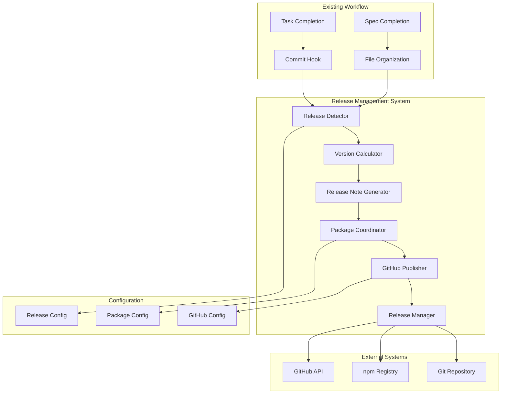

# Design Document: Release Management System

**Date**: October 17, 2025  
**Spec**: F4 - Release Management System  
**Status**: Design Phase  
**Dependencies**: F1 - Mathematical Token System (Complete), F2 - Cross-Platform Build System (Complete)

---

## Overview

The Release Management System implements a complete, automated versioning and release pipeline that integrates seamlessly with the existing DesignerPunk workflow. The system follows a modular architecture with six core components that work together to detect release triggers, calculate semantic version bumps, generate comprehensive release notes, coordinate multi-package versioning, and publish releases to GitHub and npm.

The design prioritizes contamination prevention by eliminating manual decision points while maintaining human oversight through validation gates and manual override capabilities. The system leverages existing completion documentation and spec-driven workflow patterns to provide intelligent, context-aware release management.

---

## Architecture



The system integrates with existing workflow hooks to detect release triggers, processes completion documentation to determine version bumps and generate release notes, coordinates versioning across multiple packages, and publishes releases through GitHub and npm APIs.

---

## Components and Interfaces

### Release Detector

**Responsibility**: Monitors workflow events and analyzes completion documentation to detect when releases should occur.

```typescript
interface ReleaseDetector {
  detectReleaseFromTaskCompletion(taskPath: string, taskName: string): ReleaseSignal | null;
  detectReleaseFromSpecCompletion(specPath: string): ReleaseSignal | null;
  analyzeCompletionDocuments(documentsPath: string): ReleaseAnalysis;
  validateReleaseReadiness(signal: ReleaseSignal): ValidationResult;
}

interface ReleaseSignal {
  type: 'major' | 'minor' | 'patch';
  trigger: 'spec-completion' | 'task-completion' | 'breaking-change' | 'manual';
  confidence: number;
  evidence: string[];
  affectedPackages: string[];
}

interface ReleaseAnalysis {
  breakingChanges: BreakingChange[];
  newFeatures: Feature[];
  bugFixes: BugFix[];
  improvements: Improvement[];
  suggestedVersionBump: 'major' | 'minor' | 'patch';
}
```

### Version Calculator

**Responsibility**: Calculates semantic version bumps based on release signals and maintains version consistency across packages.

```typescript
interface VersionCalculator {
  calculateVersionBump(signal: ReleaseSignal, currentVersion: string): VersionBump;
  validateSemanticVersioning(bump: VersionBump): ValidationResult;
  resolveVersionConflicts(packages: PackageVersion[]): ResolutionStrategy;
  generatePreReleaseVersion(baseVersion: string, type: PreReleaseType): string;
}

interface VersionBump {
  from: string;
  to: string;
  type: 'major' | 'minor' | 'patch';
  preRelease?: PreReleaseInfo;
  rationale: string;
}

interface PackageVersion {
  name: string;
  currentVersion: string;
  proposedVersion: string;
  dependencies: Dependency[];
}
```

### Release Note Generator

**Responsibility**: Extracts content from completion documentation and generates comprehensive, formatted release notes.

```typescript
interface ReleaseNoteGenerator {
  generateFromCompletionDocs(documentsPath: string, analysis: ReleaseAnalysis): ReleaseNotes;
  extractFeatureDescriptions(completionDoc: string): Feature[];
  extractBreakingChanges(completionDoc: string): BreakingChange[];
  formatReleaseNotes(notes: ReleaseNotes, template: ReleaseTemplate): string;
}

interface ReleaseNotes {
  version: string;
  date: string;
  summary: string;
  breakingChanges: BreakingChange[];
  newFeatures: Feature[];
  improvements: Improvement[];
  bugFixes: BugFix[];
  migrationGuide?: MigrationGuide;
}

interface Feature {
  title: string;
  description: string;
  requirements: string[];
  artifacts: string[];
}
```

### Package Coordinator

**Responsibility**: Manages versioning and dependency relationships across multiple packages in the DesignerPunk ecosystem.

```typescript
interface PackageCoordinator {
  coordinateVersions(packages: PackageVersion[], strategy: CoordinationStrategy): CoordinationPlan;
  updateDependencies(plan: CoordinationPlan): DependencyUpdate[];
  validatePackageCompatibility(packages: PackageVersion[]): CompatibilityReport;
  generatePublishingOrder(packages: PackageVersion[]): PublishingPlan;
}

interface CoordinationStrategy {
  corePackageSync: boolean; // Keep @designerpunk/tokens, @designerpunk/build-system in sync
  componentIndependence: boolean; // Allow @designerpunk/components independent versioning
  dependencyUpdates: 'automatic' | 'manual' | 'prompt';
}

interface CoordinationPlan {
  packages: PackageUpdate[];
  dependencyUpdates: DependencyUpdate[];
  publishingOrder: string[];
  conflicts: VersionConflict[];
}
```

### GitHub Publisher

**Responsibility**: Handles all GitHub API interactions for creating releases, tags, and publishing artifacts.

```typescript
interface GitHubPublisher {
  createRelease(release: GitHubRelease): Promise<ReleaseResult>;
  createTags(tags: GitTag[]): Promise<TagResult[]>;
  uploadArtifacts(releaseId: string, artifacts: Artifact[]): Promise<UploadResult[]>;
  publishToNpm(packages: PackagePublish[]): Promise<PublishResult[]>;
}

interface GitHubRelease {
  tagName: string;
  name: string;
  body: string;
  draft: boolean;
  prerelease: boolean;
  artifacts: Artifact[];
}

interface PackagePublish {
  name: string;
  version: string;
  path: string;
  registry: string;
  access: 'public' | 'restricted';
}
```

### Release Manager

**Responsibility**: Orchestrates the entire release process, coordinates between components, and provides the main API.

```typescript
interface ReleaseManager {
  executeRelease(trigger: ReleaseTrigger): Promise<ReleaseResult>;
  validateRelease(plan: ReleasePlan): ValidationResult;
  rollbackRelease(releaseId: string): Promise<RollbackResult>;
  getReleasePlan(signal: ReleaseSignal): ReleasePlan;
}

interface ReleaseTrigger {
  type: 'automatic' | 'manual';
  source: string; // task completion, spec completion, manual command
  overrides?: ReleaseOverrides;
}

interface ReleasePlan {
  version: VersionBump;
  packages: PackageUpdate[];
  releaseNotes: ReleaseNotes;
  publishingPlan: PublishingPlan;
  validationResults: ValidationResult[];
}
```

---

## Data Models

### Configuration Models

```typescript
interface ReleaseConfig {
  detection: DetectionConfig;
  versioning: VersioningConfig;
  publishing: PublishingConfig;
  validation: ValidationConfig;
}

interface DetectionConfig {
  specCompletionTrigger: boolean;
  taskCompletionTrigger: boolean;
  breakingChangeKeywords: string[];
  confidenceThreshold: number;
}

interface VersioningConfig {
  preReleaseStrategy: 'alpha' | 'beta' | 'rc';
  packageCoordination: CoordinationStrategy;
  semanticVersioning: SemanticVersioningRules;
}

interface PublishingConfig {
  github: GitHubConfig;
  npm: NpmConfig;
  artifacts: ArtifactConfig;
}
```

### Workflow Integration Models

```typescript
interface WorkflowIntegration {
  hookIntegration: HookIntegration;
  fileOrganization: OrganizationIntegration;
  aiCollaboration: AICollaborationIntegration;
}

interface HookIntegration {
  commitHookPath: string;
  organizationHookPath: string;
  releaseHookPath: string;
  integrationPoints: IntegrationPoint[];
}
```

---

## Error Handling

### Error Categories and Recovery Strategies

**Version Calculation Errors**
- **Cause**: Invalid semantic versioning, conflicting version requirements
- **Recovery**: Fallback to manual version specification, conflict resolution prompts
- **Prevention**: Pre-validation of version bump logic, dependency analysis

**Release Note Generation Errors**
- **Cause**: Missing completion documentation, malformed completion docs
- **Recovery**: Generate minimal release notes from git commits, prompt for manual input
- **Prevention**: Completion document validation, template enforcement

**Package Coordination Errors**
- **Cause**: Dependency conflicts, circular dependencies, publishing order issues
- **Recovery**: Manual dependency resolution, staged publishing with rollback
- **Prevention**: Dependency graph analysis, compatibility validation

**GitHub/npm Publishing Errors**
- **Cause**: Authentication failures, network issues, registry conflicts
- **Recovery**: Retry with exponential backoff, manual publishing fallback, rollback capabilities
- **Prevention**: Authentication validation, pre-publish checks, dry-run mode

### Rollback Capabilities

```typescript
interface RollbackStrategy {
  gitTagRollback(): Promise<void>; // Remove created tags
  npmUnpublish(): Promise<void>; // Unpublish packages (if possible)
  githubReleaseRollback(): Promise<void>; // Delete GitHub release
  versionRevert(): Promise<void>; // Revert package.json changes
  documentationRevert(): Promise<void>; // Revert documentation updates
}
```

---

## Testing Strategy

### Unit Testing Approach

**Component Isolation**: Each component (ReleaseDetector, VersionCalculator, etc.) tested independently with mocked dependencies.

**Configuration Testing**: Comprehensive testing of configuration parsing, validation, and application.

**Error Scenario Testing**: Systematic testing of error conditions and recovery strategies.

### Integration Testing Approach

**Workflow Integration**: End-to-end testing of integration with existing commit hooks and file organization system.

**Multi-Package Coordination**: Testing version coordination across multiple packages with various dependency scenarios.

**GitHub API Integration**: Testing with GitHub API using test repositories and mock responses.

### Validation Testing Approach

**Semantic Versioning Compliance**: Automated validation that all version bumps follow semantic versioning rules.

**Release Note Quality**: Validation that generated release notes contain required information and proper formatting.

**Package Compatibility**: Testing that coordinated package versions maintain compatibility requirements.

---

## Design Decisions

### Decision 1: Complete System vs Incremental Implementation

**Options Considered**: 
- Incremental implementation starting with basic versioning
- Complete system implementation from the start

**Decision**: Complete system implementation

**Rationale**: Aligns with the systematic, contamination-prevention approach used throughout DesignerPunk. Incremental implementation would create manual decision points and potential inconsistencies that contradict the project's principles.

**Trade-offs**: Higher initial complexity and implementation time, but eliminates contamination vectors and provides complete automation from day one.

### Decision 2: Hook Integration vs Standalone System

**Options Considered**:
- Standalone release management system
- Deep integration with existing hook system
- Hybrid approach with optional integration

**Decision**: Deep integration with existing hook system

**Rationale**: Leverages existing workflow patterns and ensures seamless developer experience. The hook system is already proven and provides the integration points needed for automatic release detection.

**Trade-offs**: Tighter coupling with existing systems, but provides better user experience and maintains workflow consistency.

### Decision 3: Configuration-Driven vs Code-Based Customization

**Options Considered**:
- Hard-coded release logic with minimal configuration
- Extensive configuration files for all behaviors
- Plugin system for custom release logic

**Decision**: Extensive configuration files for all behaviors

**Rationale**: Enables customization without code changes, supports different release strategies for different project phases, and maintains the principle of avoiding manual decision points through clear configuration.

**Trade-offs**: More complex configuration management, but provides flexibility needed for evolving release requirements.

### Decision 4: Multi-Package Coordination Strategy

**Options Considered**:
- Independent versioning for all packages
- Synchronized versioning across all packages
- Hybrid approach with core package synchronization

**Decision**: Hybrid approach with core package synchronization

**Rationale**: Core packages (@designerpunk/tokens, @designerpunk/build-system) need synchronized versions for consistency, while component packages can evolve independently. This balances consistency with flexibility.

**Trade-offs**: More complex coordination logic, but provides appropriate coupling between related packages while allowing independence where beneficial.