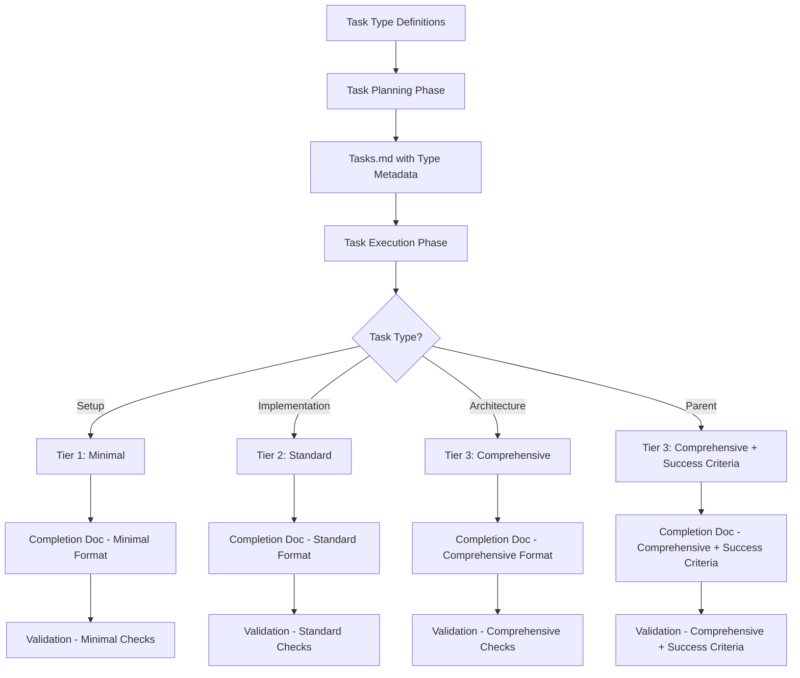

# Design Document: Spec Standards Refinement

**Date**: October 20, 2025  
**Spec**: Spec Standards Refinement  
**Status**: Design Phase  
**Dependencies**: None

---

## Overview

This design document outlines the approach for refining the Spec Planning Standards to implement a three-tier system for task classification, validation, and completion documentation. The design addresses quality concerns identified through F1 vs F2 comparative analysis while maintaining reasonable token efficiency.

The core design principle is **alignment**: validation depth, documentation detail, and task complexity should all align through a consistent three-tier classification system.

---

## Architecture

### System Components



### Three-Tier Classification System

**Tier 1: Minimal** (Setup Tasks)
- **Purpose**: Structural work with low complexity and risk
- **Validation**: Syntax + artifacts verification
- **Documentation**: Brief notes
- **Token Cost**: ~50 validation + ~150 lines doc

**Tier 2: Standard** (Implementation Tasks)
- **Purpose**: Coding work with medium complexity and risk
- **Validation**: Syntax + functional + integration + requirements
- **Documentation**: Standard implementation details
- **Token Cost**: ~200 validation + ~300 lines doc

**Tier 3: Comprehensive** (Architecture + Parent Tasks)
- **Purpose**: Design work and final integration with high complexity and risk
- **Validation**: Syntax + functional + design + integration + edge cases + requirements
- **Documentation**: Extensive with design decisions and lessons learned
- **Token Cost**: ~400-600 validation + ~600-800 lines doc
- **Parent Addition**: Success criteria verification

---

## Components and Interfaces

### Task Type Definitions Document

**Location**: `.kiro/steering/Task-Type-Definitions.md`

**Purpose**: Living document that defines task types with examples and can be updated as new patterns emerge

**Structure**:
```markdown
# Task Type Definitions

**Date**: [Last Updated]
**Purpose**: Define task types for three-tier validation and documentation system
**Organization**: process-standard
**Scope**: cross-project

## Setup Tasks

**Definition**: Structural work that prepares the environment for implementation

**Characteristics**:
- Creates directories, files, or configuration
- Installs dependencies or sets up tooling
- Low complexity, low risk
- Minimal logic or decision-making

**Examples**:
1. Create directory structure
2. Install npm dependencies
3. Configure build scripts
4. Set up test framework
5. Create placeholder files

**Validation**: Tier 1 - Minimal
**Documentation**: Tier 1 - Minimal

## Implementation Tasks

**Definition**: Coding work that implements features or functionality

**Characteristics**:
- Writes code to implement specific functionality
- Integrates with existing code
- Medium complexity, medium risk
- Requires functional validation

**Examples**:
1. Implement class methods
2. Create API endpoints
3. Build UI components
4. Write integration logic
5. Implement data transformations

**Validation**: Tier 2 - Standard
**Documentation**: Tier 2 - Standard

## Architecture Tasks

**Definition**: Design work that establishes patterns, algorithms, or system structure

**Characteristics**:
- Makes design decisions that affect system architecture
- Creates algorithms or complex logic
- Establishes patterns for other code to follow
- High complexity, high risk
- Requires design validation

**Examples**:
1. Design orchestration architecture
2. Create validation algorithm
3. Establish error handling strategy
4. Design plugin system
5. Create mathematical token system

**Validation**: Tier 3 - Comprehensive
**Documentation**: Tier 3 - Comprehensive

## Update History

### [Date] - [Pattern Name]
**Decision**: [Classification chosen]
**Rationale**: [Why this classification]
**Decided By**: [Human + AI Agent]
```

### Updated Spec Planning Standards

**Location**: `.kiro/steering/Spec Planning Standards.md`

**New Sections to Add**:

1. **Task Type Classification System**
   - Three task types defined
   - Link to Task Type Definitions document
   - Guidance on classification during planning

2. **Three-Tier Validation System**
   - Tier 1: Minimal validation checks
   - Tier 2: Standard validation checks
   - Tier 3: Comprehensive validation checks
   - Parent task additions

3. **Three-Tier Completion Documentation System**
   - Tier 1: Minimal format and sections
   - Tier 2: Standard format and sections
   - Tier 3: Comprehensive format and sections
   - Parent task additions

4. **Tasks.md Format with Type Metadata**
   - Example showing task type metadata
   - Example showing validation level specification

5. **Rationale Section**
   - Summary of F1 vs F2 audit findings
   - Why three-tier approach was chosen
   - Token impact analysis

**Sections to Update**:

1. **Tasks Document Format**
   - Add task type metadata field
   - Add validation level field
   - Update examples

2. **Implementation Workflow**
   - Add task type classification step during planning
   - Add validation by tier during execution
   - Update completion documentation guidance

3. **Quality Standards**
   - Update to reflect three-tier approach
   - Add guidance on task type classification

### Updated File Organization Standards

**Location**: `.kiro/steering/File Organization Standards.md`

**Updates Needed**:

1. **Completion Documentation Section**
   - Clarify that completion docs are created for all subtasks
   - Specify naming convention: `task-[N]-completion.md` and `task-[N.M]-completion.md`
   - Confirm organization metadata: `spec-completion`
   - Confirm location: `.kiro/specs/[spec-name]/completion/`

### Audit Summary Document

**Location**: `.kiro/specs/spec-standards-refinement/completion/audit-summary.md`

**Purpose**: Document the rationale for the three-tier approach for future reference

**Structure**:
```markdown
# Spec Standards Refinement: Audit Summary

**Date**: October 20, 2025
**Purpose**: Document rationale for three-tier validation and documentation system
**Organization**: spec-completion
**Scope**: spec-standards-refinement

## Executive Summary

[Brief overview of findings and decision]

## F1 vs F2 Comparative Analysis

### Quantitative Findings
[Completion doc coverage, validation frequency, documentation depth]

### Quality Impact
[Delayed error detection, reduced checkpoints, less detailed docs]

## Three-Tier Approach Rationale

### Why Three Tiers
[Alignment with task complexity, objective classification, balanced approach]

### Token Impact Analysis
[Comparison with F1 and F2 approaches]

## Decision-Making Process

[How we arrived at the three-tier system through systematic skepticism]

## Implementation Recommendations

[Guidance for applying the three-tier system]
```

---

## Data Models

### Task Type Metadata in Tasks.md

```markdown
- [ ] 1. Build System Foundation

  **Type**: Parent
  **Validation**: Tier 3 - Comprehensive (includes success criteria)
  
  **Success Criteria:**
  - [Criterion 1]
  - [Criterion 2]
  
  **Primary Artifacts:**
  - [Artifact 1]
  - [Artifact 2]
  
  **Completion Documentation:**
  - `.kiro/specs/[spec-name]/completion/task-1-completion.md`

  - [ ] 1.1 Create directory structure
    **Type**: Setup
    **Validation**: Tier 1 - Minimal
    - Create src/build/ directory
    - Create src/build/platforms/ directory
    - _Requirements: 1.1_
  
  - [ ] 1.2 Implement token selector
    **Type**: Implementation
    **Validation**: Tier 2 - Standard
    - Implement TokenSelector class
    - Implement selection priority logic
    - _Requirements: 9.1, 9.2_
  
  - [ ] 1.3 Design orchestration architecture
    **Type**: Architecture
    **Validation**: Tier 3 - Comprehensive
    - Design BuildOrchestrator architecture
    - Establish error handling strategy
    - _Requirements: 1.1, 6.3_
```

### Completion Document Templates

**Tier 1: Minimal (Setup Tasks)**

```markdown
# Task [N.M] Completion: [Task Name]

**Date**: [Date]
**Task**: [N.M] [Task name]
**Type**: Setup
**Status**: Complete

---

## Artifacts Created
- [File/directory 1]
- [File/directory 2]

## Implementation Notes
[Brief description of what was done]

## Validation (Tier 1: Minimal)
✅ getDiagnostics passed - no syntax errors
✅ All artifacts created as specified
✅ Basic structure correct and accessible
```

**Tier 2: Standard (Implementation Tasks)**

```markdown
# Task [N.M] Completion: [Task Name]

**Date**: [Date]
**Task**: [N.M] [Task name]
**Type**: Implementation
**Status**: Complete

---

## Artifacts Created
- [File 1]
- [File 2]

## Implementation Details
[Description of implementation approach and key decisions]

## Validation (Tier 2: Standard)

### Syntax Validation
✅ getDiagnostics passed - no syntax errors
✅ All imports resolve correctly

### Functional Validation
✅ [Functional check 1]
✅ [Functional check 2]

### Integration Validation
✅ [Integration check 1]
✅ [Integration check 2]

## Requirements Compliance
✅ Requirement [X.X]: [Description]
✅ Requirement [Y.Y]: [Description]
```

**Tier 3: Comprehensive (Architecture + Parent Tasks)**

```markdown
# Task [N.M] Completion: [Task Name]

**Date**: [Date]
**Task**: [N.M] [Task name]
**Type**: Architecture (or Parent)
**Status**: Complete

---

## Artifacts Created
- [File 1]
- [File 2]

## Architecture Decisions

### Decision 1: [Decision Title]
**Options Considered**: [List alternatives]
**Decision**: [Chosen approach]
**Rationale**: [Why this approach]
**Trade-offs**: [What we're giving up]

## Implementation Details
[Description of implementation approach]

## Algorithm
[Code examples, pseudocode if applicable]

## Validation (Tier 3: Comprehensive)

### Syntax Validation
✅ getDiagnostics passed - no syntax errors

### Functional Validation
✅ [Functional check 1]
✅ [Functional check 2]

### Design Validation
✅ [Design check 1]
✅ [Design check 2]

### Integration Validation
✅ [Integration check 1]
✅ [Integration check 2]

### Edge Cases
✅ [Edge case 1]
✅ [Edge case 2]

## Requirements Compliance
✅ Requirement [X.X]: [Description]

## Lessons Learned
[Insights from implementation]

## Integration Points
[How this integrates with other components]

## Success Criteria Verification
[ONLY for Parent tasks]
✅ Criterion 1: [Verification with evidence]
✅ Criterion 2: [Verification with evidence]

## Overall Integration Story
[ONLY for Parent tasks - how subtasks fit together]
```

---

## Error Handling

### Task Type Classification Errors

**Scenario**: AI agent cannot determine task type during planning

**Handling**:
1. AI agent prompts human: "This task could be classified as [Type A] or [Type B]. Which is more appropriate?"
2. Human provides classification decision
3. AI agent documents decision in tasks.md
4. If new pattern, AI agent updates Task Type Definitions document with pattern and rationale

**Example**:
```
AI: "Task 1.3: 'Implement configuration validation logic'

This could be:
- Implementation (writing validation code)
- Architecture (designing validation strategy)

Which classification is more appropriate?"

Human: "Architecture - this establishes the validation pattern for the system"

AI: "Understood. Classifying as Architecture task. This will use Tier 3: Comprehensive validation and documentation."
```

### Validation Failure Handling

**Scenario**: Validation fails at any tier

**Handling**:
1. Document specific validation failures
2. Fix errors before proceeding
3. Re-run validation
4. Document resolution in completion doc

**Example**:
```markdown
## Validation (Tier 2: Standard)

### Initial Validation (Failed)
❌ getDiagnostics found 2 type errors in TokenSelector.ts
❌ Functional validation: selectToken() not returning correct priority

### Resolution
- Fixed type errors: Added proper type annotations
- Fixed priority logic: Corrected semantic token check

### Final Validation (Passed)
✅ getDiagnostics passed - no syntax errors
✅ Functional validation: selectToken() returns correct priority
```

### Missing Task Type Metadata

**Scenario**: Task in tasks.md doesn't have Type metadata

**Handling**:
1. AI agent defaults to higher tier (safer)
2. AI agent prompts human for clarification
3. Human provides classification
4. AI agent updates tasks.md with Type metadata

---

## Testing Strategy

### Validation Testing

**Unit Testing**: Not applicable (this is process documentation)

**Integration Testing**: Apply three-tier system to next spec and measure:
- Are errors caught at appropriate times?
- Is documentation depth appropriate for task complexity?
- Is task type classification clear and consistent?
- Are token costs within expected range?

**Validation Metrics**:
- Error detection timing (immediate vs delayed)
- Completion doc coverage (should be 100% of subtasks)
- Token usage per spec (compare to F1 and F2)
- Task type classification consistency (% of tasks requiring human clarification)

### Documentation Testing

**Completeness Check**:
- All three tiers have clear definitions
- All validation checks are specific and measurable
- All completion doc sections are defined
- Task Type Definitions includes sufficient examples

**Clarity Check**:
- Can an AI agent apply the three-tier system without ambiguity?
- Can a human understand the rationale for the approach?
- Are examples clear and representative?

---

## Design Decisions

### Decision 1: Three Tiers Instead of Four

**Options Considered**:
- Four tiers: Setup, Implementation, Architecture, Parent
- Three tiers: Setup, Implementation, Architecture+Parent
- Two tiers: Simple, Complex

**Decision**: Three tiers (Setup, Implementation, Architecture+Parent)

**Rationale**:
- Simpler mental model than four tiers
- Architecture and Parent tasks both need thorough validation
- Conditional sections handle Parent-specific needs (success criteria)
- Reduces cognitive load during execution

**Trade-offs**:
- Parent tasks and Architecture tasks use same tier (less distinction)
- Requires conditional sections for Parent-specific content

**Counter-Arguments**:
- Parent tasks are fundamentally different from Architecture subtasks
- Four tiers would provide clearer distinction
- Response: Conditional sections provide sufficient distinction without additional tier complexity

### Decision 2: Task Type Classification During Planning

**Options Considered**:
- Classify during planning phase (when creating tasks.md)
- Classify during execution phase (when implementing tasks)
- No explicit classification (agent decides on the fly)

**Decision**: Classify during planning phase

**Rationale**:
- Removes ambiguity during execution
- Task type documented in tasks.md for reference
- Allows human oversight of classification decisions
- Enables consistent application across all agents

**Trade-offs**:
- Requires upfront classification effort
- Might need reclassification if task changes

**Counter-Arguments**:
- Classification during execution allows for more context
- Response: Planning phase has full context of task structure and dependencies

### Decision 3: Separate Completion Doc Per Subtask

**Options Considered**:
- One doc per parent task with all subtask notes
- Separate doc per subtask
- Inline notes in tasks.md (no separate docs)

**Decision**: Separate doc per subtask

**Rationale**:
- Clear ownership (each subtask has its own doc)
- Incremental writing (write immediately after subtask)
- Easy navigation (want subtask 1.2 info? Open task-1-2-completion.md)
- Git history (separate commits per subtask)
- Parallel work (no file conflicts)

**Trade-offs**:
- More files to manage
- Potential duplication between subtask and parent docs

**Counter-Arguments**:
- Single doc per parent task would be simpler
- Response: Separate docs provide better organization and incremental documentation

### Decision 4: Living Task Type Definitions Document

**Options Considered**:
- Static definitions in Spec Planning Standards
- Living document that can be updated
- No formal definitions (examples only)

**Decision**: Living document in .kiro/steering/

**Rationale**:
- Definitions can evolve as new patterns emerge
- Update history tracks how definitions change
- Separate document keeps Spec Planning Standards focused
- Enables collaborative refinement (human + AI)

**Trade-offs**:
- Another document to maintain
- Definitions might drift over time

**Counter-Arguments**:
- Static definitions would be simpler
- Response: Living document enables continuous improvement as we learn

### Decision 5: Validation Aligned with Task Type

**Options Considered**:
- Validate after every subtask (F1 approach)
- Validate only at parent level (F2 approach)
- Validate at fixed intervals (every 2-3 tasks)
- Validate based on task type (three-tier approach)

**Decision**: Validate based on task type (three-tier approach)

**Rationale**:
- Validation effort matches risk level
- Objective rule (task type determines validation)
- Balances quality and token efficiency
- Catches errors at appropriate times

**Trade-offs**:
- Setup tasks get minimal validation (might miss issues)
- More complex than F2 approach (parent only)

**Counter-Arguments**:
- F1 approach (validate everything) is safer
- Response: Three-tier approach provides sufficient safety at lower token cost

---

## Implementation Approach

### Phase 1: Create Task Type Definitions Document

1. Create `.kiro/steering/Task-Type-Definitions.md`
2. Define three task types with characteristics
3. Provide 5+ examples for each type
4. Include update history section
5. Add metadata (organization: process-standard)

### Phase 2: Update Spec Planning Standards

1. Add Task Type Classification System section
2. Add Three-Tier Validation System section
3. Add Three-Tier Completion Documentation System section
4. Update Tasks Document Format section
5. Update Implementation Workflow section
6. Add Rationale section with audit findings
7. Update examples throughout

### Phase 3: Update File Organization Standards

1. Update Completion Documentation section
2. Clarify naming conventions
3. Confirm organization metadata
4. Add examples

### Phase 4: Create Audit Summary Document

1. Create `.kiro/specs/spec-standards-refinement/completion/audit-summary.md`
2. Document F1 vs F2 findings
3. Document three-tier rationale
4. Document token impact analysis
5. Document decision-making process

### Phase 5: Validation

1. Review all updated documents for consistency
2. Verify examples are clear and accurate
3. Verify all requirements are addressed
4. Get human approval before finalizing

---

## Success Metrics

### Process Metrics

- **Task Type Classification Consistency**: >90% of tasks classified without human clarification needed
- **Completion Doc Coverage**: 100% of subtasks have completion docs
- **Validation Timing**: Errors caught within same task (not accumulated to parent level)

### Quality Metrics

- **Error Detection**: Errors caught at appropriate tier (syntax errors in all tiers, design errors in Tier 3)
- **Documentation Depth**: Appropriate detail for task complexity (brief for Setup, extensive for Architecture)
- **Clarity**: AI agents can apply system without ambiguity

### Efficiency Metrics

- **Token Usage**: ~14,000 tokens per spec (between F1 and F2)
- **Execution Time**: Comparable to F2 (validation adds minimal time)
- **Refinement Feeling**: Subjective assessment that execution feels "more refined" than F2

---

*This design document provides the architecture and approach for implementing a three-tier system that aligns task classification, validation depth, and completion documentation detail to restore incremental quality gates while maintaining reasonable token efficiency.*
