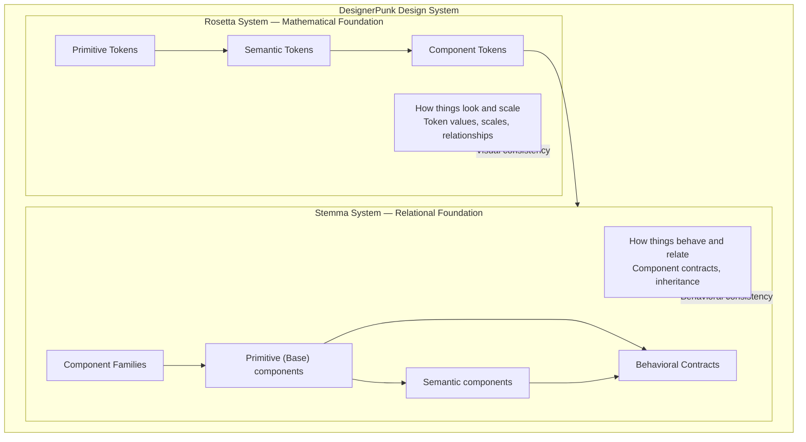
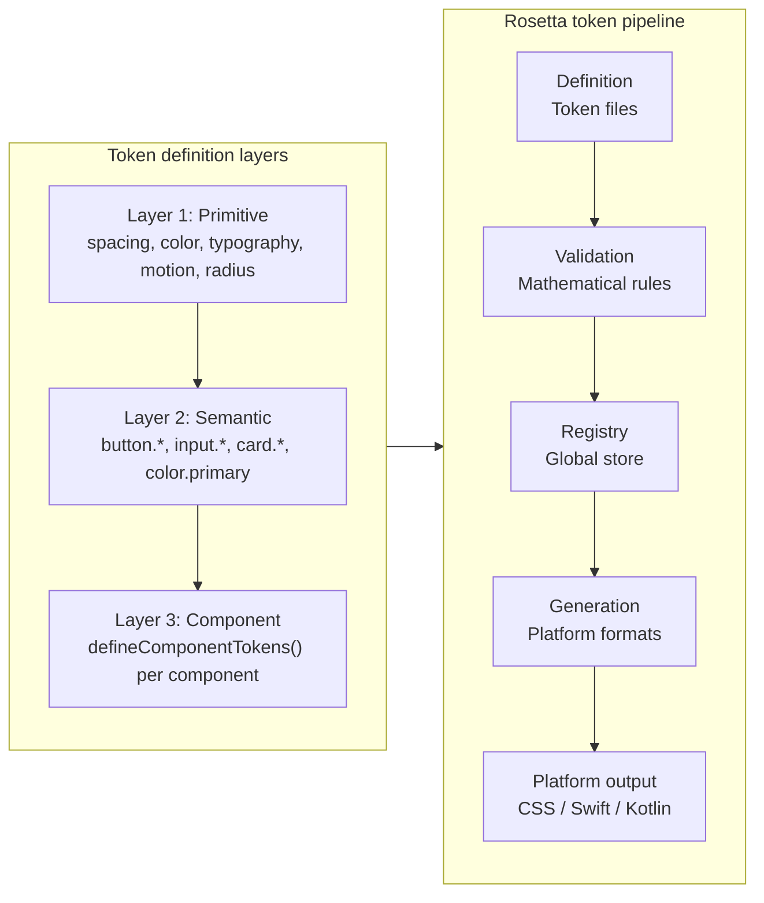
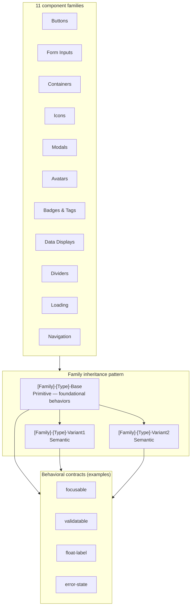
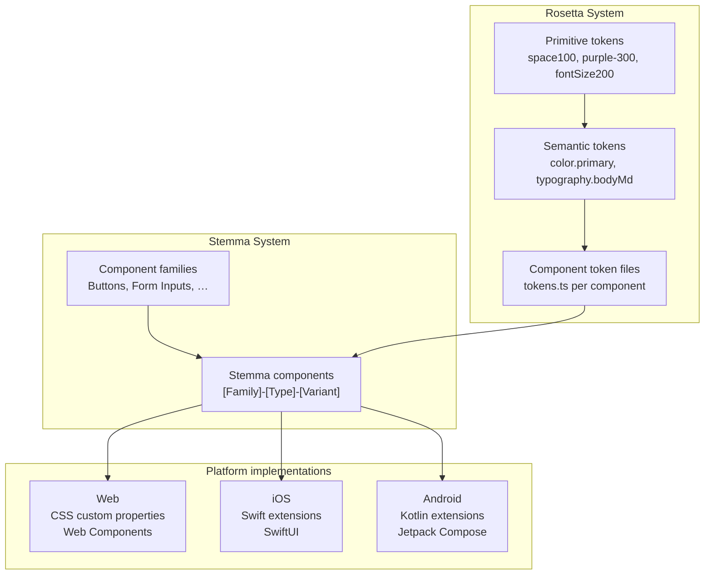
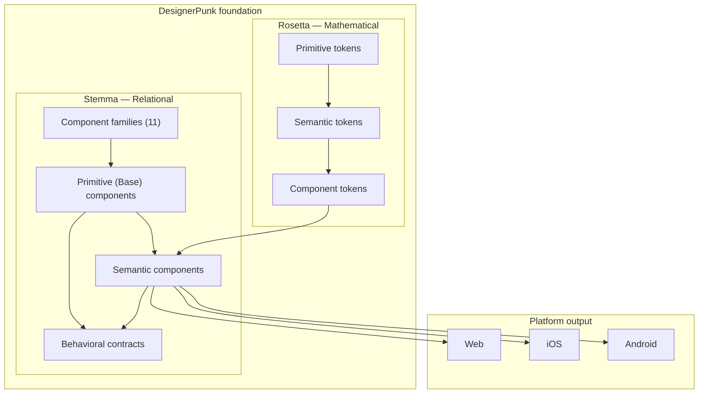

# Rosetta and Stemma Systems — Visual Overview

**Date**: 2026-02-21
**Last Reviewed**: 2026-02-21
**Purpose**: Visual architecture overview of DesignerPunk's dual foundation systems
**Organization**: architecture-overview
**Scope**: cross-project
**Layer**: 1
**Relevant Tasks**: all-tasks

---

## Overview

DesignerPunk is built on two complementary foundation systems:

- **Rosetta System** — Mathematical foundation for visual consistency (tokens, scales, relationships)
- **Stemma System** — Relational foundation for behavioral consistency (components, contracts, inheritance)

This document provides visual diagrams showing how these systems work individually and how they integrate to create the complete design system.

---

## High-Level: DesignerPunk Dual Foundation

This diagram shows the relationship between Rosetta (mathematical) and Stemma (relational) systems, and how they work together to provide both visual and behavioral consistency.

---

## Rosetta System: Token Pipeline and Layers

This diagram shows the Rosetta token pipeline (definition → validation → registry → generation → output) and the three-layer token hierarchy (primitive → semantic → component).

---

## Stemma System: Families and Inheritance

This diagram shows the 11 component families, the family inheritance pattern (primitive base → semantic variants), and how behavioral contracts apply to components.

---

## Integration: Tokens → Components → Platforms

This diagram shows how Rosetta tokens flow into Stemma components, which then generate platform-specific implementations (Web, iOS, Android).

---

## Combined Overview (Single Diagram)

This diagram provides a simplified single-view of the complete system: Rosetta foundation → Stemma foundation → Platform output.

---

## Related Documentation

**Rosetta System:**
- [Rosetta System Principles](./rosetta-system-principles.md) — Mathematical foundation and token philosophy
- [Rosetta System Architecture](./Rosetta-System-Architecture.md) — Detailed pipeline, generation subsystem, validation

**Stemma System:**
- [Stemma System Principles](./stemma-system-principles.md) — Component philosophy and inheritance patterns
- [Component Quick Reference](./Component-Quick-Reference.md) — Routing table for component family docs

**Component Families:**
- [Component-Family-Button.md](./Component-Family-Button.md)
- [Component-Family-Form-Inputs.md](./Component-Family-Form-Inputs.md)
- [Component-Family-Icon.md](./Component-Family-Icon.md)
- [Component-Family-Container.md](./Component-Family-Container.md)
- [Component-Family-Avatar.md](./Component-Family-Avatar.md)
- [Component-Family-Badge.md](./Component-Family-Badge.md)
- [Component-Family-Chip.md](./Component-Family-Chip.md)
- [Component-Family-Progress.md](./Component-Family-Progress.md)
- [Component-Family-Divider.md](./Component-Family-Divider.md) (placeholder)
- [Component-Family-Loading.md](./Component-Family-Loading.md) (placeholder)
- [Component-Family-Modal.md](./Component-Family-Modal.md) (placeholder)
- [Component-Family-Navigation.md](./Component-Family-Navigation.md) (placeholder)
- [Component-Family-Data-Display.md](./Component-Family-Data-Display.md) (placeholder)

---

**Organization**: architecture-overview
**Scope**: cross-project
