# Component Family Inheritance Structures

**Date**: 2026-01-02
**Purpose**: Comprehensive inheritance structures and behavioral contracts for all 11 component families
**Organization**: process-standard
**Scope**: cross-project
**Layer**: 2
**Relevant Tasks**: component-development, architecture, spec-planning
**Last Reviewed**: 2026-01-02

---

## Overview

This document defines the complete inheritance structures for all 11 component families in the Stemma System. Each family section includes primitive component definition, semantic variants, behavioral contracts, and relationship diagrams.

**Status Legend**:
- 🟢 **Production Ready**: Fully implemented, tested, documented
- 🟡 **Beta**: Implemented but may have minor issues  
- 🔴 **Placeholder**: Structural definition only - do NOT use

---

## Family Status Summary

| Family | Primitive Base | Status | Semantic Variants |
|--------|----------------|--------|-------------------|
| Form Inputs | Input-Text-Base | 🟢 | Email, Password, PhoneNumber |
| Buttons | Button-CTA | 🟢 | Standalone (styling via props) |
| Containers | Container-Base | 🟢 | Card, Panel, Hero (planned) |
| Icons | Icon-Base | 🟢 | Status, Action, Navigation (planned) |
| Modals | Modal-Base | 🔴 | Dialog, Sheet, Drawer, Popover |
| Avatars | Avatar-Base | 🔴 | User, Group, Entity |
| Badges and Tags | Badge-Base | 🔴 | Status, Tag, Notification, Label |
| Data Displays | Display-Base | 🔴 | Text, List, Table, Media, Empty |
| Dividers | Divider-Base | 🔴 | Horizontal, Vertical |
| Loading | Loading-Base | 🔴 | Spinner, Progress, Skeleton |
| Navigation | Nav-Base | 🔴 | Tabs, Breadcrumb, List, Bar |

---

## 1. Form Inputs Family

**Status**: 🟢 Production Ready
**Shared Need**: Data collection and validation
**Primitive Base**: Input-Text-Base

### Inheritance Structure

Input-Text-Base (Primitive) │ ├── Input-Text-Email (Semantic) │ └── Email validation + autocomplete │ ├── Input-Text-Password (Semantic) │ └── Secure input + password toggle │ └── Input-Text-PhoneNumber (Semantic) └── Phone formatting + international validation

### Component Summary

| Component | Type | Status | Description |
|-----------|------|--------|-------------|
| Input-Text-Base | Primitive | 🟢 | Foundational text input with float label pattern |
| Input-Text-Email | Semantic | 🟢 | Email validation + autocomplete |
| Input-Text-Password | Semantic | 🟢 | Secure input + password toggle |
| Input-Text-PhoneNumber | Semantic | 🟢 | Phone formatting + international validation |

### Behavioral Contracts

**Base Contracts (9 total)**:
- `focusable` - Keyboard focus support (WCAG 2.1.1)
- `float_label_animation` - Label animates on focus (WCAG 2.3.3)
- `validates_on_blur` - Validation triggers on blur (WCAG 3.3.1)
- `error_state_display` - Error message and styling (WCAG 3.3.1, 1.4.1)
- `success_state_display` - Success styling (WCAG 1.4.1)
- `disabled_state` - Prevents interaction when disabled (WCAG 4.1.2)
- `trailing_icon_display` - Contextual trailing icons
- `focus_ring` - WCAG 2.4.7 focus visible indicator
- `reduced_motion_support` - Respects prefers-reduced-motion

**Extended Contracts by Variant**:
- **Email**: `validates_email_format`, `provides_email_autocomplete`
- **Password**: `provides_secure_input`, `supports_password_toggle`, `provides_password_autocomplete`
- **PhoneNumber**: `validates_phone_format`, `provides_phone_formatting`, `supports_international_formats`

### Token Dependencies

| Category | Tokens |
|----------|--------|
| Typography | `typography.labelMd`, `typography.labelMdFloat`, `typography.input`, `typography.caption` |
| Color | `color.text.muted`, `color.text.default`, `color.primary`, `color.error`, `color.success.strong` |
| Spacing | `space.inset.100`, `space.grouped.tight`, `space.grouped.minimal` |
| Motion | `motion.floatLabel`, `motion.focusTransition` |
| Accessibility | `tapAreaRecommended`, `accessibility.focus.*` |

### MCP Documentation

- **Full Documentation**: `.kiro/steering/Component-Family-Form-Inputs.md`
- **Query**: `get_document_full({ path: ".kiro/steering/Component-Family-Form-Inputs.md" })`

---

## 2. Buttons Family

**Status**: 🟢 Production Ready
**Shared Need**: User interaction and actions
**Primitive Base**: Button-CTA

### Inheritance Structure

Button-CTA (Standalone) │ └── Styling via props (variant: primary | secondary | tertiary) └── No behavioral variants - single component with styling props

### Component Summary

| Component | Type | Status | Description |
|-----------|------|--------|-------------|
| Button-CTA | Standalone | 🟢 | Call-to-action button with variant prop for styling |

### Naming Convention Note

Button-CTA uses the `[Family]-[Type]` pattern (not `[Family]-[Type]-Base`) because:
- CTA is a descriptive type that fully describes the component
- Styling variations (primary, secondary, tertiary) are handled via the `variant` prop
- No behavioral variants exist that would require separate component implementations

### Behavioral Contracts

**Contracts (7 total)**:
- `clickable` - Responds to click/tap interactions (WCAG 2.1.1)
- `focusable` - Keyboard focus support (WCAG 2.1.1)
- `disabled_state` - Prevents interaction when disabled (WCAG 4.1.2)
- `loading_state` - Shows loading indicator during async operations
- `icon_support` - Supports leading/trailing icons
- `focus_ring` - WCAG 2.4.7 focus visible indicator
- `reduced_motion_support` - Respects prefers-reduced-motion

### Token Dependencies

| Category | Tokens |
|----------|--------|
| Typography | `typography.buttonMd`, `typography.buttonSm`, `typography.buttonLg` |
| Color | `color.primary`, `color.secondary`, `color.text.inverse`, `color.background` |
| Spacing | `space.inset.*`, `space.inline.*` |
| Border | `radius.*`, `borderDefault` |
| Accessibility | `tapAreaRecommended`, `accessibility.focus.*` |

### MCP Documentation

- **Full Documentation**: `.kiro/steering/Component-Family-Button.md`
- **Query**: `get_document_full({ path: ".kiro/steering/Component-Family-Button.md" })`

---

## 3. Containers Family

**Status**: 🟢 Production Ready
**Shared Need**: Layout and content organization
**Primitive Base**: Container-Base

### Inheritance Structure

Container-Base (Primitive) │ ├── Container-Card (Semantic) [Planned] │ └── Elevated card with shadow and border radius │ ├── Container-Panel (Semantic) [Planned] │ └── Flat panel for content sections │ └── Container-Hero (Semantic) [Planned] └── Full-width hero section with background

### Component Summary

| Component | Type | Status | Description |
|-----------|------|--------|-------------|
| Container-Base | Primitive | 🟢 | Foundational layout container |
| Container-Card | Semantic | 🔴 Planned | Elevated card with shadow |
| Container-Panel | Semantic | 🔴 Planned | Flat panel for sections |
| Container-Hero | Semantic | 🔴 Planned | Full-width hero section |

### Naming Convention Note

Container-Base uses the `[Family]-Base` pattern because:
- "Base" serves as the Type for this foundational component
- No more specific type is needed for the primitive
- Semantic variants (Card, Panel, Hero) will use `[Family]-[Variant]` pattern

### Behavioral Contracts

**Contracts (7 total)**:
- `contains_children` - Can contain child components
- `applies_padding` - Applies consistent internal padding
- `applies_background` - Supports background color/image
- `applies_border` - Supports border styling
- `applies_shadow` - Supports elevation shadow
- `applies_radius` - Supports border radius
- `responsive_layout` - Adapts to container width

### Token Dependencies

| Category | Tokens |
|----------|--------|
| Color | `color.background`, `color.surface`, `color.border` |
| Spacing | `space.inset.*`, `space.stack.*` |
| Border | `radius.*`, `borderDefault` |
| Shadow | `shadow.sm`, `shadow.md`, `shadow.lg` |

### MCP Documentation

- **Full Documentation**: `.kiro/steering/Component-Family-Container.md`
- **Query**: `get_document_full({ path: ".kiro/steering/Component-Family-Container.md" })`

---

## 4. Icons Family

**Status**: 🟢 Production Ready
**Shared Need**: Visual communication
**Primitive Base**: Icon-Base

### Inheritance Structure

Icon-Base (Primitive) │ ├── Icon-Status (Semantic) [Planned] │ └── Status indicators (success, error, warning, info) │ ├── Icon-Action (Semantic) [Planned] │ └── Action icons (edit, delete, share, etc.) │ └── Icon-Navigation (Semantic) [Planned] └── Navigation icons (arrow, chevron, menu, etc.)

### Component Summary

| Component | Type | Status | Description |
|-----------|------|--------|-------------|
| Icon-Base | Primitive | 🟢 | Foundational icon component |
| Icon-Status | Semantic | 🔴 Planned | Status indicator icons |
| Icon-Action | Semantic | 🔴 Planned | Action icons |
| Icon-Navigation | Semantic | 🔴 Planned | Navigation icons |

### Naming Convention Note

Icon-Base uses the `[Family]-Base` pattern because:
- "Base" serves as the Type for this foundational component
- Semantic variants will categorize icons by purpose (Status, Action, Navigation)

### Behavioral Contracts

**Contracts (5 total)**:
- `renders_svg` - Renders SVG icon content
- `scales_with_size` - Scales proportionally with size prop
- `inherits_color` - Inherits color from parent or uses explicit color
- `accessible_label` - Provides accessible label for screen readers
- `decorative_mode` - Can be marked as decorative (aria-hidden)

### Token Dependencies

| Category | Tokens |
|----------|--------|
| Size | `icon.size100`, `icon.size200`, `icon.size300`, `icon.size400` |
| Color | `color.icon.default`, `color.icon.muted`, `color.icon.inverse` |

### MCP Documentation

- **Full Documentation**: `.kiro/steering/Component-Family-Icon.md`
- **Query**: `get_document_full({ path: ".kiro/steering/Component-Family-Icon.md" })`

---

## 5. Modals Family

**Status**: 🔴 Placeholder
**Shared Need**: Overlay interactions
**Primitive Base**: Modal-Base

### Inheritance Structure

Modal-Base (Primitive) [Placeholder] │ ├── Modal-Dialog (Semantic) [Placeholder] │ └── Centered dialog with backdrop │ ├── Modal-Sheet (Semantic) [Placeholder] │ └── Bottom sheet (mobile) / side panel (desktop) │ ├── Modal-Drawer (Semantic) [Placeholder] │ └── Side drawer navigation │ └── Modal-Popover (Semantic) [Placeholder] └── Contextual popover anchored to trigger

### Component Summary

| Component | Type | Status | Description |
|-----------|------|--------|-------------|
| Modal-Base | Primitive | 🔴 | Foundational modal overlay |
| Modal-Dialog | Semantic | 🔴 | Centered dialog with backdrop |
| Modal-Sheet | Semantic | 🔴 | Bottom sheet / side panel |
| Modal-Drawer | Semantic | 🔴 | Side drawer navigation |
| Modal-Popover | Semantic | 🔴 | Contextual popover |

### Behavioral Contracts (Planned)

**Base Contracts**:
- `manages_focus_trap` - Traps focus within modal (WCAG 2.4.3)
- `supports_backdrop` - Renders backdrop overlay
- `dismissible` - Can be dismissed via close button, backdrop click, or Escape key
- `animates_entry_exit` - Smooth open/close animations
- `prevents_body_scroll` - Prevents background scrolling when open
- `accessible_role` - Proper ARIA role (dialog, alertdialog)

**Extended Contracts by Variant**:
- **Dialog**: `centers_content`, `supports_actions`
- **Sheet**: `slides_from_edge`, `supports_drag_dismiss`
- **Drawer**: `slides_from_side`, `supports_navigation`
- **Popover**: `anchors_to_trigger`, `positions_intelligently`

### Token Dependencies (Planned)

| Category | Tokens |
|----------|--------|
| Color | `color.backdrop`, `color.surface`, `color.border` |
| Spacing | `space.inset.*`, `space.stack.*` |
| Shadow | `shadow.lg`, `shadow.xl` |
| Motion | `motion.modalEntry`, `motion.modalExit` |
| Z-Index | `zIndex.modal`, `zIndex.backdrop` |

### MCP Documentation

- **Full Documentation**: `.kiro/steering/Component-Family-Modal.md`
- **Query**: `get_document_full({ path: ".kiro/steering/Component-Family-Modal.md" })`

---

## 6. Avatars Family

**Status**: 🔴 Placeholder
**Shared Need**: Identity representation
**Primitive Base**: Avatar-Base

### Inheritance Structure

Avatar-Base (Primitive) [Placeholder] │ ├── Avatar-User (Semantic) [Placeholder] │ └── User profile avatar with image/initials fallback │ ├── Avatar-Group (Semantic) [Placeholder] │ └── Stacked group of avatars │ └── Avatar-Entity (Semantic) [Placeholder] └── Organization/brand avatar

### Component Summary

| Component | Type | Status | Description |
|-----------|------|--------|-------------|
| Avatar-Base | Primitive | 🔴 | Foundational avatar component |
| Avatar-User | Semantic | 🔴 | User profile avatar |
| Avatar-Group | Semantic | 🔴 | Stacked group of avatars |
| Avatar-Entity | Semantic | 🔴 | Organization/brand avatar |

### Behavioral Contracts (Planned)

**Base Contracts**:
- `displays_image` - Renders image when available
- `displays_fallback` - Shows initials or icon when image unavailable
- `supports_sizes` - Multiple size variants (xs, sm, md, lg, xl)
- `supports_shapes` - Circle or rounded square shapes
- `accessible_label` - Provides accessible label for screen readers

**Extended Contracts by Variant**:
- **User**: `shows_presence_indicator`, `links_to_profile`
- **Group**: `stacks_avatars`, `shows_overflow_count`
- **Entity**: `supports_logo`, `supports_badge`

### Token Dependencies (Planned)

| Category | Tokens |
|----------|--------|
| Size | `avatar.sizeXs`, `avatar.sizeSm`, `avatar.sizeMd`, `avatar.sizeLg`, `avatar.sizeXl` |
| Color | `color.avatar.background`, `color.avatar.text`, `color.presence.*` |
| Border | `radius.full`, `radius.md` |
| Typography | `typography.avatarInitials` |

### MCP Documentation

- **Full Documentation**: `.kiro/steering/Component-Family-Avatar.md`
- **Query**: `get_document_full({ path: ".kiro/steering/Component-Family-Avatar.md" })`

---

## 7. Badges and Tags Family

**Status**: 🔴 Placeholder
**Shared Need**: Status and labeling
**Primitive Base**: Badge-Base

### Inheritance Structure

Badge-Base (Primitive) [Placeholder] │ ├── Badge-Status (Semantic) [Placeholder] │ └── Status indicators (success, error, warning, info) │ ├── Badge-Tag (Semantic) [Placeholder] │ └── Removable tags for categorization │ ├── Badge-Notification (Semantic) [Placeholder] │ └── Notification count badges │ └── Badge-Label (Semantic) [Placeholder] └── Static labels for metadata

### Component Summary

| Component | Type | Status | Description |
|-----------|------|--------|-------------|
| Badge-Base | Primitive | 🔴 | Foundational badge component |
| Badge-Status | Semantic | 🔴 | Status indicators |
| Badge-Tag | Semantic | 🔴 | Removable tags |
| Badge-Notification | Semantic | 🔴 | Notification count badges |
| Badge-Label | Semantic | 🔴 | Static labels |

### Behavioral Contracts (Planned)

**Base Contracts**:
- `displays_text` - Renders text content
- `supports_icon` - Optional leading icon
- `supports_variants` - Color variants (default, success, error, warning, info)
- `supports_sizes` - Size variants (sm, md, lg)

**Extended Contracts by Variant**:
- **Status**: `indicates_state`, `supports_dot_indicator`
- **Tag**: `supports_removal`, `triggers_on_remove`
- **Notification**: `displays_count`, `supports_max_count`, `supports_dot_mode`
- **Label**: `static_display`, `supports_truncation`

### Token Dependencies (Planned)

| Category | Tokens |
|----------|--------|
| Typography | `typography.badgeSm`, `typography.badgeMd` |
| Color | `color.badge.*`, `color.status.*` |
| Spacing | `space.inset.50`, `space.inline.50` |
| Border | `radius.full`, `radius.sm` |

### MCP Documentation

- **Full Documentation**: `.kiro/steering/Component-Family-Badge.md`
- **Query**: `get_document_full({ path: ".kiro/steering/Component-Family-Badge.md" })`

---

## 8. Data Displays Family

**Status**: 🔴 Placeholder
**Shared Need**: Information presentation
**Primitive Base**: Display-Base

### Inheritance Structure

Display-Base (Primitive) [Placeholder] │ ├── Display-Text (Semantic) [Placeholder] │ └── Formatted text display (headings, paragraphs, labels) │ ├── Display-List (Semantic) [Placeholder] │ └── List display (ordered, unordered, description) │ ├── Display-Table (Semantic) [Placeholder] │ └── Tabular data display │ ├── Display-Media (Semantic) [Placeholder] │ └── Media display (images, videos, audio) │ └── Display-Empty (Semantic) [Placeholder] └── Empty state display

### Component Summary

| Component | Type | Status | Description |
|-----------|------|--------|-------------|
| Display-Base | Primitive | 🔴 | Foundational display component |
| Display-Text | Semantic | 🔴 | Formatted text display |
| Display-List | Semantic | 🔴 | List display |
| Display-Table | Semantic | 🔴 | Tabular data display |
| Display-Media | Semantic | 🔴 | Media display |
| Display-Empty | Semantic | 🔴 | Empty state display |

### Behavioral Contracts (Planned)

**Base Contracts**:
- `renders_content` - Renders provided content
- `supports_alignment` - Text/content alignment options
- `supports_truncation` - Truncation with ellipsis
- `accessible_structure` - Proper semantic HTML structure

**Extended Contracts by Variant**:
- **Text**: `supports_typography_variants`, `supports_links`
- **List**: `supports_list_types`, `supports_nesting`
- **Table**: `supports_sorting`, `supports_pagination`, `supports_selection`
- **Media**: `supports_lazy_loading`, `supports_aspect_ratio`, `supports_fallback`
- **Empty**: `displays_illustration`, `displays_action`

### Token Dependencies (Planned)

| Category | Tokens |
|----------|--------|
| Typography | `typography.heading*`, `typography.body*`, `typography.caption` |
| Color | `color.text.*`, `color.background.*` |
| Spacing | `space.stack.*`, `space.inline.*` |

### MCP Documentation

- **Full Documentation**: `.kiro/steering/Component-Family-Data-Display.md`
- **Query**: `get_document_full({ path: ".kiro/steering/Component-Family-Data-Display.md" })`

---

## 9. Dividers Family

**Status**: 🔴 Placeholder
**Shared Need**: Visual separation
**Primitive Base**: Divider-Base

### Inheritance Structure

Divider-Base (Primitive) [Placeholder] │ ├── Divider-Horizontal (Semantic) [Placeholder] │ └── Horizontal line separator │ └── Divider-Vertical (Semantic) [Placeholder] └── Vertical line separator

### Component Summary

| Component | Type | Status | Description |
|-----------|------|--------|-------------|
| Divider-Base | Primitive | 🔴 | Foundational divider component |
| Divider-Horizontal | Semantic | 🔴 | Horizontal line separator |
| Divider-Vertical | Semantic | 🔴 | Vertical line separator |

### Behavioral Contracts (Planned)

**Base Contracts**:
- `renders_line` - Renders separator line
- `supports_thickness` - Line thickness variants
- `supports_color` - Color variants
- `accessible_role` - Proper ARIA role (separator)

**Extended Contracts by Variant**:
- **Horizontal**: `spans_width`, `supports_inset`
- **Vertical**: `spans_height`, `supports_inset`

### Token Dependencies (Planned)

| Category | Tokens |
|----------|--------|
| Color | `color.border`, `color.divider` |
| Spacing | `space.inset.*` |
| Border | `borderDefault`, `borderThick` |

### MCP Documentation

- **Full Documentation**: `.kiro/steering/Component-Family-Divider.md`
- **Query**: `get_document_full({ path: ".kiro/steering/Component-Family-Divider.md" })`

---

## 10. Loading Family

**Status**: 🔴 Placeholder
**Shared Need**: Progress indication
**Primitive Base**: Loading-Base

### Inheritance Structure

Loading-Base (Primitive) [Placeholder] │ ├── Loading-Spinner (Semantic) [Placeholder] │ └── Circular spinning indicator │ ├── Loading-Progress (Semantic) [Placeholder] │ └── Linear progress bar │ └── Loading-Skeleton (Semantic) [Placeholder] └── Content placeholder skeleton

### Component Summary

| Component | Type | Status | Description |
|-----------|------|--------|-------------|
| Loading-Base | Primitive | 🔴 | Foundational loading component |
| Loading-Spinner | Semantic | 🔴 | Circular spinning indicator |
| Loading-Progress | Semantic | 🔴 | Linear progress bar |
| Loading-Skeleton | Semantic | 🔴 | Content placeholder skeleton |

### Behavioral Contracts (Planned)

**Base Contracts**:
- `indicates_loading` - Visually indicates loading state
- `accessible_label` - Provides accessible label for screen readers
- `supports_sizes` - Size variants (sm, md, lg)
- `reduced_motion_support` - Respects prefers-reduced-motion

**Extended Contracts by Variant**:
- **Spinner**: `animates_rotation`, `supports_color`
- **Progress**: `shows_percentage`, `supports_indeterminate`, `animates_progress`
- **Skeleton**: `mimics_content_shape`, `animates_shimmer`

### Token Dependencies (Planned)

| Category | Tokens |
|----------|--------|
| Color | `color.loading.primary`, `color.loading.track`, `color.skeleton` |
| Size | `loading.sizeSm`, `loading.sizeMd`, `loading.sizeLg` |
| Motion | `motion.spinner`, `motion.progress`, `motion.shimmer` |

### MCP Documentation

- **Full Documentation**: `.kiro/steering/Component-Family-Loading.md`
- **Query**: `get_document_full({ path: ".kiro/steering/Component-Family-Loading.md" })`

---

## 11. Navigation Family

**Status**: 🔴 Placeholder
**Shared Need**: Wayfinding
**Primitive Base**: Nav-Base

### Inheritance Structure

Nav-Base (Primitive) [Placeholder] │ ├── Nav-Tabs (Semantic) [Placeholder] │ └── Tab navigation for content switching │ ├── Nav-Breadcrumb (Semantic) [Placeholder] │ └── Breadcrumb trail for hierarchical navigation │ ├── Nav-List (Semantic) [Placeholder] │ └── Vertical navigation list │ └── Nav-Bar (Semantic) [Placeholder] └── Horizontal navigation bar

### Component Summary

| Component | Type | Status | Description |
|-----------|------|--------|-------------|
| Nav-Base | Primitive | 🔴 | Foundational navigation component |
| Nav-Tabs | Semantic | 🔴 | Tab navigation |
| Nav-Breadcrumb | Semantic | 🔴 | Breadcrumb trail |
| Nav-List | Semantic | 🔴 | Vertical navigation list |
| Nav-Bar | Semantic | 🔴 | Horizontal navigation bar |

### Behavioral Contracts (Planned)

**Base Contracts**:
- `manages_active_state` - Tracks and displays active item
- `supports_keyboard_navigation` - Arrow key navigation (WCAG 2.1.1)
- `accessible_role` - Proper ARIA role (navigation, tablist)
- `supports_icons` - Optional icons for items

**Extended Contracts by Variant**:
- **Tabs**: `switches_content`, `supports_disabled_tabs`, `supports_scrollable`
- **Breadcrumb**: `shows_hierarchy`, `supports_truncation`, `links_to_ancestors`
- **List**: `supports_nesting`, `supports_collapsible`, `supports_badges`
- **Bar**: `supports_responsive`, `supports_dropdown`, `supports_search`

### Token Dependencies (Planned)

| Category | Tokens |
|----------|--------|
| Typography | `typography.navItem`, `typography.navItemActive` |
| Color | `color.nav.default`, `color.nav.active`, `color.nav.hover` |
| Spacing | `space.inline.*`, `space.stack.*` |
| Border | `borderDefault`, `radius.*` |

### MCP Documentation

- **Full Documentation**: `.kiro/steering/Component-Family-Navigation.md`
- **Query**: `get_document_full({ path: ".kiro/steering/Component-Family-Navigation.md" })`

---

## Cross-Family Composition Patterns

### Login Form Pattern

┌─────────────────────────────────────┐ │ Container-Base │ │ ┌─────────────────────────────────┐ │ │ │ Input-Text-Email │ │ │ └─────────────────────────────────┘ │ │ ┌─────────────────────────────────┐ │ │ │ Input-Text-Password │ │ │ └─────────────────────────────────┘ │ │ ┌─────────────────────────────────┐ │ │ │ Button-CTA (primary) │ │ │ └─────────────────────────────────┘ │ └─────────────────────────────────────┘

**Components**: Container-Base, Input-Text-Email, Input-Text-Password, Button-CTA
**Token Dependencies**: `space.stack.*`, `space.inset.*`

### Feed Post Pattern

┌─────────────────────────────────────┐ │ Container-Base (card) │ │ ┌──────┐ ┌────────────────────────┐ │ │ │Avatar│ │ Display-Text (author) │ │ │ └──────┘ └────────────────────────┘ │ │ ┌─────────────────────────────────┐ │ │ │ Display-Text (content) │ │ │ └─────────────────────────────────┘ │ │ ┌─────┐ ┌─────┐ ┌─────┐ │ │ │Like │ │Cmnt │ │Share│ │ │ └─────┘ └─────┘ └─────┘ │ └─────────────────────────────────────┘

**Components**: Container-Base, Avatar-User, Display-Text, Button-CTA (icon variants)
**Token Dependencies**: `space.inline.*`, `space.stack.*`, `radius.card.*`, `shadow.card.*`

---

## Component Relationship Diagram

```mermaid
graph TB
    subgraph "Production Ready 🟢"
        ITB[Input-Text-Base]
        ITE[Input-Text-Email]
        ITP[Input-Text-Password]
        ITPN[Input-Text-PhoneNumber]
        BC[Button-CTA]
        CB[Container-Base]
        IB[Icon-Base]
        
        ITB --> ITE
        ITB --> ITP
        ITB --> ITPN
    end
    
    subgraph "Placeholder 🔴"
        MB[Modal-Base]
        AB[Avatar-Base]
        BB[Badge-Base]
        DB[Display-Base]
        DVB[Divider-Base]
        LB[Loading-Base]
        NB[Nav-Base]
    end
    
    subgraph "Cross-Family Composition"
        CB -.-> ITB
        CB -.-> BC
        BC -.-> IB
        ITB -.-> IB
    end
```

---

## Naming Convention Quick Reference

| Pattern | When to Use | Example |
|---------|-------------|---------|
| `[Family]-[Type]` | Standalone with descriptive type | Button-CTA |
| `[Family]-Base` | Foundational, no specific type | Container-Base, Icon-Base |
| `[Family]-[Type]-Base` | Primitive with semantic variants | Input-Text-Base |
| `[Family]-[Type]-[Variant]` | Semantic variant | Input-Text-Email |

**Key Rules**:
- PascalCase for all segments
- Hyphens between segments
- 2-3 segments maximum
- "Base" reserved for foundational components

---

*For detailed implementation guidance, see individual family MCP documents.*
*For naming conventions, see `.kiro/steering/stemma-system-principles.md`.*