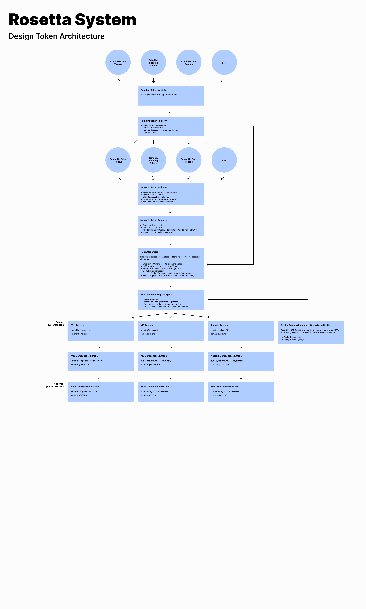
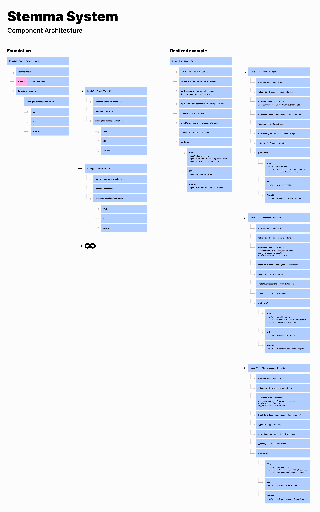

# DesignerPunk v8

**A Design System Foundation Built for Modern Product Development, Cross-Platform Excellence, and AI-Assisted Development**

[](docs/releases/RELEASE-NOTES-8.0.0.md)
[](https://github.com/3fn/DesignerPunkv2)
[](LICENSE)
[](https://www.typescriptlang.org/)
[](.)

---

## Latest Release: v8.0.0

**Contract & Metadata Infrastructure** — Three specs delivering uniform behavioral contracts, machine-readable component metadata, and a rebuilt release pipeline:

- **Uniform Contract System** (Spec 063): 10-category behavioral contract taxonomy with 112 concepts across all 28 components — standardized `contracts.yaml` files as the sole source of truth for behavioral guarantees, with formal inheritance and intentional exclusions
- **Component Metadata Schema** (Spec 064): New component MCP server assembling schema, contracts, and semantic annotations into a queryable catalog — 6 tools with progressive disclosure for agent-driven component selection and composition
- **Release System Rebuild** (Spec 065): Summary-driven release analysis pipeline with LLM-powered change classification, version recommendation, and automated release notes generation

**Breaking**: Avatar renamed to Avatar-Base; component MCP server is a new sibling server; release tool relocated to `src/tools/release/`.

[Full Release Notes →](docs/releases/RELEASE-NOTES-8.0.0.md)

---

## One Thing First

This is **my design system foundation**—15+ years of industry experience distilled into an opinionated, mathematically-grounded system. I built it for my own work. If it's useful for yours too, excellent. But I'm sharing it because I believe these principles and patterns represent genuinely better approaches to design systems.

---

## What This Actually Is

DesignerPunk isn't a design system you download and use off-the-shelf. It's:

1. **A complete toolkit I use for my own projects** - Including components, tokens, build systems, and tooling
2. **A case study in design system thinking** - Portfolio work demonstrating deep expertise in cross-platform design systems
3. **A working exploration of AI-assisted design development** - With a production-grade MCP server that actually reduces AI context load by 82%

---

## Core Systems

DesignerPunk is built on two interconnected systems:


### Rosetta System — The Mathematical Foundation



A token system + build pipeline that translates design intent into platform-native code.

- **Tokens**: ~310 mathematical values (spacing, color, typography, radius, shadow, glow, motion, opacity, blend)
- **Build Pipeline**: Converts tokens to CSS (web), Swift (iOS), Kotlin (Android)
- **Documentation**: Mechanical parsing + MCP servers for AI-friendly access
- **Purpose**: Single source of truth that generates consistent output across platforms

Think of it as: **Define once, generate everywhere**

**What's included:**
- Three-tier architecture: Primitive → Semantic → Component tokens
- Cross-platform generation with platform-native syntax
- MCP Documentation Server with 82% token reduction for AI agents
- Component MCP Server with 6 query tools for agent-driven component selection
- Empirically validated performance and token efficiency

### Stemma System — The Component Architecture



A framework for building components that work identically across platforms while staying native.

- **Naming Convention**: `[Family]-[Type]-[Variant]` (AI-discoverable)
- **Behavioral Contracts**: 10-category taxonomy with 112 concepts — explicit specifications ensuring cross-platform consistency
- **Component MCP Server**: Machine-readable metadata with 6 query tools for agent-driven component selection
- **11 Component Families**: Navigation, Form Inputs, Core, Progress Indicators, Data Displays, etc.
- **Purpose**: Systematic, scalable component development with shared architecture

Think of it as: **Build once, implement natively everywhere**

**What's included:**
- Form Inputs family (4 production-ready components)
- Core components (11 production-ready components)
- Placeholder families with documented patterns (6 families, ready for implementation)
- Health guardrails with 270+ validation tests
- Component token API for lightweight, reasoned token authoring
- 28 contracts.yaml files with formal inheritance and intentional exclusions
- 28 component-meta.yaml semantic annotations for agent selection guidance

#### Unified Contract System


Every component makes explicit behavioral promises organized by a 10-category taxonomy (layout, interaction, state, validation, accessibility, composition, content, animation, visual, performance), with formal inheritance and intentional exclusions. Contracts define WHAT behavior occurs across platforms — implementations define HOW. The component MCP server makes these contracts queryable by agents.

---

## The Problem It Solves

### The Real Issues

**For designers building products**: You need consistency across web, iOS, and Android without maintaining three separate design systems. Mathematical precision in your token system prevents "but what does medium padding mean?" arguments between platforms.

**For AI agents assisting with design**: They encounter "fuzzy" terminology where terms mean different things across contexts. When you tell Claude "use space100," that's unambiguous: it means 8 pixels/points/dp. When you say "add padding," Claude has to guess.

**For teams learning design systems**: Good design systems are hard to understand because they're rarely documented with their underlying philosophy. You see tokens and components but not *why* they're structured that way.

### How DesignerPunk Addresses Them

- **Mathematical Foundation**: Every spacing relationship derives from an 8px baseline grid. space075=6, space100=8, space150=12. It's mathematical, not arbitrary.
- **True Native Architecture**: Build-time platform separation means you ship native iOS/Android/Web code—not a cross-platform compromise.
- **AI-First Documentation**: The MCP Documentation Server lets AI agents query your design system intelligently, reducing context load by 82%.

---

## Why This Matters

### For Designers

**Design systems are infrastructure**, not just pretty components. You need:
- Mathematical relationships that hold across platforms (no fuzzy "medium padding")
- Clear architectural thinking (so you know *why* tokens are organized this way)
- Built-in contamination prevention (so your system doesn't degrade as it evolves)

DesignerPunk demonstrates all three.

### For Developers

**Cross-platform development is hard** because you usually choose:
- Shared codebase (loses native performance)
- Separate codebases (multiplies maintenance)

True native architecture says: same *design system*, separate *implementations*. One source of truth (tokens), platform-optimized delivery (native code).

### For AI Advocates

**AI can't collaborate on design without precision**. "Use medium padding" is ambiguous. "Use space150" is unambiguous. The MCP server proves that precise design language enables AI agents to generate better code.

---

## Engineering Approach: AI-Driven Implementation Supported by Human Framing

I provide architectural direction, design decisions, and problem-solving; AI agents (Claude, Cursor) handle implementation.

This is the **producer/musician model**: I don't write the music, but I shape the sound through clear vision, specific guidance, and iterative refinement.

**Why this matters**: This demonstrates how modern product teams actually work. You don't need to be an expert coder to build sophisticated systems—you need to understand architecture, make good decisions, and guide implementation effectively.

DesignerPunk has 7,400+ tests, production implementations across Web/iOS/Android, and sophisticated build pipelines—all architected and guided by clear framing, with execution handled by AI.

This is a working case study in how to lead AI-driven development at scale.

---

## Current State

### ✅ Production Ready

**Form Inputs Family** (Web, iOS, Android)
- `Input-Text-Base`, `Input-Text-Email`, `Input-Text-Password`, `Input-Text-PhoneNumber`
- Complete with validation, accessibility, and cross-platform consistency

**Core Components** (Web, iOS, Android)
- Avatar, Badges (Label/Count/Notification), Buttons (CTA/Icon), Containers (Base/Card), Icon System
- Chips (Base/Filter/Input) — Compact interactive elements for filtering, selection, and input
- Checkboxes (Base/Legal) — Binary selection controls with legal consent support
- Radio Buttons (Base/Set) — Single-selection controls with mutual exclusivity and group orchestration
- Progress Indicators — Node-Base, Connector-Base, Label-Base (primitives) + Pagination-Base, Stepper-Base, Stepper-Detailed (semantic variants) with sliding window virtualization
- 28 production-ready components with behavioral contracts
- Full cross-platform support with platform-native implementations
- Uniform contract system: 10 categories, 112 concepts, formal inheritance

**Custom Agent System**
- 3 specialized Kiro agents: Ada (tokens), Lina (components), Thurgood (governance)
- Domain-scoped configurations with progressive `skill://` resource loading
- 11 user-triggered validation hooks across all agents
- 53 steering docs with skill-compatible frontmatter for on-demand loading

**Rosetta Token System**
- 310+ tokens (spacing, typography, color, radius, shadow, glow, motion, opacity, blend)
- Cross-platform generation (CSS, Swift, Kotlin, DTCG JSON)
- Three-tier architecture (Primitive → Semantic → Component)
- MCP Documentation Server with 82% token reduction for AI agent queries
- Component MCP Server with progressive disclosure queries for agent-driven selection
- Bidirectional Figma integration: token push (Variables + Styles) and design extraction (ComponentAnalysis with three-tier classification)

### 🟡 Structural Foundation Ready

**Placeholder Component Families** (6 families)
- Navigation, Data Displays, Loading, Modals, Dividers
- Architecture documented, inheritance patterns defined, ready for implementation
- Waiting for component-specific needs to drive development

### 📋 What's Not Included (And Why)

**Design Tool Integration** 
- Figma integration is production-ready (v7.0.0) — bidirectional token sync and component analysis
- Other design tools (Sketch, Adobe XD) not currently supported

**Pre-built Themes Beyond Base/WCAG**
- By design—you define additional themes using the token system
- The system enables infinite variations rather than shipping predefined ones
- Current support: Original theme + WCAG 2.2 theme, each with day/night modes

**Component Templates for Non-Web Platforms**
- Currently Web-forward—iOS and Android use hand-written Swift/Kotlin
- Future exploration may provide templates to accelerate platform parity

---

## Getting Started

### What You Can Actually Use Today

If you want to understand how these ideas work in practice:

1. **The token system** (`src/tokens/`) — 310 tokens organized mathematically with cross-platform generation
2. **Component implementations** (`src/components/`) — Real, production-ready components for Web/iOS/Android
3. **MCP Documentation Server** (`mcp-server/`) — Working implementation you can integrate with Cursor or Claude
4. **Component MCP Server** (`component-mcp-server/`) — Agent-driven component discovery and selection
5. **Steering Documentation** (`.kiro/steering/`) — Current architectural thinking and development guidance

### Installation

```bash
git clone https://github.com/3fn/DesignerPunkv2.git
cd DesignerPunkv2
npm install
npm test
```

### If You Want to Explore

**5-minute intro**: Read [What This Actually Is](#what-this-actually-is) + [Core Systems](#core-systems)

**30-minute deep dive**: 
- Read [.kiro/steering/Token System Overview](.kiro/steering/)
- Check [Component Examples](#architecture-highlights)
- Look at one component implementation (e.g., `src/components/core/Button-CTA/`)

**Full commitment**:
- Review [.kiro/steering/](.kiro/steering/) — Current architectural thinking and development guidance
- Study [Strategic Framework](strategic-framework/) — How core systems fit together
- Read component code across Web, iOS, Android to see true native architecture in action

---

## Architecture Highlights

### True Native Design-to-Code

Instead of cross-platform compromises:

```
DesignerPunk Tokens (unambiguous)
         ↓
    [Build System]
    /      |      \
  Web    iOS     Android
  ↓       ↓        ↓
 CSS    Swift    Kotlin
(Native code for each platform)
```

### AI-Accessible Design Language

```
Traditional: "Add medium padding"
DesignerPunk: "Add space150" (unambiguous: 8px/pt/dp)

Claude with DesignerPunk: "Use space150 for button padding"
Result: Correct implementation on all platforms
```

### Documentation as a Queryable System

Instead of: *"Read our 26,000-token documentation"*
With MCP: *"Query the documentation map → get summary → retrieve specific section"*

**Result**: 82% token reduction, AI agents can access design guidance without context exhaustion

### Component Selection as a Queryable System

Instead of: *"Parse 28 schema files, 28 contract files, and 28 annotation files"*
With Component MCP: *"find_components({ purpose: 'email' }) → get_component_summary('Input-Text-Email')"*

**Result**: Agents discover and select components through structured queries, not file parsing

### Component Token Authoring

```typescript
defineComponentTokens({
  component: 'buttonicon',
  family: 'spacing',
  tokens: {
    insetLarge: {
      reference: space150,
      reasoning: 'Large buttons need comfortable touch targets'
    }
  }
})
```

Lightweight authoring with explicit reasoning, cross-platform generation.

---

## Core Philosophy

### The Business Localization Model

Tokens are "remote workers" with specialized expertise serving multiple "markets" (platforms) through "translation services" (build system):

- **Remote Workers (Tokens)**: Provide pure mathematical expertise (space100=8)
- **Language Translators**: Convert expertise to platform formats (8px web, 8pt iOS, 8dp Android)
- **Cultural Translators (Build System)**: Ensure platform-native delivery
- **Local Operations (Components)**: Serve end users with consistent, native experiences

This metaphor clarifies the whole architecture.

### Mathematical Precision with Strategic Flexibility

- **8px baseline grid**: Systematic foundation
- **Strategic flexibility**: Mathematically-derived exceptions (space075=6, not arbitrary)
- **Cross-platform consistency**: Same relationships across all platforms

### Systematic Skepticism in AI Collaboration

Every AI recommendation includes mandatory counter-arguments:

```
"I recommend space.grouped.normal for field spacing.

HOWEVER, here's why this might be wrong:
- If validation is complex, space.related.normal provides better separation
- For mobile, space.grouped.tight might be more appropriate
- Consider whether space.inset tokens are needed for internal padding"
```

This prevents AI optimism bias and builds trust.

---

## Development Direction

The following represent areas of active development, sequenced by dependencies and architectural coherence rather than strict timelines.

### Current Work

- Specs 048-065 (active implementation)

### Near-Term Focus

Development continues based on architectural needs and emerging patterns. Check `.kiro/specs/` for current work in progress.

---

## Areas to Explore

These represent genuine interests—not committed roadmap items, but directions we're actively thinking about:

### Design Tool Integration

**Figma Console MCP** — Bidirectional Figma integration is now production-ready (v7.0.0). Token push syncs DesignerPunk tokens to Figma as native Variables and Styles. Design extraction reads Figma components and generates ComponentAnalysis artifacts with three-tier token classification.

**What's next**: Expanded property extraction for HTML/CSS prototype generation, typography style capture, and multi-file support.

### Expanded Theming System

Currently: Original theme, WCAG 2.2 theme, day/night modes for both

Future exploration:
- Additional semantic themes (high-contrast, reduced-motion variants)
- Custom theme authoring patterns
- Theme composition (mix and match variant strategies)

**Why it matters**: Different use cases need different themes; the infrastructure exists, patterns need exploration.

### Component Generation from Specifications

**Wireframing-to-component**: Generate component skeletons from wireframe specifications

**Spec-to-component**: Auto-generate component boilerplate from Stemma System specs

**Why it matters**: Reduces manual scaffolding; accelerates component development cycle.

### Design File-to-Component Pipeline

**Active exploration**: ComponentAnalysis extraction (v7.0.0) captures layout, typography, color, stroke, and dimensions from Figma components with token classification. The analysis data is rich enough to inform prototype generation — a natural next step.

**Why it matters**: Closes the gap between design and implementation with structured, machine-readable analysis rather than manual translation.

---

## Key Innovations

### Mathematical Token System
Every spacing token derives from 8px baseline. Color relationships follow design theory (warm light creates cool shadows). Motion timing follows Material Design curves. Nothing is arbitrary.

### Electric Design Language
45-color palette system with dual themes:
- **Original**: Maximum aesthetic impact for marketing moments
- **WCAG 2.2**: Accessible while maintaining electric character

Both support day/night modes for comprehensive coverage.

### Hierarchical Spacing Semantics
Two-category system that encodes design intent:
- **Layout tokens**: External spacing (space.grouped, space.separated)
- **Inset tokens**: Internal spacing (space.inset.tight, space.inset.spacious)

### True Native Architecture
Build-time platform separation provides native performance with unified developer experience—no runtime platform detection, same API contracts, platform-specific optimization.

---

## Portfolio Context

This project demonstrates:

| What | Why It Matters |
|------|----------------|
| **Complete design system foundation** | Shows understanding of system design, not just components |
| **Cross-platform native code** | Demonstrates bridge between design and deep technical work |
| **310+ tokens** | Proves ability to create systematic, scalable foundations |
| **7,400+ tests** | Shows commitment to reliability and quality |
| **2 MCP Servers** (docs + components) | Working solutions to real AI collaboration problems |
| **112 behavioral contracts** | Explicit cross-platform consistency guarantees |
| **Architectural documentation** | Demonstrates design leadership and systems thinking |

For hiring managers: This shows someone who understands both design and engineering deeply enough to build infrastructure that serves both disciplines.

---

## How to Use This

### If You're Evaluating Design Systems
This demonstrates what a complete, mathematically-grounded design system looks like. Read the token definitions, study component implementations.

### If You're Hiring
This shows design system expertise, cross-platform thinking, ability to direct AI-driven development, and the ability to build infrastructure that serves both design and engineering.

### If You're Building Products
Study the token system and component patterns. The architecture is reusable—even if you don't adopt DesignerPunk directly, these principles will improve your own work.

### If You're Interested in AI + Design
The MCP Documentation Server is a working solution to the "AI context exhaustion" problem. It's production-grade and empirically validated.

---

## Deep Dives

**Want the full story?**

- [Strategic Framework](strategic-framework/) — How core systems fit together
- [Steering Documentation](.kiro/steering/) — Current architectural thinking and development guidance  
- [Component Development Guide](.kiro/steering/Component%20Development%20Guide.md) — How to build components in this system
- [Token System Overview](docs/token-system-overview.md) — Complete token documentation

---

## Learning About Me

**Peter Michaels Allen** — Designer, Design System Architect, and Design Leadership Expert

- 15+ years of design leadership across enterprise, healthcare, fintech
- Deep expertise in design systems at scale
- Strong opinions about mathematical precision, accessibility, and sustainable development
- Teaching myself engineering processes and structure to build infrastructure that serves design

**LinkedIn**: [petermichaelsallen](https://www.linkedin.com/in/petermichaelsallen/)

---

## License

MIT — Use it however you want.

---

## One More Thing

This project reflects my opinions about what good design systems look like. You might disagree with some choices (the mathematical relationships, the semantic token structure, the emphasis on AI collaboration). That's fine. The point is to demonstrate *systematic thinking* about design system architecture.

Even if you don't adopt DesignerPunk directly, I hope it influences how you think about design systems in your own work.
```

---

## What Changed from Previous Version

1. ✅ **Added** Uniform Contract System: 10-category taxonomy, 112 concepts, 28 contracts.yaml files (Spec 063)
2. ✅ **Added** Component MCP Server: 6 query tools with progressive disclosure, resolve-on-read assembly (Spec 064)
3. ✅ **Added** 28 component-meta.yaml semantic annotations with purpose, usage, contexts, alternatives (Spec 064)
4. ✅ **Added** Contract-token derivation for accessibility and animation contracts (Spec 064)
5. ✅ **Added** Composition checking with bounded conditional rules (Spec 064)
6. ✅ **Added** Release analysis pipeline rebuild with summary-driven change detection (Spec 065)
7. ✅ **Added** Contract-System-Reference.md and Component-Schema-Format.md steering docs (Spec 063)
8. ✅ **Added** Schema reference, query guide, and authoring guide documentation (Spec 064)
9. ✅ **Breaking** Avatar renamed to Avatar-Base across all references (Spec 064)
10. ✅ **Breaking** Component MCP server is a new sibling server requiring configuration (Spec 064)
11. ✅ **Breaking** Release tool relocated from `src/release-analysis/` to `src/tools/release/` (Spec 065)
12. ✅ **Updated** Agent configurations: Lina's scaffolding workflow, MCP queries, write paths (Spec 064)
13. ✅ **Updated** Specs reference to 048-065 (active implementation)
