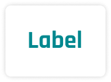
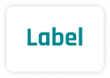

# Component Analysis: Segment

**Component Type**: COMPONENT_SET
**Figma ID**: 1639:125
**File Key**: yU7908VXR1khQN5hZXC6Cy
**Extracted**: 2026-03-10T14:40:25.439Z
**Extractor Version**: 6.3.0

**Variant Definitions**:
- State: VARIANT, default=Active (Active, Inactive)
- Type: VARIANT, default=Label (Label, Icon)
- Size: VARIANT, default=Standard (Standard, Condensed)

---

## Classification Summary

| Tier | Count | Percentage |
| --- | --- | --- |
| ✅ Semantic Identified | 0 | 0% |
| ⚠️ Primitive Identified | 64 | 44% |
| ❌ Unidentified | 80 | 56% |
| **Total** | **144** | **100%** |

## Node Tree

- **Segment** (COMPONENT_SET, depth 0) [S:0 P:0 U:0]
  - **State=Active, Type=Label, Size=Standard** (COMPONENT, depth 1) [S:0 P:5 U:3]
    - **Label** (TEXT, depth 2) [S:0 P:2 U:3]
  - **State=Active, Type=Label, Size=Condensed** (COMPONENT, depth 1) [S:0 P:5 U:3]
    - **Label** (TEXT, depth 2) [S:0 P:2 U:3]
  - **State=Active, Type=Icon, Size=Standard** (COMPONENT, depth 1) [S:0 P:5 U:3]
    - **Icon** (INSTANCE, depth 2) [S:0 P:0 U:6]
      - **Vector (Stroke)** (FRAME, depth 3) [S:0 P:1 U:1]
      - **Vector (Stroke)** (FRAME, depth 3) [S:0 P:1 U:1]
      - **Vector (Stroke)** (FRAME, depth 3) [S:0 P:1 U:1]
      - **Vector (Stroke)** (FRAME, depth 3) [S:0 P:1 U:1]
      - **Vector (Stroke)** (FRAME, depth 3) [S:0 P:1 U:1]
  - **State=Active, Type=Icon, Size=Condensed** (COMPONENT, depth 1) [S:0 P:5 U:3]
    - **Icon** (INSTANCE, depth 2) [S:0 P:0 U:6]
      - **Vector (Stroke)** (FRAME, depth 3) [S:0 P:1 U:1]
      - **Vector (Stroke)** (FRAME, depth 3) [S:0 P:1 U:1]
      - **Vector (Stroke)** (FRAME, depth 3) [S:0 P:1 U:1]
      - **Vector (Stroke)** (FRAME, depth 3) [S:0 P:1 U:1]
      - **Vector (Stroke)** (FRAME, depth 3) [S:0 P:1 U:1]
  - **State=Inactive, Type=Label, Size=Standard** (COMPONENT, depth 1) [S:0 P:4 U:3]
    - **Label** (TEXT, depth 2) [S:0 P:2 U:3]
  - **State=Inactive, Type=Label, Size=Condensed** (COMPONENT, depth 1) [S:0 P:4 U:3]
    - **Label** (TEXT, depth 2) [S:0 P:2 U:3]
  - **State=Inactive, Type=Icon, Size=Standard** (COMPONENT, depth 1) [S:0 P:4 U:3]
    - **Icon** (INSTANCE, depth 2) [S:0 P:0 U:6]
      - **Vector (Stroke)** (FRAME, depth 3) [S:0 P:1 U:1]
      - **Vector (Stroke)** (FRAME, depth 3) [S:0 P:1 U:1]
      - **Vector (Stroke)** (FRAME, depth 3) [S:0 P:1 U:1]
      - **Vector (Stroke)** (FRAME, depth 3) [S:0 P:1 U:1]
      - **Vector (Stroke)** (FRAME, depth 3) [S:0 P:1 U:1]
  - **State=Inactive, Type=Icon, Size=Condensed** (COMPONENT, depth 1) [S:0 P:4 U:3]
    - **Icon** (INSTANCE, depth 2) [S:0 P:0 U:6]
      - **Vector (Stroke)** (FRAME, depth 3) [S:0 P:1 U:1]
      - **Vector (Stroke)** (FRAME, depth 3) [S:0 P:1 U:1]
      - **Vector (Stroke)** (FRAME, depth 3) [S:0 P:1 U:1]
      - **Vector (Stroke)** (FRAME, depth 3) [S:0 P:1 U:1]
      - **Vector (Stroke)** (FRAME, depth 3) [S:0 P:1 U:1]

## Token Usage by Node

### State=Active, Type=Label, Size=Standard (COMPONENT, depth 1)

- ⚠️ `padding-top`: space.space150 (binding, exact)
- ⚠️ `padding-right`: space.space200 (binding, exact)
- ⚠️ `padding-bottom`: space.space150 (binding, exact)
- ⚠️ `padding-left`: space.space200 (binding, exact)
- ⚠️ `fill`: color.white100 (binding, exact)
- ❌ `item-spacing`: 8 (value-match)
- ❌ `border-radius`: 4 (value-match)
- ❌ `border-width`: 1 (value-match)

### Label (TEXT, depth 2)

- ⚠️ `fill`: color.cyan500 (binding, exact)
- ⚠️ `font-size`: fontSize.fontSize125 (binding, exact)
- ❌ `border-width`: 1 (value-match)
- ❌ `font-weight`: 700 (value-match)
- ❌ `line-height`: 28 (out-of-tolerance — closest: lineHeight.lineHeight125 (±26.444px))

### State=Active, Type=Label, Size=Condensed (COMPONENT, depth 1)

- ⚠️ `padding-top`: space.space100 (binding, exact)
- ⚠️ `padding-right`: space.space150 (binding, exact)
- ⚠️ `padding-bottom`: space.space100 (binding, exact)
- ⚠️ `padding-left`: space.space150 (binding, exact)
- ⚠️ `fill`: color.white100 (binding, exact)
- ❌ `item-spacing`: 8 (value-match)
- ❌ `border-radius`: 4 (value-match)
- ❌ `border-width`: 1 (value-match)

### Label (TEXT, depth 2)

- ⚠️ `fill`: color.cyan500 (binding, exact)
- ⚠️ `font-size`: fontSize.fontSize100 (binding, exact)
- ❌ `border-width`: 1 (value-match)
- ❌ `font-weight`: 700 (value-match)
- ❌ `line-height`: 24 (out-of-tolerance — closest: lineHeight.lineHeight125 (±22.444px))

### State=Active, Type=Icon, Size=Standard (COMPONENT, depth 1)

- ⚠️ `padding-top`: space.space150 (binding, exact)
- ⚠️ `padding-right`: space.space200 (binding, exact)
- ⚠️ `padding-bottom`: space.space150 (binding, exact)
- ⚠️ `padding-left`: space.space200 (binding, exact)
- ⚠️ `fill`: color.white100 (binding, exact)
- ❌ `item-spacing`: 8 (value-match)
- ❌ `border-radius`: 4 (value-match)
- ❌ `border-width`: 1 (value-match)

### Icon (INSTANCE, depth 2)

- ❌ `padding-top`: 0 (value-match)
- ❌ `padding-right`: 0 (value-match)
- ❌ `padding-bottom`: 0 (value-match)
- ❌ `padding-left`: 0 (value-match)
- ❌ `fill`: rgba(255, 255, 255, 1) (value-match)
- ❌ `border-width`: 1 (value-match)

### Vector (Stroke) (FRAME, depth 3)

- ⚠️ `fill`: color.cyan500 (binding, exact)
- ❌ `border-width`: 2 (value-match)

### Vector (Stroke) (FRAME, depth 3)

- ⚠️ `fill`: color.cyan500 (binding, exact)
- ❌ `border-width`: 2 (value-match)

### Vector (Stroke) (FRAME, depth 3)

- ⚠️ `fill`: color.cyan500 (binding, exact)
- ❌ `border-width`: 2 (value-match)

### Vector (Stroke) (FRAME, depth 3)

- ⚠️ `fill`: color.cyan500 (binding, exact)
- ❌ `border-width`: 2 (value-match)

### Vector (Stroke) (FRAME, depth 3)

- ⚠️ `fill`: color.cyan500 (binding, exact)
- ❌ `border-width`: 2 (value-match)

### State=Active, Type=Icon, Size=Condensed (COMPONENT, depth 1)

- ⚠️ `padding-top`: space.space100 (binding, exact)
- ⚠️ `padding-right`: space.space150 (binding, exact)
- ⚠️ `padding-bottom`: space.space100 (binding, exact)
- ⚠️ `padding-left`: space.space150 (binding, exact)
- ⚠️ `fill`: color.white100 (binding, exact)
- ❌ `item-spacing`: 8 (value-match)
- ❌ `border-radius`: 4 (value-match)
- ❌ `border-width`: 1 (value-match)

### Icon (INSTANCE, depth 2)

- ❌ `padding-top`: 0 (value-match)
- ❌ `padding-right`: 0 (value-match)
- ❌ `padding-bottom`: 0 (value-match)
- ❌ `padding-left`: 0 (value-match)
- ❌ `fill`: rgba(255, 255, 255, 1) (value-match)
- ❌ `border-width`: 1 (value-match)

### Vector (Stroke) (FRAME, depth 3)

- ⚠️ `fill`: color.cyan500 (binding, exact)
- ❌ `border-width`: 2 (value-match)

### Vector (Stroke) (FRAME, depth 3)

- ⚠️ `fill`: color.cyan500 (binding, exact)
- ❌ `border-width`: 2 (value-match)

### Vector (Stroke) (FRAME, depth 3)

- ⚠️ `fill`: color.cyan500 (binding, exact)
- ❌ `border-width`: 2 (value-match)

### Vector (Stroke) (FRAME, depth 3)

- ⚠️ `fill`: color.cyan500 (binding, exact)
- ❌ `border-width`: 2 (value-match)

### Vector (Stroke) (FRAME, depth 3)

- ⚠️ `fill`: color.cyan500 (binding, exact)
- ❌ `border-width`: 2 (value-match)

### State=Inactive, Type=Label, Size=Standard (COMPONENT, depth 1)

- ⚠️ `padding-top`: space.space150 (binding, exact)
- ⚠️ `padding-right`: space.space200 (binding, exact)
- ⚠️ `padding-bottom`: space.space150 (binding, exact)
- ⚠️ `padding-left`: space.space200 (binding, exact)
- ❌ `item-spacing`: 8 (value-match)
- ❌ `border-radius`: 2 (value-match)
- ❌ `border-width`: 1 (value-match)

### Label (TEXT, depth 2)

- ⚠️ `fill`: color.cyan500 (binding, exact)
- ⚠️ `font-size`: fontSize.fontSize125 (binding, exact)
- ❌ `border-width`: 1 (value-match)
- ❌ `font-weight`: 700 (value-match)
- ❌ `line-height`: 28 (out-of-tolerance — closest: lineHeight.lineHeight125 (±26.444px))

### State=Inactive, Type=Label, Size=Condensed (COMPONENT, depth 1)

- ⚠️ `padding-top`: space.space100 (binding, exact)
- ⚠️ `padding-right`: space.space150 (binding, exact)
- ⚠️ `padding-bottom`: space.space100 (binding, exact)
- ⚠️ `padding-left`: space.space150 (binding, exact)
- ❌ `item-spacing`: 8 (value-match)
- ❌ `border-radius`: 2 (value-match)
- ❌ `border-width`: 1 (value-match)

### Label (TEXT, depth 2)

- ⚠️ `fill`: color.cyan500 (binding, exact)
- ⚠️ `font-size`: fontSize.fontSize100 (binding, exact)
- ❌ `border-width`: 1 (value-match)
- ❌ `font-weight`: 700 (value-match)
- ❌ `line-height`: 24 (out-of-tolerance — closest: lineHeight.lineHeight125 (±22.444px))

### State=Inactive, Type=Icon, Size=Standard (COMPONENT, depth 1)

- ⚠️ `padding-top`: space.space150 (binding, exact)
- ⚠️ `padding-right`: space.space200 (binding, exact)
- ⚠️ `padding-bottom`: space.space150 (binding, exact)
- ⚠️ `padding-left`: space.space200 (binding, exact)
- ❌ `item-spacing`: 8 (value-match)
- ❌ `border-radius`: 2 (value-match)
- ❌ `border-width`: 1 (value-match)

### Icon (INSTANCE, depth 2)

- ❌ `padding-top`: 0 (value-match)
- ❌ `padding-right`: 0 (value-match)
- ❌ `padding-bottom`: 0 (value-match)
- ❌ `padding-left`: 0 (value-match)
- ❌ `fill`: rgba(255, 255, 255, 1) (value-match)
- ❌ `border-width`: 1 (value-match)

### Vector (Stroke) (FRAME, depth 3)

- ⚠️ `fill`: color.cyan500 (binding, exact)
- ❌ `border-width`: 2 (value-match)

### Vector (Stroke) (FRAME, depth 3)

- ⚠️ `fill`: color.cyan500 (binding, exact)
- ❌ `border-width`: 2 (value-match)

### Vector (Stroke) (FRAME, depth 3)

- ⚠️ `fill`: color.cyan500 (binding, exact)
- ❌ `border-width`: 2 (value-match)

### Vector (Stroke) (FRAME, depth 3)

- ⚠️ `fill`: color.cyan500 (binding, exact)
- ❌ `border-width`: 2 (value-match)

### Vector (Stroke) (FRAME, depth 3)

- ⚠️ `fill`: color.cyan500 (binding, exact)
- ❌ `border-width`: 2 (value-match)

### State=Inactive, Type=Icon, Size=Condensed (COMPONENT, depth 1)

- ⚠️ `padding-top`: space.space100 (binding, exact)
- ⚠️ `padding-right`: space.space150 (binding, exact)
- ⚠️ `padding-bottom`: space.space100 (binding, exact)
- ⚠️ `padding-left`: space.space150 (binding, exact)
- ❌ `item-spacing`: 8 (value-match)
- ❌ `border-radius`: 2 (value-match)
- ❌ `border-width`: 1 (value-match)

### Icon (INSTANCE, depth 2)

- ❌ `padding-top`: 0 (value-match)
- ❌ `padding-right`: 0 (value-match)
- ❌ `padding-bottom`: 0 (value-match)
- ❌ `padding-left`: 0 (value-match)
- ❌ `fill`: rgba(255, 255, 255, 1) (value-match)
- ❌ `border-width`: 1 (value-match)

### Vector (Stroke) (FRAME, depth 3)

- ⚠️ `fill`: color.cyan500 (binding, exact)
- ❌ `border-width`: 2 (value-match)

### Vector (Stroke) (FRAME, depth 3)

- ⚠️ `fill`: color.cyan500 (binding, exact)
- ❌ `border-width`: 2 (value-match)

### Vector (Stroke) (FRAME, depth 3)

- ⚠️ `fill`: color.cyan500 (binding, exact)
- ❌ `border-width`: 2 (value-match)

### Vector (Stroke) (FRAME, depth 3)

- ⚠️ `fill`: color.cyan500 (binding, exact)
- ❌ `border-width`: 2 (value-match)

### Vector (Stroke) (FRAME, depth 3)

- ⚠️ `fill`: color.cyan500 (binding, exact)
- ❌ `border-width`: 2 (value-match)

## Recommendations

### Variant Mapping

⚠️ **Validation Required**: This analysis is based on Figma component structure. The optimal code structure may differ.

**Component**: Segment
**Classification**: styling

**A** ✅ Recommended
- Single component with a variant prop
- Rationale: Variants differ only in visual styling, making a single component with a variant prop the simplest API surface.
- Aligns with: Behavioral analysis: variants are styling-only
- Trade-offs: Simpler consumer API — one import, one tag., Internal complexity grows if behavioral differences emerge later., Harder to tree-shake unused variants.

**B** 
- Primitive + semantic component structure (Stemma pattern)
- Rationale: A split structure future-proofs the component for behavioral divergence, though current variants are styling-only.
- Trade-offs: Clean separation of behavioral contracts per component., Aligns with Stemma inheritance pattern used across DesignerPunk., More components to maintain and document.

**Domain Specialist Validation**:
- **Ada** (Token Specialist): Are token classifications correct? Should new semantic tokens be created?
- **Lina** (Component Specialist): Does the component architecture match Stemma patterns?
- **Thurgood** (Governance): Does this meet spec standards and test coverage requirements?

### Component Token Suggestions

⚠️ **Validation Required**: This analysis is based on Figma component structure. The optimal code structure may differ.

- **segment.padding.vertical = space.space150** ← `space.space150` (used 2× in padding-top, padding-bottom)
  - space.space150 is used across 2 properties (padding-top, padding-bottom). Consistent usage suggests semantic intent that could be encoded as a component token.
- **segment.padding.horizontal = space.space200** ← `space.space200` (used 2× in padding-right, padding-left)
  - space.space200 is used across 2 properties (padding-right, padding-left). Consistent usage suggests semantic intent that could be encoded as a component token.

**Domain Specialist Validation**:
- **Ada** (Token Specialist): Are token classifications correct? Should new semantic tokens be created?
- **Lina** (Component Specialist): Does the component architecture match Stemma patterns?
- **Thurgood** (Governance): Does this meet spec standards and test coverage requirements?

## Unidentified Values

- **State=Active, Type=Label, Size=Standard** → `item-spacing`: 8 (value-match — suggested: `semanticSpace.grouped.normal`)
- **State=Active, Type=Label, Size=Standard** → `border-radius`: 4 (value-match — suggested: `semanticRadius.small`)
- **State=Active, Type=Label, Size=Standard** → `border-width`: 1 (value-match — suggested: `semanticBorderWidth.default`)
- **Label** → `border-width`: 1 (value-match — suggested: `semanticBorderWidth.default`)
- **Label** → `font-weight`: 700 (value-match — suggested: `fontWeight.fontWeight700`)
- **Label** → `line-height`: 28 (out-of-tolerance — closest: lineHeight.lineHeight125 (±26.444px))
- **State=Active, Type=Label, Size=Condensed** → `item-spacing`: 8 (value-match — suggested: `semanticSpace.grouped.normal`)
- **State=Active, Type=Label, Size=Condensed** → `border-radius`: 4 (value-match — suggested: `semanticRadius.small`)
- **State=Active, Type=Label, Size=Condensed** → `border-width`: 1 (value-match — suggested: `semanticBorderWidth.default`)
- **Label** → `border-width`: 1 (value-match — suggested: `semanticBorderWidth.default`)
- **Label** → `font-weight`: 700 (value-match — suggested: `fontWeight.fontWeight700`)
- **Label** → `line-height`: 24 (out-of-tolerance — closest: lineHeight.lineHeight125 (±22.444px))
- **State=Active, Type=Icon, Size=Standard** → `item-spacing`: 8 (value-match — suggested: `semanticSpace.grouped.normal`)
- **State=Active, Type=Icon, Size=Standard** → `border-radius`: 4 (value-match — suggested: `semanticRadius.small`)
- **State=Active, Type=Icon, Size=Standard** → `border-width`: 1 (value-match — suggested: `semanticBorderWidth.default`)
- **Icon** → `padding-top`: 0 (value-match — suggested: `semanticSpace.grouped.none`)
- **Icon** → `padding-right`: 0 (value-match — suggested: `semanticSpace.grouped.none`)
- **Icon** → `padding-bottom`: 0 (value-match — suggested: `semanticSpace.grouped.none`)
- **Icon** → `padding-left`: 0 (value-match — suggested: `semanticSpace.grouped.none`)
- **Icon** → `fill`: rgba(255, 255, 255, 1) (value-match — suggested: `semanticColor.color.feedback.notification.text`)
- **Icon** → `border-width`: 1 (value-match — suggested: `semanticBorderWidth.default`)
- **Vector (Stroke)** → `border-width`: 2 (value-match — suggested: `semanticBorderWidth.emphasis`)
- **Vector (Stroke)** → `border-width`: 2 (value-match — suggested: `semanticBorderWidth.emphasis`)
- **Vector (Stroke)** → `border-width`: 2 (value-match — suggested: `semanticBorderWidth.emphasis`)
- **Vector (Stroke)** → `border-width`: 2 (value-match — suggested: `semanticBorderWidth.emphasis`)
- **Vector (Stroke)** → `border-width`: 2 (value-match — suggested: `semanticBorderWidth.emphasis`)
- **State=Active, Type=Icon, Size=Condensed** → `item-spacing`: 8 (value-match — suggested: `semanticSpace.grouped.normal`)
- **State=Active, Type=Icon, Size=Condensed** → `border-radius`: 4 (value-match — suggested: `semanticRadius.small`)
- **State=Active, Type=Icon, Size=Condensed** → `border-width`: 1 (value-match — suggested: `semanticBorderWidth.default`)
- **Icon** → `padding-top`: 0 (value-match — suggested: `semanticSpace.grouped.none`)
- **Icon** → `padding-right`: 0 (value-match — suggested: `semanticSpace.grouped.none`)
- **Icon** → `padding-bottom`: 0 (value-match — suggested: `semanticSpace.grouped.none`)
- **Icon** → `padding-left`: 0 (value-match — suggested: `semanticSpace.grouped.none`)
- **Icon** → `fill`: rgba(255, 255, 255, 1) (value-match — suggested: `semanticColor.color.feedback.notification.text`)
- **Icon** → `border-width`: 1 (value-match — suggested: `semanticBorderWidth.default`)
- **Vector (Stroke)** → `border-width`: 2 (value-match — suggested: `semanticBorderWidth.emphasis`)
- **Vector (Stroke)** → `border-width`: 2 (value-match — suggested: `semanticBorderWidth.emphasis`)
- **Vector (Stroke)** → `border-width`: 2 (value-match — suggested: `semanticBorderWidth.emphasis`)
- **Vector (Stroke)** → `border-width`: 2 (value-match — suggested: `semanticBorderWidth.emphasis`)
- **Vector (Stroke)** → `border-width`: 2 (value-match — suggested: `semanticBorderWidth.emphasis`)
- **State=Inactive, Type=Label, Size=Standard** → `item-spacing`: 8 (value-match — suggested: `semanticSpace.grouped.normal`)
- **State=Inactive, Type=Label, Size=Standard** → `border-radius`: 2 (value-match — suggested: `semanticRadius.subtle`)
- **State=Inactive, Type=Label, Size=Standard** → `border-width`: 1 (value-match — suggested: `semanticBorderWidth.default`)
- **Label** → `border-width`: 1 (value-match — suggested: `semanticBorderWidth.default`)
- **Label** → `font-weight`: 700 (value-match — suggested: `fontWeight.fontWeight700`)
- **Label** → `line-height`: 28 (out-of-tolerance — closest: lineHeight.lineHeight125 (±26.444px))
- **State=Inactive, Type=Label, Size=Condensed** → `item-spacing`: 8 (value-match — suggested: `semanticSpace.grouped.normal`)
- **State=Inactive, Type=Label, Size=Condensed** → `border-radius`: 2 (value-match — suggested: `semanticRadius.subtle`)
- **State=Inactive, Type=Label, Size=Condensed** → `border-width`: 1 (value-match — suggested: `semanticBorderWidth.default`)
- **Label** → `border-width`: 1 (value-match — suggested: `semanticBorderWidth.default`)
- **Label** → `font-weight`: 700 (value-match — suggested: `fontWeight.fontWeight700`)
- **Label** → `line-height`: 24 (out-of-tolerance — closest: lineHeight.lineHeight125 (±22.444px))
- **State=Inactive, Type=Icon, Size=Standard** → `item-spacing`: 8 (value-match — suggested: `semanticSpace.grouped.normal`)
- **State=Inactive, Type=Icon, Size=Standard** → `border-radius`: 2 (value-match — suggested: `semanticRadius.subtle`)
- **State=Inactive, Type=Icon, Size=Standard** → `border-width`: 1 (value-match — suggested: `semanticBorderWidth.default`)
- **Icon** → `padding-top`: 0 (value-match — suggested: `semanticSpace.grouped.none`)
- **Icon** → `padding-right`: 0 (value-match — suggested: `semanticSpace.grouped.none`)
- **Icon** → `padding-bottom`: 0 (value-match — suggested: `semanticSpace.grouped.none`)
- **Icon** → `padding-left`: 0 (value-match — suggested: `semanticSpace.grouped.none`)
- **Icon** → `fill`: rgba(255, 255, 255, 1) (value-match — suggested: `semanticColor.color.feedback.notification.text`)
- **Icon** → `border-width`: 1 (value-match — suggested: `semanticBorderWidth.default`)
- **Vector (Stroke)** → `border-width`: 2 (value-match — suggested: `semanticBorderWidth.emphasis`)
- **Vector (Stroke)** → `border-width`: 2 (value-match — suggested: `semanticBorderWidth.emphasis`)
- **Vector (Stroke)** → `border-width`: 2 (value-match — suggested: `semanticBorderWidth.emphasis`)
- **Vector (Stroke)** → `border-width`: 2 (value-match — suggested: `semanticBorderWidth.emphasis`)
- **Vector (Stroke)** → `border-width`: 2 (value-match — suggested: `semanticBorderWidth.emphasis`)
- **State=Inactive, Type=Icon, Size=Condensed** → `item-spacing`: 8 (value-match — suggested: `semanticSpace.grouped.normal`)
- **State=Inactive, Type=Icon, Size=Condensed** → `border-radius`: 2 (value-match — suggested: `semanticRadius.subtle`)
- **State=Inactive, Type=Icon, Size=Condensed** → `border-width`: 1 (value-match — suggested: `semanticBorderWidth.default`)
- **Icon** → `padding-top`: 0 (value-match — suggested: `semanticSpace.grouped.none`)
- **Icon** → `padding-right`: 0 (value-match — suggested: `semanticSpace.grouped.none`)
- **Icon** → `padding-bottom`: 0 (value-match — suggested: `semanticSpace.grouped.none`)
- **Icon** → `padding-left`: 0 (value-match — suggested: `semanticSpace.grouped.none`)
- **Icon** → `fill`: rgba(255, 255, 255, 1) (value-match — suggested: `semanticColor.color.feedback.notification.text`)
- **Icon** → `border-width`: 1 (value-match — suggested: `semanticBorderWidth.default`)
- **Vector (Stroke)** → `border-width`: 2 (value-match — suggested: `semanticBorderWidth.emphasis`)
- **Vector (Stroke)** → `border-width`: 2 (value-match — suggested: `semanticBorderWidth.emphasis`)
- **Vector (Stroke)** → `border-width`: 2 (value-match — suggested: `semanticBorderWidth.emphasis`)
- **Vector (Stroke)** → `border-width`: 2 (value-match — suggested: `semanticBorderWidth.emphasis`)
- **Vector (Stroke)** → `border-width`: 2 (value-match — suggested: `semanticBorderWidth.emphasis`)

## Screenshots

*State=Active, Type=Label, Size=Standard (png, 2x, captured 2026-03-10T14:40:04.579Z)*

*State=Active, Type=Label, Size=Condensed (png, 2x, captured 2026-03-10T14:40:07.493Z)*

*State=Active, Type=Icon, Size=Standard (png, 2x, captured 2026-03-10T14:40:10.576Z)*

*State=Active, Type=Icon, Size=Condensed (png, 2x, captured 2026-03-10T14:40:13.977Z)*

*State=Inactive, Type=Label, Size=Standard (png, 2x, captured 2026-03-10T14:40:16.694Z)*

*State=Inactive, Type=Label, Size=Condensed (png, 2x, captured 2026-03-10T14:40:19.741Z)*

*State=Inactive, Type=Icon, Size=Standard (png, 2x, captured 2026-03-10T14:40:22.583Z)*

*State=Inactive, Type=Icon, Size=Condensed (png, 2x, captured 2026-03-10T14:40:25.435Z)*
