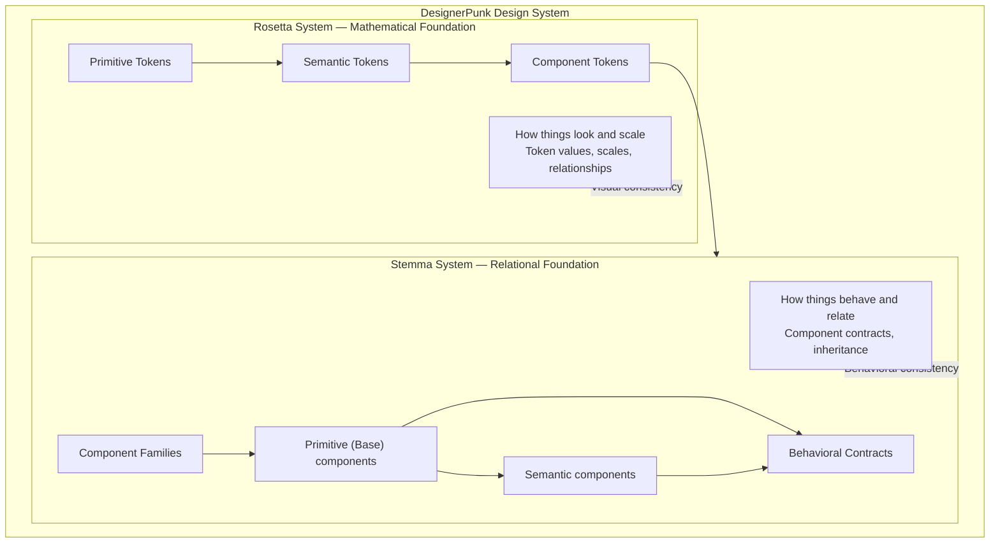
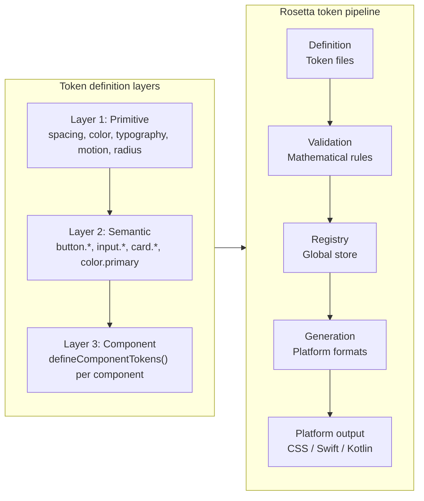
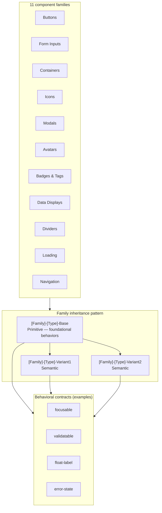
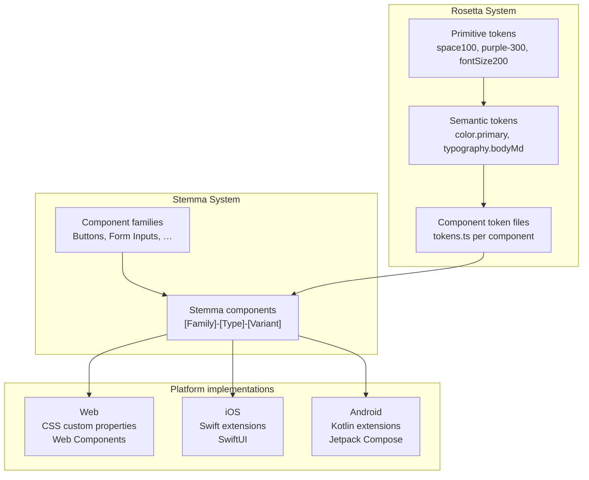
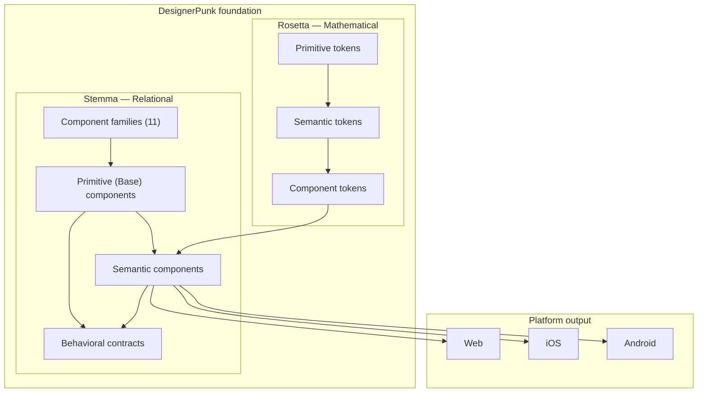

# Rosetta and Stemma Systems — Mermaid Diagram

**Purpose**: Visual overview of the DesignerPunk dual foundation: Rosetta (mathematical token system) and Stemma (relational component system), and how they integrate.

---

## High-level: DesignerPunk dual foundation

---

## Rosetta System — token pipeline and layers

---

## Stemma System — families and inheritance

---

## Integration: tokens → components → platforms

---

## Combined overview (single diagram)

---

## Related docs

- **Rosetta**: [Rosetta System Principles](.kiro/steering/rosetta-system-principles.md), [Rosetta System Architecture](.kiro/steering/Rosetta-System-Architecture.md)
- **Stemma**: [Stemma System Principles](.kiro/steering/stemma-system-principles.md)
- **Spec**: [034 Component Architecture System](.kiro/specs/034-component-architecture-system/design.md)
